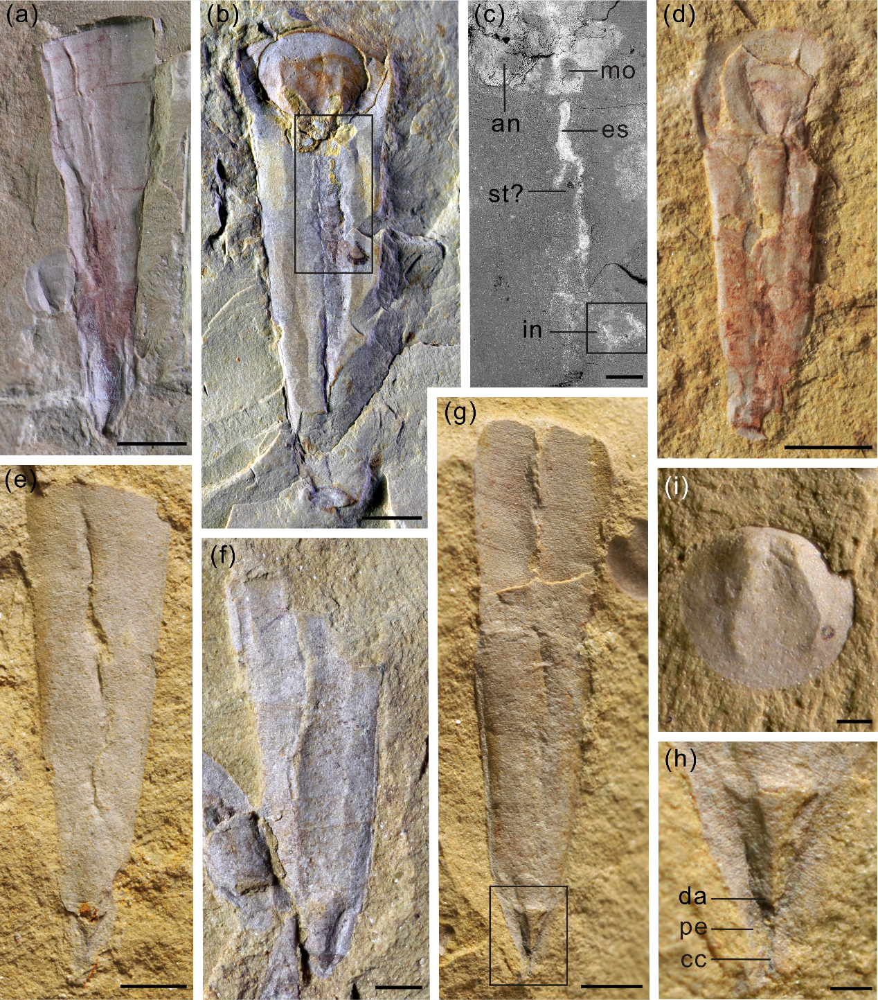
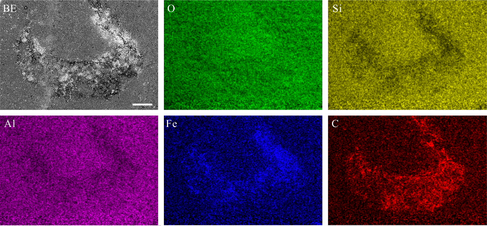

# Supplementary Figures and Table {-}

(ref:captionS1) **_Pedunculotheca diania_ Sun et Smith gen. et sp. nov. from the Chengjiang Biota, Yunnan Province, China.**
(a) NIGPAS 166601, external mould of dorsum with dorsal apex and pedicle foramen. (b) NIGPAS 166597, preserving conical shell, operculum and internal soft tissue, showing a compressed elliptic cross-section; backscatter electron micrograph of boxed region shown in (c).
(d) NIGPAS 166599b, counterpart, juvenile conical shell with operculum showing two longitudinal ventral grooves and circular larval shell. 
(e) NIGPAS 166602, conical shell with incomplete attachment structure.
(f) NIGPAS 166598, broken shell with two ventral furrows and incomplete attachment structure. (g) NIGPAS 166596, incomplete shell with one medial ventral furrow and short attachment structure with coelomic cavity; detail of boxed region shown in (h).
(i) NIGPAS 166603, exterior of operculum.\newline
Scale bars: 2mm (for a, b and e–g); 500&nbsp;µm (for c, h and i).\newline
Abbreviations: an = anus, cc = coelomic cavity, da = dorsal apex, es = esophagus, in = intestine, mo = mouth, pe = pedicle, st = stomach.

```{R more-specimens, echo=FALSE, out.width="80%", fig.align='center', fig.cap="(ref:captionS1)"}

```


(ref:captionS2) **Elemental distribution in the gut of _Pedunculotheca diania_ Sun et Smith gen. et sp. nov.** NIGPAS 166597. Region corresponds to boxed region in Fig. S1c.
Scale bar = 100&nbsp;µm.\newline
Abbreviations: BE = backscatter electron image, O = Oxygen, Si = Silicon, Al = Aluminium, Fe = Iron, C = Carbon.

```{R gut-elemental, echo=FALSE, out.width="80%", fig.align="center", fig.cap='(ref:captionS2)', cache=TRUE}

```

(ref:captionS3) **Global diversity of brachiopods through the Paleozoic.** Points represent number of genera reported in each time bin; lines represent rolling mean diversity over `r rollOver <- 3; WriteNumber(rollOver)` consecutive time bins.  Data from Paleobiology database. 

```{R brach-diversity, echo=FALSE, fig.width=7, fig.cap='(ref:captionS3)', cache=TRUE}
# Definitions
cbPalette <- c("#000000", "#E69F00", "#56B4E9", "#009E73", "#F0E442", "#0072B2", "#D55E00", "#CC79A7") # Colour-blind friendly palette
PDBGenera <-  R.cache::addMemoization(function (taxon) read.csv(paste0('https://paleobiodb.org/data1.2/occs/diversity.txt?base_name=', taxon, '&count=genera')))
timescale <- geoscale::timescales[[1]]
rollmean <- zoo::rollmean
plotDiv <- function (dataset, rollOver = 5, col) {
  if (dataset[2, 'max_ma'] > dataset[1, 'max_ma']) {
    dataset <- dataset[rev(rownames(dataset)), ]
  }
  attach(dataset)
  on.exit(detach(dataset))
  points(sampled_in_bin ~ I(-(max_ma + min_ma) / 2), col=paste0(cbPalette[col], 77))
  points(sampled_in_bin ~ I(-(max_ma + min_ma) / 2), pch='.', cex=2, col=cbPalette[col])
  lines(rollmean(sampled_in_bin, rollOver) ~ rollmean(-(max_ma + min_ma) / 2, rollOver), col=cbPalette[col])
}
 
# Read and sanitize data                        
all.ages <- timescale[timescale$Type == 'Age', ]
ages <- all.ages[all.ages$Part_of != 'Quaternary', ]
ages$Name <- as.character(ages$Name)
n.ages <- nrow(ages)

hyo  <- PDBGenera('Hyolitha')
ling <- PDBGenera('Linguliformea')
rhyn <- PDBGenera('Rhynchonelliformea')
tomm <- PDBGenera('Tommotiida')
ecc  <- PDBGenera('Eccentrotheca')

addities <- c('sampled_in_bin', 'n_occs')
tomm[tomm$interval_name == 'Stage 3', addities] <- tomm[tomm$interval_name == 'Stage 3', addities] + ecc[ecc$interval_name == 'Stage 3', addities]
tomm[tomm$interval_name == 'Stage 2', addities] <- tomm[tomm$interval_name == 'Stage 2', addities] + ecc[ecc$interval_name == 'Stage 2', addities]

allIntervals <- unique(as.character(rhyn$interval_name, ling$interval_name, hyo$interval_name))

# Plot
yMax <- 200
par(cex=0.8)

plot(99, 0, ylim=c(0, yMax), xlim=c(-540, -400), 
     xlab='Million years ago', ylab='Genera')
bottom <- yMax * 0.6; gap <- yMax * 0.08
text(-542, bottom + (4 * gap), lab='Rhynchonelliformea', col=cbPalette[5], pos=4)
text(-542, bottom + (3 * gap), lab='Linguliformea',     col=cbPalette[3], pos=4)
text(-542, bottom + (2 * gap), lab='Hyolitha',          col=cbPalette[4], pos=4)
text(-542, bottom + (1 * gap), lab='Tommotiida',        col=cbPalette[2], pos=4)

plotDiv(ling, rollOver=rollOver, col=3)
plotDiv(rhyn, rollOver=rollOver, col=5)
plotDiv(hyo , rollOver=rollOver, col=4)
plotDiv(tomm , rollOver=3, col=2)
```


\clearpage

(ref:tableS1) **Provenance of fossil material.** Individuals from the Yaoying section are usually bigger, with a thicker body wall, and have a smaller ratio of apertural width to shell length than specimens from other areas. 
In the absence of other differentiating features, we consider these deviations to represent ecophenotypical variation within a single species, perhaps reflecting the increased energetics and predation pressure that accompany the shallower water depth reported at the Yaoying section [@Zhao2012].

```{r table-s1, echo=FALSE, asis=TRUE}
prov <- matrix(c("166593, 166617", "Shankou Village, Anning", "24°49’53’’&nbsp;N, 102°24’47.9”&nbsp;E", "166594, 166595", "Yaoying Village, Wuding", "25°36’01.2”&nbsp;N, 102°20’04.6”&nbsp;E", "166596--166616", "Ma'anshan Village, Chengjiang", "24°40’37.2”&nbsp;N, 102°58’40.2”&nbsp;E"), nrow=3, ncol=3, byrow=TRUE)
colnames(prov) <- c("NIGPAS Specimen numbers", "Fossil locality", "Coordinates")
knitr::kable(prov, caption='(ref:tableS1)')
```

```{r table-s1-backup, echo=FALSE, asis=TRUE}
#prov <- matrix(c("166593, 166617", "Shankou Village, Anning", #"24&deg;49&rsquo;53&rsquo;&rsquo;&nbsp;N, 102&deg;24&rsquo;47.9&rdquo;&nbsp;E", "166594, #166595", "Yaoying Village, Wuding", "25&deg;36&rsquo;01.2&rdquo;&nbsp;N, #102&deg;20&rsquo;04.6&rdquo;&nbsp;E", "166596--166616", "Ma'anshan Village, Chengjiang", #"24&deg;40&rsquo;37.2&rdquo;&nbsp;N, 102&deg;58&rsquo;40.2&rdquo;&nbsp;E"), nrow=3, ncol=3, #byrow=TRUE)
#colnames(prov) <- c("NIGPAS Specimen numbers", "Fossil locality", "Coordinates")
#knitr::kable(prov, caption='(ref:tableS1)', escape=FALSE)
```

\clearpage
