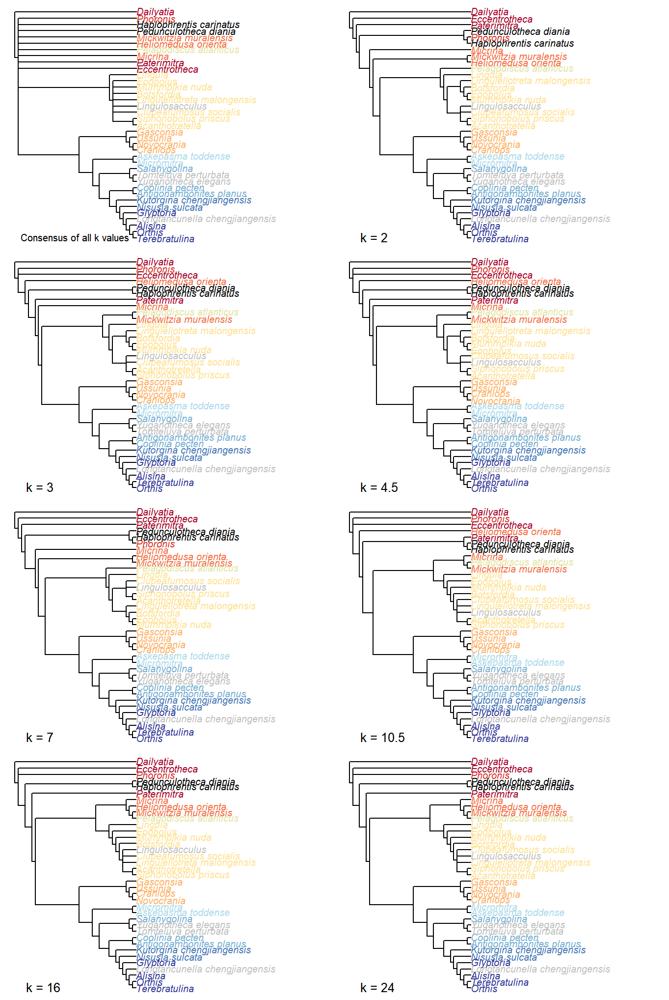
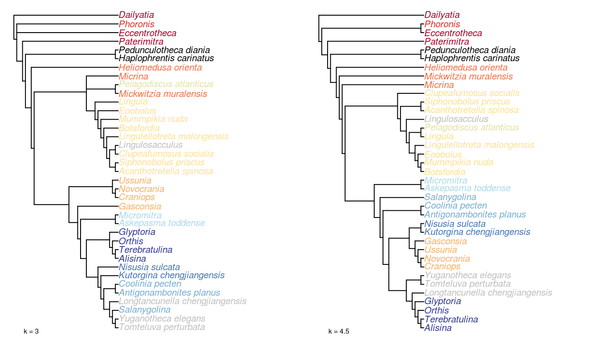
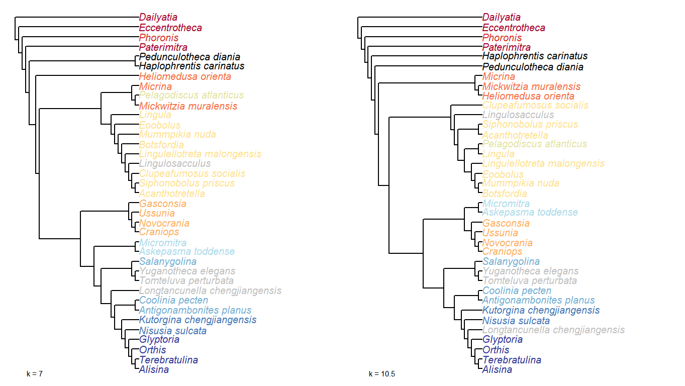
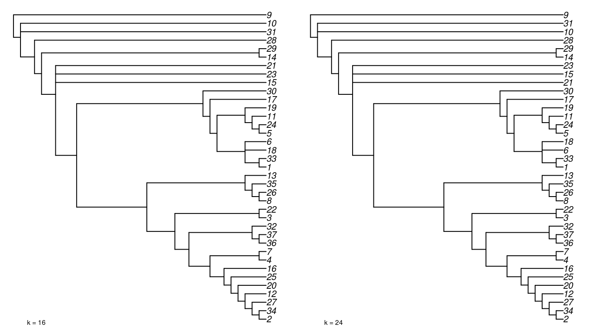
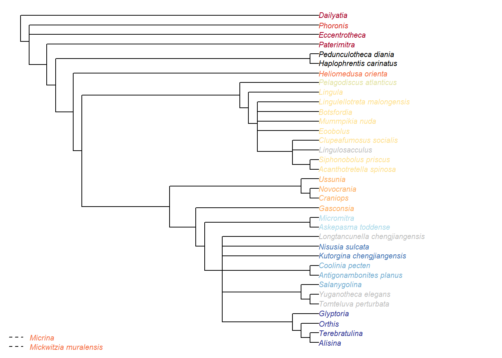
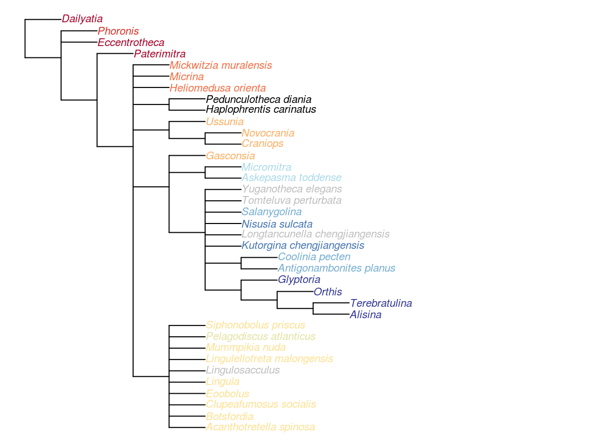
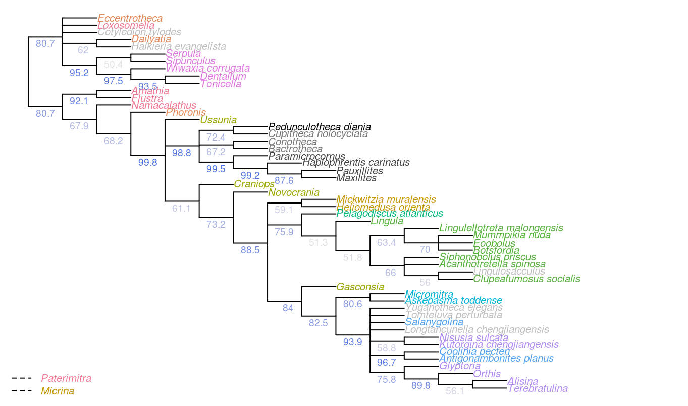

--- 
title: "Brachiopod origins -- Supplementary material -- Phylogenetic analysis"
author: "Sun, Hai-Jing; Smith, Martin Ross; Zhu, Mao-Yan; Zeng, Han; Zhao, Fang-Chen"
date: "2018-04-05"
site: bookdown::bookdown_site
output: bookdown::gitbook
documentclass: book
bibliography: [References.bib, MorphoBank.bib]
csl: http://raw.githubusercontent.com/citation-style-language/styles/master/paleobiology.csl
link-citations: yes
github-repo: ms609/hy
description: "Results of phylogenetic analysis"
---


# Brachiopod origins {-}

This document provides a detailed discussion of analyses of the [morphological dataset](#dataset) constructed to accompany Sun _et al._ [-@Sun2018], and their results.

We first discuss the results presented in the main paper, which employ the algorithm described by Brazeau, Guillerme and Smith [-@Brazeau2018] for correct handling of inapplicable data in a parsimony setting, and explore how each
character is [reconstructed](#reconstructions) on an optimal tree.

For completeness, we also document the results of [standard Fitch parsimony](#tnt) analysis, and the results of [Bayesian analysis](#MrBayes), neither of which treat inapplicable data in a logically consistent fashion.

<!--chapter:end:index.Rmd-->

---
title: "Phylogenetic dataset"
author: "Martin R. Smith"
date: "2018-04-05"
---

# The dataset

Analysis was performed on a new matrix of 37 early brachiozoan taxa, including hyoliths, tommotiids and mickwitziids, which were coded for 98 morphological characters (44 neomorphic, 54 transformational).

The dataset can be viewed and downloaded at Morphobank ([project 2800](https://morphobank.org/permalink/?P2800)), where each character is defined
and its coding for each taxon discussed.

Characters are coded following the recommendations of Brazeau, Guillerme and
Smith [@Brazeau2018].  In brief, we have employed reductive coding, using a distinct state to mark character inapplicability. Character specifications follow the model of Sereno [-@Sereno2007].

We have distinguished between neomorphic and transformational characters [sensu @Sereno2007] by reserving the token `0` to refer to the absence of a neomorphic character.  The states of transformational characters are represented by the tokens `1`, `2`, `3`, ...

Following the recommendations of Brazeau, Guillerme and
Smith [@Brazeau2018, supplementary discussion], we code the absence of neomorphic ontologically dependent characters [sensu @Vogt2017] as absence, rather than inapplicability.


<!--chapter:end:01_Dataset.Rmd-->

---
title: "TreeSearch results"
author: "Martin R. Smith"
date: "2018-04-05"
---

# Parsimony analysis {#treesearch}

The phylogenetic dataset contains a high proportion of inapplicable codings (451/3626 = 12.4% of tokens), which are known to introduce error and bias to phylogenetic reconstruction [@Maddison1993;@Brazeau2018].  As such, phylogenetic search employed a new algorithm that correctly handles inapplicable data [@Brazeau2018].  This algorithm is implemented in the _MorphyLib_ C library [@Brazeau2017Morphylib], and phylogenetic search was conducted using the _R_ package _TreeSearch_ v0.0.8 [@Smith2018TreeSearch].

_Namacalathus_ is included in the matrix but has been excluded from analysis due to its potentially long branch, which is likely to mislead analysis.

## Search parameters

Heuristic searches were conducted using the parsimony ratchet [@Nixon1999] under equal and implied weights [@Goloboff1997] with a variety of concavity constants.  The consensus tree presented in the main manuscript represents a strict consensus of all trees that are most parsimonious under one or more of the concavity constants (_k_) 2, 3, 4.5, 7, 10.5, 16 and 24, an approach that has been shown to produce higher accuracy than equal weights at any fixed level of precision [@Smith2017].

## Analysis 

### Load data


### Generate starting tree

_Dailyatia_ has been selected as an outgroup as camenellans have been interpreted as the earliest diverging members of the Brachiozoa [@Skovsted2015;@Zhao2017].


```r
nj.tree <- NJTree(my_data)
rooted.tree <- EnforceOutgroup(nj.tree, 'Dailyatia')
start.tree <- TreeSearch(tree=rooted.tree, dataset=my_data, maxIter=3000,
                         EdgeSwapper=RootedNNISwap, verbosity=0)
```

### Implied weights analysis


```r
for (k in kValues) {
  iw.tree <- IWRatchet(start.tree, iw_data, concavity=k,
                       ratchHits = 60, searchHits=55,
                       swappers=list(RootedTBRSwap, RootedSPRSwap, RootedNNISwap),
                       verbosity=0L)
  score <- IWScore(iw.tree, iw_data, concavity=k)
  # Write single best tree
  write.nexus(iw.tree,
              file=paste0("TreeSearch/hy_iw_k", k, "_", 
                          signif(score, 5), ".nex", collapse=''))

  suboptFraction = 0.02
  iw.consensus <- IWRatchetConsensus(iw.tree, iw_data, concavity=k,
                  swappers=list(RootedTBRSwap, RootedNNISwap),
                  searchHits=4,
                  suboptimal=score * suboptFraction,
                  nSearch=150, verbosity=0L)
  write.nexus(iw.consensus, 
              file=paste0("TreeSearch/hy_iw_k", k, "_", 
                          signif(IWScore(iw.tree, iw_data, concavity=k), 5),
                          ".all.nex", collapse=''))
}
```

### Equal weights analysis


```r
ew.tree <- Ratchet(start.tree, my_data, verbosity=0L,
                   ratchHits = 10, searchHits=55,
                   swappers=list(RootedTBRSwap, RootedSPRSwap, RootedNNISwap))
write.nexus(ew.tree, file=paste0(collapse='', "TreeSearch/hy_ew_",
                                 Fitch(ew.tree, my_data), ".nex"))

ew.consensus <- RatchetConsensus(ew.tree, my_data, nSearch=150,
                                 swappers=list(RootedTBRSwap, RootedNNISwap),
                                 verbosity=0L)
write.nexus(ew.consensus, file=paste0(collapse='', "TreeSearch/hy_ew_",
                                      Fitch(ew.tree, my_data), ".nex"))
```

## Results

### Implied weights results


<div class="figure">

<p class="caption">(\#fig:IW-consensus-TreeSearch)Consensus of implied weights analyses at all values of k</p>
</div>


<div class="figure">

<p class="caption">(\#fig:All-IW-results-TreeSearch)Implied weights results</p>
</div>

### Equal weights results

<div class="figure">

<p class="caption">(\#fig:equal-weights-results-in-TreeSearch)Strict consensus of equal weights results</p>
</div>


<!--chapter:end:02_TreeSearch.Rmd-->

---
title: "Visualizing characters"
author: "Martin R. Smith"
date: "2018-04-05"
---

# Character reconstructions {#reconstructions}


This page provides definitions for each of the characters in our matrix, and justifies codings in particular taxa where necessary.  Citations for all codings can be found by browsing the [morphological dataset](#dataset) on MorphoBank ([project 2800](https://morphobank.org/permalink/?P2800)).

The _Inapp_ _R_ package [@Brazeau2018] was used to map each character onto one of the most parsimonious trees (obtained under implied weighting, $k = 4.5$):


  
## Sclerites  
  
### [1] Present in adult {-}  
  

 **Character 1: Sclerites: Present in adult**  

 > 0: Absent  
  > 1: Present  
>  Neomorphic character.  
>
  

Plate-like (wider than tall) skeletal elements, whether mineralized or non-mineralized.  
The definition deliberately excludes setae (which are taller than wide).   
  
  
### [2] Disposition {-}  
  

 **Character 2: Sclerites: Disposition**  

 > 1: Single skeletal element  
  > 2: Bivalved: scleritome dominated by prominent dorsal and ventral valve  
  > 3: Multiple skeletal elements with no differentiated pair  
>  Transformational character.  
>
  

Taxa in the bivalved condition may bear small additional elements, such as the L-elements of _Paterimitra_ or the stegidial / deltidial plates of certain brachiopods.   
  
 <div class='state-note'>_Paterimitra_: Sclerites of _Paterimitra_ are opposing symmetrical and fused, not separated like brachiopods.</div>  
  
 <div class='state-note'>_Yuganotheca elegans_: The conical element is taken to be homologous to the colleplax and thus part of the ventral valve.</div>  
  
  
  
### [3] Hinge line shape {-}  
  

 **Character 3: Sclerites: Bivalved: Hinge line shape**  

 > 1: Astrophic  
  > 2: Strophic  
>  Transformational character.  
>
  

  
 <div class='state-note'>_Micrina_: See @Holmer2008EarlyCambrian.</div>  
  
 <div class='state-note'>_Tomteluva perturbata_: "Tomteluvid taxa all have a strongly ventribiconvex, astrophic shell with a unisulcate commissure" -- @Streng2016Anew, p5.</div>  
  
 <div class='state-note'>_Kutorgina chengjiangensis_: Williams _et al_. [-@Williams2000BrachiopodaLinguliformea, p. 208] consider the hinge of _Kutorgina_ to be stropic, whereas Bassett _et al_. [-@Bassett2001Functionalmorphology] argue for an astropic interpretation -- whilst noting that the arrangement is prominently different from other astrophic taxa.  We therefore code this taxon as ambiguous.</div>  
  
 <div class='state-note'>_Longtancunella chengjiangensis_: "_Longtancunella_ has an oval to subcircular shell with a very short strophic hinge line" -- @Zhang2011Theexceptionally.</div>  
  
 <div class='state-note'>_Nisusia sulcata_: "The strophic, articulated shells of the Kutorginata rotated on simple hinge mechanisms that are different from those of other rhynchonelliforms" (Williams _et al_. p. 208).</div>  
  
 <div class='state-note'>_Novocrania_: Craniides have a strophic posterior valve edge [@Williams2007PartH, table 39 on p. 2853].</div>  
  
 <div class='state-note'>_Yuganotheca elegans_: Not evident from fossil material; the possibility of a short strophic hinge line (as in _Longtancunella_) is difficult to discount.</div>  
  
 <div class='state-note'>_Mickwitzia muralensis_: non-strophic.</div>  
  
 <div class='state-note'>_Botsfordia_: Coded as dissociated in <mark>Williams _et al_. (1998)</mark>, Appendix 2.</div>  
  
  
  
### [4] Apophyses {-}  
  

 **Character 4: Sclerites: Bivalved: Apophyses**  

 > 0: Absent  
  > 1: Present  
>  Neomorphic character.  
>
  

Many brachiopods, in addition to _Micrina_ and others, bear tooth-like structures or processes that articulate the two primary valves.  
Caution must be applied before taxa are coded as "absent", as teeth can be subtle and may be overlooked.  
  
Kutorginata don't have teeth or dental sockets, but their shells are articulated by "two triangular plates formed by dorsal interarea, bearing oblique ridges on the inner sides" [@Williams2000BrachiopodaLinguliformea, p. 211]; this simple hinge mechanism is different from other rhynchonelliforms [@Williams2000BrachiopodaLinguliformea, p.208], but serves an equivalent purpose and is thus potentially homologous.  We thus code kutorginids as present, using a subsequent character to capture difference in tooth morphology.   
  
 <div class='state-note'>_Tomteluva perturbata_: Tomteluvids [...] lack articulation structures such as teeth and sockets [@Streng2016Anew].</div>  
  
 <div class='state-note'>_Mummpikia nuda_: No articulation structures are evident; instead, the propareas are rotated inwards [@Balthasar2008iMummpikia].  The definition of Family Obolellidae in Williams _et al_. [-@Williams2000BrachiopodaLinguliformea] notes that articulation may be lacking or vestigial in the group.</div>  
  
 <div class='state-note'>_Kutorgina chengjiangensis_: "Articulation characterized by two triangular plates formed by dorsal interarea, bearing oblique ridges on the inner sides" -- @Williams2000BrachiopodaLinguliformea, p. 211.</div>  
  
 <div class='state-note'>_Nisusia sulcata_: Pseudodont articulation: teeth formed by distal lateral extensions from the ventral pseudodeltidium -- @Holmer2018Evolutionarysignificance.</div>  
  
 <div class='state-note'>_Alisina_: "Strophic articulation with paired, ventral denticles, composed of secondary shell" -- definition of family Trematobolidae in @Williams2000BrachiopodaLinguliformea.</div>  
  
 <div class='state-note'>_Gasconsia_: "Articulatory structure comprising ventral cardinal socket and dorsal hinge plate [...] The shape of the shell probably correlates strongly with the unique type of articulation, which consists of a dorsal hinge plate that fits tightly into a cardinal socket in the ventral valve, with a concave homeodeltidium in the center of the ventral interarea" -- @Williams2000BrachiopodaLinguliformea, p.184, concerning order Trimerellida.</div>  
  
 <div class='state-note'>_Clupeafumosus socialis_: No articulating processes evident or reported by Topper _et al_. [-@Topper2013Reappraisalof].</div>  
  
 <div class='state-note'>_Ussunia_: "articulatory structures poorly developed" -- @Williams2000BrachiopodaLinguliformea, p. 192.</div>  
  
 <div class='state-note'>_Mickwitzia muralensis_: Not reported by or evident in Balthasar [-@Balthasar2004Shellstructure].</div>  
  
  
  
### [5] Apophyses: Morphology {-}  
  

 **Character 5: Sclerites: Bivalved: Apophyses: Morphology**  

 > 1: Deltidiodont  
  > 2: Cyrtomatodont  
  > 3: Pseudodont  
>  Transformational character.  
>
  

Deltidiodont teeth are simple hinge teeth developed by the distal accretion of secondary shell; Cyrtomatodont teeth are knoblike or hook-shaped hinge teeth developed by differential secretion and resorption of the secondary shell [fig. 322 in @Williams2000BrachiopodaLinguliformea].  
  
Kutorginata (here represented by _Kutorgina_ and _Nisusia_) don't have teeth (apophyses) or dental sockets, but their shells are articulated by "two triangular plates formed by dorsal interarea, bearing oblique ridges on the inner sides" [@Williams2000BrachiopodaLinguliformea, p. 211]; this simple hinge mechanism is different from other rhynchonelliforms [@Williams2000BrachiopodaLinguliformea, p.208; table 13 character 30], and is described as a "pseudodont articulation" [@Holmer2018Evolutionarysignificance].   
  
 <div class='state-note'>_Micrina_: The simple knob-like teeth of _Micrina_ show no evidence of resprobtion or the hook-like shape that characterises Cyrtomatodont teeth.</div>  
  
 <div class='state-note'>_Kutorgina chengjiangensis_: "Articulation characterized by two triangular plates formed by dorsal interarea, bearing oblique ridges on the inner sides" -- @Williams2000BrachiopodaLinguliformea, p. 211.</div>  
  
 <div class='state-note'>_Nisusia sulcata_: The 'teeth' are formed by the distal lateral extensions from the ventral  
pseudodeltidium fitting into the 'sockets' on the inner side of the dorsal interarea [@Holmer2018Evolutionarysignificance].  [Coded as "deltidiodont teeth absent" in Benedetto [-@Benedetto2009iChaniella].].</div>  
  
 <div class='state-note'>_Terebratulina_: Cyrtomatodont -- see fig. 322 in Williams _et al_. [-@Williams2000BrachiopodaLinguliformea].</div>  
  
 <div class='state-note'>_Antigonambonites planus_: Coded as deltidiodont in Benedetto [-@Benedetto2009iChaniella].</div>  
  
 <div class='state-note'>_Orthis_: Coded as deltidiodont (in _Eoorthis_) in Benedetto [-@Benedetto2009iChaniella].</div>  
  
 <div class='state-note'>_Glyptoria_: Coded as deltidiodont in Benedetto [-@Benedetto2009iChaniella].</div>  
  
  
  
### [6] Apophyses: Dental plates {-}  
  

 **Character 6: Sclerites: Bivalved: Apophyses: Dental plates**  

 > 0: Absent  
  > 1: Present  
>  Neomorphic character.  
>
  

@Williams1997BrachiopodaRevised (p362) write: "Teeth [...] are commonly supported by a pair of variably disposed plates also built up exclusively of secondary shell and known as dental plates (Fig. 323.1, 323.3)."  
  
Dewing [-@Dewing2001Hingemodifications] elaborates: "Dental plates are near-vertical, narrow sheets of shell tissue between the anteromedian edge of the teeth and floor of the ventral valve. They are a composite structure, resulting from the growth of teeth over the ridge that bounds the ventral-valve muscle field."  
  
@Williams2000BrachiopodaLinguliformea (p.201) write: "The denticles lack supporting structures in all Obolellida, but in Naukatida they are supported by an arcuate plate below the  
interarea, the anterise (Fig. 119.3a)".  
  
The anterise is conceivably homologous with the dental plates, thus the presence of either is coded "present" for this character.   
  
 <div class='state-note'>_Coolinia pecten_: Coded as present following Dewing [-@Dewing2001Hingemodifications], who seems to use the term Strophomenoids to encompass _Coolinia_, and attests to the presence of dental plates.</div>  
  
 <div class='state-note'>_Nisusia sulcata_: Coded as absent in Benedetto [-@Benedetto2009iChaniella].</div>  
  
 <div class='state-note'>_Antigonambonites planus_: Coded as present (well developed) in Benedetto [-@Benedetto2009iChaniella].</div>  
  
 <div class='state-note'>_Orthis_: Coded as present (short and recessive, in _Eoorthis_) in Benedetto [-@Benedetto2009iChaniella].</div>  
  
 <div class='state-note'>_Gasconsia_: Coded ambiguous to reflect the possibility that the hinge plate in trimerellids is homologous to the dental plates of other taxa, and has replaced the teeth themselves as the primary articulatory mechanism [see @Williams2000BrachiopodaLinguliformea, p. 184, for details of the articulation].</div>  
  
 <div class='state-note'>_Glyptoria_: Coded as absent in Benedetto [-@Benedetto2009iChaniella].</div>  
  
  
  
### [7] Sockets {-}  
  

 **Character 7: Sclerites: Bivalved: Sockets**  

 > 0: Absent  
  > 1: Present  
>  Neomorphic character.  
>
  

Simplified from Bassett _et al_. [-@Bassett2001Functionalmorphology] character 16.  
This character is independent of apophyses, as several taxa bear sockets without corresponding teeth; the function of these sockets is unknown.  
See figs 323ff in Williams _et al_. [-@Williams1997BrachiopodaRevised].   
  
 <div class='state-note'>_Tomteluva perturbata_: Tomteluvids [...] lack articulation structures such as teeth and sockets [@Streng2016Anew].</div>  
  
 <div class='state-note'>_Nisusia sulcata_: Coded as absent in Benedetto [-@Benedetto2009iChaniella].</div>  
  
 <div class='state-note'>_Antigonambonites planus_: Coded as present in Benedetto [-@Benedetto2009iChaniella].</div>  
  
 <div class='state-note'>_Alisina_: "bearing sockets, bounded by low ridges" -- @Williams2000BrachiopodaLinguliformea.</div>  
  
 <div class='state-note'>_Gasconsia_: "Articulatory structure comprising ventral cardinal socket and dorsal hinge plate" -- @Williams2000BrachiopodaLinguliformea, p. 184.</div>  
  
 <div class='state-note'>_Glyptoria_: Coded as absent in Benedetto [-@Benedetto2009iChaniella].</div>  
  
 <div class='state-note'>_Ussunia_: Following table 15 in @Williams2000BrachiopodaLinguliformea.</div>  
  
 <div class='state-note'>_Mickwitzia muralensis_: Not reported by or evident in Balthasar [-@Balthasar2004Shellstructure].</div>  
  
  
  
### [8] Socket ridges {-}  
  

 **Character 8: Sclerites: Bivalved: Socket ridges**  

 > 0: Absent  
  > 1: Present  
>  Neomorphic character.  
>
  

After Bassett _et al_. [-@Bassett2001Functionalmorphology] character 17.  May be difficult to distinguish from a brachiophore [see Fig 323 in @Williams1997BrachiopodaRevised], so the two structures are not distinguished here.   
  
 <div class='state-note'>_Tomteluva perturbata_: Tomteluvids [...] lack articulation structures such as teeth and sockets [@Streng2016Anew].</div>  
  
 <div class='state-note'>_Nisusia sulcata_: Coded as absent in Benedetto [-@Benedetto2009iChaniella].</div>  
  
 <div class='state-note'>_Antigonambonites planus_: Coded as present in Benedetto [-@Benedetto2009iChaniella].</div>  
  
 <div class='state-note'>_Alisina_: "bearing sockets, bounded by low ridges" -- @Williams2000BrachiopodaLinguliformea.</div>  
  
 <div class='state-note'>_Glyptoria_: Coded as absent in Benedetto [-@Benedetto2009iChaniella].</div>  
  
  
  
### [9] Enclosing filtration chamber {-}  
  

 **Character 9: Sclerites: Bivalved: Enclosing filtration chamber**  

 > 0: No filtration chamber, or open chamber  
  > 1: Shells close to form enclosed filtration chamber  
>  Neomorphic character.  
>
  

In crown-group brachiopods, the two primary shells close to form an enclosed filtration chamber.  Further down the stem, taxa such as _Micrina_ do not.   
  
  
### [10] Commissure {-}  
  

 **Character 10: Sclerites: Bivalved: Commissure**  

 > 1: Rectimarginate  
  > 2: Uniplicate  
  > 3: Sulcate  
>  Transformational character.  
>
  

The anterior commissure can be rectimarginate (i.e. straight), uniplicate (i.e. median sulcus in ventral valve), or sulcate (with median sulcus in dorsal valve).   
  
 <div class='state-note'>_Kutorgina chengjiangensis_: Following Appendix 2 in Williams _et al_. [-@Williams1998Thediversity].</div>  
  
 <div class='state-note'>_Salanygolina_: Following Appendix 2 in Williams _et al_. [-@Williams1998Thediversity].</div>  
  
 <div class='state-note'>_Askepasma toddense_: "ventral valve weakly to moderately sulcate" [@Topper2013Theoldest]; a similar description is provided by Williams _et al_. [-@Williams2000BrachiopodaLinguliformea].</div>  
  
 <div class='state-note'>_Micromitra_: Following Appendix 2 in Williams _et al_. [-@Williams1998Thediversity].</div>  
  
 <div class='state-note'>_Terebratulina_: "Anterior commissure rectimarginate to uniplicate" -- uniplicate in fig. 1425.1c of Williams _et al_. [-@Williams2006Rhynchonelliformeapart].</div>  
  
 <div class='state-note'>_Glyptoria_: Following Appendix 2 in Williams _et al_. [-@Williams1998Thediversity].</div>  
  
  
  
### [11] Muscle scars: Ventral  {-}  
  

 **Character 11: Sclerites: Bivalved: Muscle scars: Ventral **  

 > 0: Absent  
  > 1: Present  
>  Neomorphic character.  
>
  

After Bassett _et al_. [-@Bassett2001Functionalmorphology] character 6.   
  
 <div class='state-note'>_Micrina_: Prominent ventral muscle scars -- see e.g. @Holmer2008EarlyCambrian, fig. 1f.</div>  
  
 <div class='state-note'>_Alisina_: Muscle scars scored based on _Alisina_ _comleyensis_ [@Bassett2001Functionalmorphology].</div>  
  
 <div class='state-note'>_Mickwitzia muralensis_: Scars absent; instead, cones ornament shell's internal surface.</div>  
  
  
  
### [12] Muscle scars: Ventral: Position {-}  
  

 **Character 12: Sclerites: Bivalved: Muscle scars: Ventral: Position**  

 > 1: Posterolateral and medial attachments  
  > 2: Medial attachments only  
>  Transformational character.  
>
  

Muscles can attach to the ventral valve posterolaterally to, as well as between, the _vascula_ _lateralia_ [@Popov1992TheCambrian].   
  
 <div class='state-note'>_Kutorgina chengjiangensis_: Following situation in _Nisusia_; see fig. 18.2 in Bassett _et al_. [-@Bassett2001Functionalmorphology].</div>  
  
 <div class='state-note'>_Acanthotretella_: "Individual muscle scars cannot be distinguished" -- @Holmer2006Aspinose.</div>  
  
 <div class='state-note'>_Askepasma toddense_: Restricted to medial field, following the interpretation of the musculature presented by Williams _et al_. [-@Williams2000BrachiopodaLinguliformea], fig. 81.</div>  
  
 <div class='state-note'>_Nisusia sulcata_: Posterolateral diductors [fig. 18.2 in @Bassett2001Functionalmorphology].</div>  
  
 <div class='state-note'>_Pelagodiscus atlanticus_: Inapplicable as vascular system not directly equivalent to the canonical; see. fig 6b in Balthasar [-@Balthasar2009Thebrachiopod].</div>  
  
 <div class='state-note'>_Glyptoria_: Posterolateral reflected by diductor attachments; see fig. 18.3.2 in @Bassett2001Functionalmorphology.</div>  
  
 <div class='state-note'>_Clupeafumosus socialis_: Coded following _Hadrotreta_, as illustrated in Popov [-@Popov1992TheCambrian].</div>  
  
 <div class='state-note'>_Craniops_: See fig. 89 in Williams _et al_. [-@Williams2000BrachiopodaLinguliformea].</div>  
  
 <div class='state-note'>_Eoobolus_: The 'laterals' of Balthasar [-@Balthasar2009Thebrachiopod, fig. 5] are situated almost upon the _vascula_ _lateralia_; they are interpreted as sitting posterolateral to them.</div>  
  
 <div class='state-note'>_Siphonobolus priscus_: Coded following general siphonotretid condition described by Popov [-@Popov1992TheCambrian, p. 407].</div>  
  
  
  
### [13] Muscle scars: Adjustor {-}  
  

 **Character 13: Sclerites: Bivalved: Muscle scars: Adjustor**  

 > 0: Absent  
  > 1: Present  
>  Neomorphic character.  
>
  

After Bassett _et al_. [-@Bassett2001Functionalmorphology] character 7.  
This character is contingent on the presence of a pedicle.  Extreme caution must be used in inferring an absent state, as adjustor scars can be extremely difficult to distinguish from the adductor scars.   
  
 <div class='state-note'>_Askepasma toddense_: Following the interpretation of the musculature presented by Williams _et al_. [-@Williams2000BrachiopodaLinguliformea], fig. 81.</div>  
  
 <div class='state-note'>_Alisina_: Muscle scars scored based on _Alisina_ _comleyensis_ [@Bassett2001Functionalmorphology].  
  
The presence of an adjustor is marked NPA as it is not clear that a scar, if present, could be distinguished from the diminutive muscle scars present.</div>  
  
 <div class='state-note'>_Gasconsia_: No mention of an adjustor muscle in _Gasconsia_ or Trimerellida more generally on pp. 184--185 of @Williams2000BrachiopodaLinguliformea, nor in discussion in @Williams2007PartH (p. 2850).  Coded as absent.</div>  
  
 <div class='state-note'>_Clupeafumosus socialis_: Not known in any acrotretid [@Williams2000BrachiopodaLinguliformea]; not evident in _Clupeafumosus_ [@Topper2013Reappraisalof].</div>  
  
 <div class='state-note'>_Mickwitzia muralensis_: Scars absent; instead, cones ornament shell's internal surface.</div>  
  
 <div class='state-note'>_Siphonobolus priscus_: Ventral musculature poorly constrained [@Williams2000BrachiopodaLinguliformea; @Popov2009Earlyontogeny].</div>  
  
 <div class='state-note'>_Botsfordia_: Not described in Popov [-@Popov1992TheCambrian].</div>  
  
  
  
### [14] Muscle scars: Dorsal adductor {-}  
  

 **Character 14: Sclerites: Bivalved: Muscle scars: Dorsal adductor**  

 > 1: Dispersed  
  > 2: Radially arranged  
  > 3: Quadripartite  
>  Transformational character.  
>
  

After Bassett _et al_. [-@Bassett2001Functionalmorphology] character 8, and Williams _et al_. [-@Williams1996Asupra, character 35; 2000, p. 160, character 54]  
  
In the dorsal valve, the anterior and posterior adductor scars of articulated brachiopods form a single (quadripartite) muscle field [@Williams2000BrachiopodaLinguliformea, p. 201]  
  
In contrast, the anterior and posterior scars of e.g. trimerellids have prominently separate attachment points, with anterior and posterior muscle fields clearly distinct, and coded as "dispersed".  
  
In e.g. kutorginates, adductor muscles are separated into left and right fields; the same is the case in lingulids, where there are more separate muscle groups and the left and right fields conspire to produce a radial arrangement; both of these configurations are scored as "radially arranged".   
  
 <div class='state-note'>_Haplophrentis carinatus_: Laterally dispersed, based on interpretation of Moysiuk _et al_. [-@Moysiuk2017Hyolithsare], and consistent with general situation in hyoliths [see @Dzik1980Ontogenyof].</div>  
  
 <div class='state-note'>_Coolinia pecten_: "radially arranged adductor scars" -- @Bassett2017Earliestontogeny, p1.</div>  
  
 <div class='state-note'>_Salanygolina_: "The dorsal valve of _Salanygolina_ has a radial arrangement of adductor muscle scars and the scars of posteromedially placed internal oblique muscles, which are also characteristic of paterinates and chileates" -- Holmer _et al_. [-@Holmer2009Theenigmatic].</div>  
  
 <div class='state-note'>_Heliomedusa orienta_: Distinct anterior and posterior fields [@Chen2007Reinterpretationof]; coded as "dispersed" by Williams _et al_. [-@Williams2000BrachiopodaLinguliformea] in table 15.</div>  
  
 <div class='state-note'>_Askepasma toddense_: Separate left and right fields, so radially arranged -- following the interpretation of the musculature presented by Williams _et al_. [-@Williams2000BrachiopodaLinguliformea], fig. 81.</div>  
  
 <div class='state-note'>_Micromitra_: Williams _et al_. [-@Williams1998Thediversity] code as "dispersed", but have a less divided scheme of character states and disagree with other sources in some codings [e.g. @Bassett2001Functionalmorphology, in Kutorginates].  Williams _et al_. [-@Williams2000BrachiopodaLinguliformea] do not describe _Micromitra_ musculature and we were unable to find any reliable description of the scars, so we code as "not presently available".</div>  
  
 <div class='state-note'>_Pelagodiscus atlanticus_: Discinids scored as "open, quadripartite" by Williams _et al_. [-@Williams1996Asupra].</div>  
  
 <div class='state-note'>_Novocrania_: Craniids scored as "open, quadripartite" by Williams _et al_. [-@Williams1996Asupra].</div>  
  
 <div class='state-note'>_Terebratulina_: Coded as "grouped, quadripartite" by Williams _et al_. [-@Williams1996Asupra].</div>  
  
 <div class='state-note'>_Antigonambonites planus_: Treatise.</div>  
  
 <div class='state-note'>_Alisina_: Following Williams _et al_. [-@Williams2000BrachiopodaLinguliformea] table 15 (their character 54).</div>  
  
 <div class='state-note'>_Gasconsia_: Following the coding of Williams _et al_. [-@Williams2000BrachiopodaLinguliformea], table 15.</div>  
  
 <div class='state-note'>_Glyptoria_: Scored as "dispersed" by Williams _et al_. [-@Williams1998Thediversity] ... but then so is _Kutorgina_, which Bassett _et al_. [-@Bassett2001Functionalmorphology] score as radial.  
  
Williams _et al_. [-@Williams2000BrachiopodaLinguliformea] state, for superfamily Protorthida, "dorsal adductor scars probably linear", which fits in the category of "radial" employed herein -- so that's what we follow.</div>  
  
 <div class='state-note'>_Clupeafumosus socialis_: Following reconstruction of _Hadrotreta_ by Williams [-@Williams2000BrachiopodaLinguliformea], fig. 51, which exhibits distinct left and right fields.</div>  
  
 <div class='state-note'>_Ussunia_: Following table 15 in @Williams2000BrachiopodaLinguliformea.</div>  
  
 <div class='state-note'>_Mickwitzia muralensis_: Scars absent; instead, cones ornament shell's internal surface.</div>  
  
 <div class='state-note'>_Siphonobolus priscus_: Ventral musculature poorly constrained [@Williams2000BrachiopodaLinguliformea; @Popov2009Earlyontogeny].</div>  
  
 <div class='state-note'>_Botsfordia_: Following @Williams1998Thediversity, appendix 2.</div>  
  
  
  
### [15] Muscle scars: Adductors: Position {-}  
  

 **Character 15: Sclerites: Bivalved: Muscle scars: Adductors: Position**  

 > 1: Oblique  
  > 2: At high angle  
>  Transformational character.  
>
  

Position of adductor muscles relative to commissural plane.  
After Bassett _et al_. [-@Bassett2001Functionalmorphology] character 11.   
  
 <div class='state-note'>_Coolinia pecten_: Not reported by Williams _et al_. [-@Williams2000BrachiopodaLinguliformea], nor Bassett & Popov [-@Bassett2017Earliestontogeny], nor explicitly by Dewing [-@Dewing2001Hingemodifications].</div>  
  
 <div class='state-note'>_Askepasma toddense_: Following the interpretation of the musculature presented by Williams _et al_. [-@Williams2000BrachiopodaLinguliformea], fig. 81.</div>  
  
 <div class='state-note'>_Pelagodiscus atlanticus_: Musculature considered essentially equivalent to _Lingula_ by @Williams2000BrachiopodaLinguliformea, so _Lingula_ coding followed here.</div>  
  
 <div class='state-note'>_Gasconsia_: See discussion under Trimerellida in Williams _et al_. [-@Williams2000BrachiopodaLinguliformea].</div>  
  
 <div class='state-note'>_Mickwitzia muralensis_: Scars absent; instead, cones ornament shell's internal surface.</div>  
  
 <div class='state-note'>_Eoobolus_: "_Eoobolus_ should have anterior and posterior adductors and a variety of oblique muscles which were probably arranged in criss-crossing pairs" -- @Balthasar2009Thebrachiopod.</div>  
  
 <div class='state-note'>_Siphonobolus priscus_: Ventral musculature poorly constrained [@Williams2000BrachiopodaLinguliformea; @Popov2009Earlyontogeny].</div>  
  
 <div class='state-note'>_Botsfordia_: Following description of Popov [-@Popov1992TheCambrian].</div>  
  
  
  
### [16] Muscle scars: Dermal muscles {-}  
  

 **Character 16: Sclerites: Bivalved: Muscle scars: Dermal muscles**  

 > 0: Absent or weakly developed  
  > 1: Strongly developed  
>  Neomorphic character.  
>
  

Based on character 11 in Zhang _et al_. [-@Zhang2014Anearly].  
Well developed dermal muscles present in the body wall of recent lingulates, which are absent in all calcareous-shelled brachiopods. These muscles are responsible for the hydraulic shell-opening mechanism, and possibly present in all organophosphatic-shelled brachiopods, with the possible exception of the paterinates (Williams _et al_., 2000, p. 32).   
  
 <div class='state-note'>_Tomteluva perturbata_: Though Williams _et al_. [-@Williams2000BrachiopodaLinguliformea, P.32] state that these muscles are absent in all carbonate-shelled brachiopods, their existence cannot be discounted with certainty in this taxon, which is therefore coded not presently available.</div>  
  
 <div class='state-note'>_Mummpikia nuda_: Though Williams _et al_. [-@Williams2000BrachiopodaLinguliformea, P.32] state that these muscles are absent in all carbonate-shelled brachiopods, their existence cannot be discounted with certainty in this taxon, which is therefore coded not presently available.</div>  
  
 <div class='state-note'>_Coolinia pecten_: According to the statement of Williams _et al_. [-@Williams2000BrachiopodaLinguliformea, P.32] that these muscle are absent in all carbonate-shelled brachiopods.</div>  
  
 <div class='state-note'>_Kutorgina chengjiangensis_: According to the statement of Williams _et al_. [-@Williams2000BrachiopodaLinguliformea, P.32] that these muscle are absent in all carbonate- shelled brachiopods, and the coding for kutorginids in Zhang _et al_. [-@Zhang2014Anearly].</div>  
  
 <div class='state-note'>_Salanygolina_: According to the statement of Williams _et al_. [-@Williams2000BrachiopodaLinguliformea, P.32] that these muscle are absent in all carbonate- shelled brachiopods.</div>  
  
 <div class='state-note'>_Askepasma toddense_: According to the statement of Williams _et al_. [-@Williams2000BrachiopodaLinguliformea, P.32] that the presence of these muscles in paterinates is uncertain.</div>  
  
 <div class='state-note'>_Micromitra_: Williams _et al_. [-@Williams2000BrachiopodaLinguliformea, P.32] are uncertain about the presence of these muscles in the paterinates.  Zhang _et al_. [-@Zhang2014Anearly] code absence in Paterinida, but without specifying evidence; we follow their coding here.</div>  
  
 <div class='state-note'>_Nisusia sulcata_: According to the statement of Williams _et al_. [-@Williams2000BrachiopodaLinguliformea, P.32] that these muscle are absent in all carbonate- shelled brachiopods.</div>  
  
 <div class='state-note'>_Pelagodiscus atlanticus_: Musculature considered essentially equivalent to _Lingula_ by @Williams2000BrachiopodaLinguliformea, so _Lingula_ coding followed here.</div>  
  
 <div class='state-note'>_Novocrania_: Following Zhang _et al_. [-@Zhang2014Anearly], and the statement of Williams _et al_. [-@Williams2000BrachiopodaLinguliformea] that such muscles are absent in all calcite-shelled brachiopods.</div>  
  
 <div class='state-note'>_Terebratulina_: Williams _et al_. [-@Williams2000BrachiopodaLinguliformea, P.32] state that these muscles are absent in all carbonate-shelled brachiopods.</div>  
  
 <div class='state-note'>_Antigonambonites planus_: According to the statement of Williams _et al_. [-@Williams2000BrachiopodaLinguliformea, P.32] that these muscle are absent in all carbonate- shelled brachiopods.</div>  
  
 <div class='state-note'>_Alisina_: According to the statement of Williams _et al_. [-@Williams2000BrachiopodaLinguliformea, P.32] that these muscle are absent in all carbonate- shelled brachiopods.</div>  
  
 <div class='state-note'>_Orthis_: According to the statement of Williams _et al_. [-@Williams2000BrachiopodaLinguliformea, P.32] that these muscle are absent in all carbonate- shelled brachiopods.</div>  
  
 <div class='state-note'>_Gasconsia_: According to the statement of Williams _et al_. [-@Williams2000BrachiopodaLinguliformea, P.32] that these muscle are absent in all carbonate- shelled brachiopods.</div>  
  
 <div class='state-note'>_Glyptoria_: According to the statement of Williams _et al_. [-@Williams2000BrachiopodaLinguliformea, P.32] that these muscle are absent in all carbonate- shelled brachiopods.</div>  
  
 <div class='state-note'>_Clupeafumosus socialis_: This character is coded based on the score of Acrotreta in Zhang _et al_. [-@Zhang2014Anearly], and statement in Williams _et al_. [-@Williams2000BrachiopodaLinguliformea, P.32].</div>  
  
 <div class='state-note'>_Eoobolus_: Not remarked upon by Balthasar [-@Balthasar2009Thebrachiopod].</div>  
  
 <div class='state-note'>_Siphonobolus priscus_: Ventral musculature poorly constrained [@Williams2000BrachiopodaLinguliformea; @Popov2009Earlyontogeny].</div>  
  
 <div class='state-note'>_Botsfordia_: Implicitly taken as present in Popov [-@Popov1992TheCambrian], though not marked in diagrams -- suggesting not strongly developed.</div>  
  
  
  
### [17] Muscle scars: Unpaired median (levator ani) {-}  
  

 **Character 17: Sclerites: Bivalved: Muscle scars: Unpaired median (levator ani)**  

 > 0: Absent  
  > 1: Present  
>  Neomorphic character.  
>
  

The levator ani is a diminutive unpaired medial muscle found in certain calcitic brachiopods [@Williams2000BrachiopodaLinguliformea; see fig. 89, character 34 in table 13].   
  
 <div class='state-note'>_Coolinia pecten_: Not reported in Dewing [-@Dewing2001Hingemodifications].</div>  
  
 <div class='state-note'>_Kutorgina chengjiangensis_: Following table 13 in @Williams2000BrachiopodaLinguliformea.</div>  
  
 <div class='state-note'>_Heliomedusa orienta_: Poor preservation of minor muscle scars noted by Chen _et al_. [-@Chen2007Reinterpretationof].</div>  
  
 <div class='state-note'>_Nisusia sulcata_: Following table 13 in @Williams2000BrachiopodaLinguliformea.</div>  
  
 <div class='state-note'>_Pelagodiscus atlanticus_: Musculature considered essentially equivalent to _Lingula_ by @Williams2000BrachiopodaLinguliformea, so _Lingula_ coding followed here.</div>  
  
 <div class='state-note'>_Novocrania_: Following table 13 in @Williams2000BrachiopodaLinguliformea (for _Novocrania_).</div>  
  
 <div class='state-note'>_Alisina_: Following table 13 in @Williams2000BrachiopodaLinguliformea.</div>  
  
 <div class='state-note'>_Gasconsia_: Following table 13 in @Williams2000BrachiopodaLinguliformea.</div>  
  
 <div class='state-note'>_Craniops_: See fig. 90 in @Williams2000BrachiopodaLinguliformea.</div>  
  
 <div class='state-note'>_Ussunia_: Following table 15 in @Williams2000BrachiopodaLinguliformea.</div>  
  
 <div class='state-note'>_Mickwitzia muralensis_: Scars absent; instead, cones ornament shell's internal surface.</div>  
  
 <div class='state-note'>_Siphonobolus priscus_: Ventral musculature poorly constrained [@Williams2000BrachiopodaLinguliformea; @Popov2009Earlyontogeny].</div>  
  
  
  
### [18] Muscle scars: Dorsal diductor {-}  
  

 **Character 18: Sclerites: Bivalved: Muscle scars: Dorsal diductor**  

 > 0: Absent  
  > 1: Present  
>  Neomorphic character.  
>
  

After Bassett _et al_. [-@Bassett2001Functionalmorphology] character 9.   
  
 <div class='state-note'>_Acanthotretella_: Not observable in _Acanthotretella_ itself, so coded as ambiguous -- though it is likely based on the anticipated phylogenetic affinities of _Acanthotretella_ that the muscles are absent.</div>  
  
 <div class='state-note'>_Askepasma toddense_: Not reconstructed in the the interpretation of the musculature presented by Williams _et al_. [-@Williams2000BrachiopodaLinguliformea], fig. 81, but presence cannot be confidently excluded.</div>  
  
 <div class='state-note'>_Gasconsia_: Internal oblique muscles serve as diductors.</div>  
  
 <div class='state-note'>_Clupeafumosus socialis_: Not reported by Topper _et al_. [-@Topper2013Reappraisalof], nor reconstructed in generic acrotretid by Williams _et al_. [-@Williams2000BrachiopodaLinguliformea].</div>  
  
 <div class='state-note'>_Siphonobolus priscus_: Ventral musculature poorly constrained [@Williams2000BrachiopodaLinguliformea; @Popov2009Earlyontogeny].</div>  
  
  
  
### [19] Muscle scars: Dorsal diductor: Position {-}  
  

 **Character 19: Sclerites: Bivalved: Muscle scars: Dorsal diductor: Position**  

 > 1: Close to commissural plane  
  > 2: Oblique to commissural plane  
  > 3: At high angle to commissural plane  
>  Transformational character.  
>
  

After Bassett _et al_. [-@Bassett2001Functionalmorphology] character 10.   
  
 <div class='state-note'>_Siphonobolus priscus_: Ventral musculature poorly constrained [@Williams2000BrachiopodaLinguliformea; @Popov2009Earlyontogeny].</div>  
  
  
  
## Sclerites: Dorsal valve  
  
### [20] Growth direction {-}  
  

 **Character 20: Sclerites: Dorsal valve: Growth direction**  

 > 1: Holoperipheral  
  > 2: Mixoperipheral  
  > 3: Hemiperipheral  
>  Transformational character.  
>
  

See Fig. 284 in Williams _et al_. [-@Williams1997BrachiopodaRevised].  
The growth direction dictates the attitude of the cardinal area relative to the hinge, which does not therefore represent an independent character.  
Crudely put, if, viewed from a dorsal position, the umbo falls within the outer margin of the shell, growth is holoperipheral; if it falls outside the margin, it is mixoperipheral; if it falls exactly on the margin, it is hemiperipheral.   
  
 <div class='state-note'>_Micrina_: See Holmer _et al_. [-@Holmer2008EarlyCambrian].</div>  
  
 <div class='state-note'>_Paterimitra_: S2 and L sclerites are clearly holoperipheral. See @Larsson2014iPaterimitra, fig. 2.</div>  
  
 <div class='state-note'>_Heliomedusa orienta_: "holoperipheral growth in dorsal valve" -- @Williams2007PartH.  
  
The insinuation from Zhang _et al_. [-@Zhang2009Architectureand] is that Chen _et al_. [-@Chen2007Reinterpretationof] misidentify the dorsal valve as the ventral valve.</div>  
  
 <div class='state-note'>_Clupeafumosus socialis_: Appears hemiperipheral in fig. 3 in Topper _et al_. [-@Topper2013Reappraisalof], though bordering on holoperipheral, so scored as ambiguous.</div>  
  
 <div class='state-note'>_Craniops_: "both valves with growth holoperipheral" -- @Williams2000BrachiopodaLinguliformea p164.</div>  
  
 <div class='state-note'>_Ussunia_: Following description of order in @Williams2000BrachiopodaLinguliformea.</div>  
  
  
  
### [21] Posterior surface: Differentiated {-}  
  

 **Character 21: Sclerites: Dorsal valve: Posterior surface: Differentiated**  

 > 0: Posterior shell not differentiated  
  > 1: Posterior shell forms distinct cardinal area or pseudointerarea  
>  Neomorphic character.  
>
  

In shells that grow by mixoperipheral growth, the triangular area subtended between each apex and the posterior ends of the lateral margins is termed the cardinal area.  In shells with holoperipheral growth, a flattened surface on the posterior margin of the valve is termed a pseudointerarea [paraphrasing @Williams1997BrachiopodaRevised].  
  
In order for this character to be independent of a shell's growth direction, we do not distinguish between a "cardinal area", "interarea" or "pseudointerarea".   
  
 <div class='state-note'>_Pedunculotheca diania_: Pseudointerarea.</div>  
  
 <div class='state-note'>_Micrina_: = Sellate sclerite duplicature [@Holmer2008EarlyCambrian].</div>  
  
 <div class='state-note'>_Paterimitra_: Pseudointerarea.</div>  
  
 <div class='state-note'>_Haplophrentis carinatus_: A very short pseudointerarea appears to be present [@Moysiuk2017Hyolithsare].</div>  
  
 <div class='state-note'>_Lingulosacculus_: Unclear from fossil material.</div>  
  
 <div class='state-note'>_Tomteluva perturbata_: Cardinal area (interarea) present.</div>  
  
 <div class='state-note'>_Mummpikia nuda_: "Information on the dorsal interarea is inconclusive [...] no obvious  
interarea is recognisable; whether or not this is the primary state or a taphonomic artefact is difficult to assess" -- @Balthasar2008iMummpikia, p. 276.</div>  
  
 <div class='state-note'>_Coolinia pecten_: Cardinal area (interarea) present.</div>  
  
 <div class='state-note'>_Kutorgina chengjiangensis_: Cardinal area (interarea) present.</div>  
  
 <div class='state-note'>_Salanygolina_: Cardinal area (interarea) present.</div>  
  
 <div class='state-note'>_Lingula_: Pseudointerarea present, following Williams _et al_. [-@Williams2000BrachiopodaLinguliformea], table 6.</div>  
  
 <div class='state-note'>_Acanthotretella_: Pseudointerarea present, following Siphonotretidae coding in Williams _et al_. [-@Williams2000BrachiopodaLinguliformea], table 6.</div>  
  
 <div class='state-note'>_Heliomedusa orienta_: Pseudointerea in ventral valve, but not dorsal valve [@Williams2000BrachiopodaLinguliformea, 2007].</div>  
  
 <div class='state-note'>_Longtancunella chengjiangensis_: Zhang _et al_. [-@Zhang2011Theexceptionally] note that "all evidence of a pseudointerarea is lacking", but the two-dimensional preservation style of Chengjiang material makes details of dorsal valve difficult to distinguish, and the possibility of a diminutive pseudointerarea cannot be excluded with total confidence.</div>  
  
 <div class='state-note'>_Lingulellotreta malongensis_: Pseudointerarea present, following Williams _et al_. [-@Williams2000BrachiopodaLinguliformea], table 6.</div>  
  
 <div class='state-note'>_Askepasma toddense_: Well-defined pseudointerarea [@Williams2000BrachiopodaLinguliformea, p153].</div>  
  
 <div class='state-note'>_Micromitra_: "Dorsal pseudointerarea usually well defined, low, anacline to catacline" -- @Williams2000BrachiopodaLinguliformea.</div>  
  
 <div class='state-note'>_Nisusia sulcata_: Cardinal area (interarea) present -- with reference to Holmer _et al_. [-@Holmer2018Evolutionarysignificance].</div>  
  
 <div class='state-note'>_Pelagodiscus atlanticus_: Absent, following entry for Discinidae in Williams _et al_. [-@Williams2000BrachiopodaLinguliformea], table 6.</div>  
  
 <div class='state-note'>_Novocrania_: Pseudointerarea.</div>  
  
 <div class='state-note'>_Terebratulina_: Interarea present.</div>  
  
 <div class='state-note'>_Antigonambonites planus_: Cardinal area (interarea) present.</div>  
  
 <div class='state-note'>_Alisina_: Cardinal area (interarea) present.</div>  
  
 <div class='state-note'>_Orthis_: Cardinal area (interarea) present.</div>  
  
 <div class='state-note'>_Glyptoria_: Cardinal area (interarea) present.</div>  
  
 <div class='state-note'>_Clupeafumosus socialis_: Pseudointerarea present; figured by Topper _et al_. [-@Topper2013Reappraisalof], fig. 3j.</div>  
  
 <div class='state-note'>_Yuganotheca elegans_: A differentiated region is not obvious in fossil material or its reconstruction [@Zhang2014Anearly], but the two-dimensional preservation style of Chengjiang material makes details of dorsal valve difficult to distinguish, and the possibility of a diminutive pseudointerarea cannot be excluded with confidence.</div>  
  
 <div class='state-note'>_Craniops_: "Only some craniopsids (Lingulapholis, Pseudopholidops [not _Craniops_]) have well-developed pseudointerareas." -- @Williams2000BrachiopodaLinguliformea.</div>  
  
 <div class='state-note'>_Ussunia_: Following table 15 in @Williams2000BrachiopodaLinguliformea.</div>  
  
 <div class='state-note'>_Mickwitzia muralensis_: Shell flat.</div>  
  
 <div class='state-note'>_Siphonobolus priscus_: "Dorsal pseudointerarea weakly anacline, undivided, elevated above the valve floor" -- @Popov2009Earlyontogeny.</div>  
  
 <div class='state-note'>_Botsfordia_: "dorsal pseudointerarea vestigial, divided by median groove" -- @Williams2000BrachiopodaLinguliformea.</div>  
  
  
  
### [22] Differentiated posterior surface: Morphology {-}  
  

 **Character 22: Sclerites: Dorsal valve: Differentiated posterior surface: Morphology**  

 > 0: Curved lateral profile  
  > 1: Planar lateral profile  
>  Neomorphic character.  
>
  

It is possible for a cardinal area or pseudointerarea to be distinct from the anterior part of the shell, yet to remain curved in lateral profile.  
  
Taking an undifferentiated posterior margin as primitive, the primitive condition is curved -- flattening of the posterior margin represents an additional modification that can only occur once the posterior margin is differentiated.   
  
 <div class='state-note'>_Pedunculotheca diania_: Difficult to evaluate based on present material, given low nature of valve and compressed preservation.</div>  
  
 <div class='state-note'>_Heliomedusa orienta_: Posterior surface cannot be flat if it is not differentiated.</div>  
  
 <div class='state-note'>_Micromitra_: Essentially straight; see fig. 3.7 in @Ushatinskaya2016Protegulumand.</div>  
  
 <div class='state-note'>_Pelagodiscus atlanticus_: Posterior surface cannot be flat if it is not differentiated.</div>  
  
 <div class='state-note'>_Gasconsia_: Posterior surface cannot be flat if it is not differentiated.</div>  
  
 <div class='state-note'>_Clupeafumosus socialis_: Truncated but essentially planar surface; see e.g. p196 of @Topper2013Reappraisalof.</div>  
  
 <div class='state-note'>_Ussunia_: Posterior surface cannot be flat if it is not differentiated.</div>  
  
 <div class='state-note'>_Mickwitzia muralensis_: Posterior surface cannot be flat if it is not differentiated.</div>  
  
 <div class='state-note'>_Eoobolus_: Essentially planar; see <mark>Balthasar (2009)</mark>, fig. 4a.</div>  
  
 <div class='state-note'>_Siphonobolus priscus_: The short interarea appears planar (see for example Popov et a. 2009 fig. 6A), but its short length makes it difficult to establish whether slight curvature is present.</div>  
  
 <div class='state-note'>_Botsfordia_: "Curved pseudointerarea" -- @Skovsted2017Depthrelated.</div>  
  
  
  
### [23] Posterior surface: Medial groove {-}  
  

 **Character 23: Sclerites: Dorsal valve: Posterior surface: Medial groove**  

 > 0: Absent  
  > 1: Present  
>  Neomorphic character.  
>
  

Following character 29 in Williams _et al_. [-@Williams2000BrachiopodaLinguliformea], table 9 (which relates to pseudointerarea).   
  
 <div class='state-note'>_Acanthotretella_: The dorsal pseudointerarea is poorly preserved, but appears to have a median groove (Holmer & Caron, 2006).</div>  
  
 <div class='state-note'>_Heliomedusa orienta_: "A posteriorly protruding dorsal pseudointerarea with no median groove and no flexure lines" -- @Chen2007Reinterpretationof.</div>  
  
 <div class='state-note'>_Lingulellotreta malongensis_: Dorsal pseudointerarea with wide, concave median groove and short propareas" -- @Williams2000BrachiopodaLinguliformea.</div>  
  
 <div class='state-note'>_Clupeafumosus socialis_: Present; figured by Topper _et al_. [-@Topper2013Reappraisalof], fig. 3j.</div>  
  
 <div class='state-note'>_Eoobolus_: Prominent medial groove (<mark>Balthasar 2009</mark>).</div>  
  
 <div class='state-note'>_Siphonobolus priscus_: The dorsal pseudointerarea of _S. priscus_ is undivided [@Popov2009Earlyontogeny], but in other species it is divided by a "wide, poorly defined median groove" [@Williams2000BrachiopodaLinguliformea].  Coded, therefore, as polymorphic.</div>  
  
 <div class='state-note'>_Botsfordia_: "dorsal pseudointerarea vestigial, divided by median groove" -- @Williams2000BrachiopodaLinguliformea.</div>  
  
  
  
### [24] Posterior surface: Notothyrium {-}  
  

 **Character 24: Sclerites: Dorsal valve: Posterior surface: Notothyrium**  

 > 0: Absent  
  > 1: Present  
>  Neomorphic character.  
>
  

A notothyrium is an opening in an interarea that accommodates the pedicle, and may be filled with plates.   
  
 <div class='state-note'>_Longtancunella chengjiangensis_: No evidence or report of an opening at the hinge line in fossil material in @Zhang2007Agregarious or @Zhang2011Theexceptionally.</div>  
  
 <div class='state-note'>_Botsfordia_: Following @Williams1998Thediversity, Appendix 2.</div>  
  
  
  
### [25] Posterior surface: Notothyrium: Shape {-}  
  

 **Character 25: Sclerites: Dorsal valve: Posterior surface: Notothyrium: Shape**  

 > 1: Parallel-sided cleft  
  > 2: Triangular  
>  Transformational character.  
>
  

A notothyrium is an opening in an interarea that accommodates the pedicle, and may be filled with plates.  
  
A simplification of character 5 in @Bassett2001Functionalmorphology.   
  
  
### [26] Posterior surface: Notothyrium: Chilidial plates {-}  
  

 **Character 26: Sclerites: Dorsal valve: Posterior surface: Notothyrium: Chilidial plates**  

 > 1: Open  
  > 2: Covered by chilidial plates  
>  Transformational character.  
>
  

A notothyrium may be open or covered by a chilidium or two chilidial plates.  
No included taxa exhibit more than one chilidial plate.  
Transformational as it is not self-evident whether the ancestral taxon had an open or closed notothyrium.   
  
  
### [27] Notothyrial platform {-}  
  

 **Character 27: Sclerites: Dorsal valve: Notothyrial platform**  

 > 0: Absent  
  > 1: Present  
>  Neomorphic character.  
>
  

After Bassett _et al_. [-@Bassett2001Functionalmorphology] character 12.  
The presence or absence of a notothyrial platform, which often serves as an attachment point for the diductors in a similar fashion to the cardinal processes, is independent of the presence of a notothyrium.   
  
 <div class='state-note'>_Coolinia pecten_: Referred to as the "posterior platform" in Dewing [-@Dewing2001Hingemodifications].</div>  
  
 <div class='state-note'>_Kutorgina chengjiangensis_: "Dorsal diductor scars impressed on floor of notothyrial cavity": @Williams2000BrachiopodaLinguliformea, regarding Kutorginata.  
Bassett _et al_. [-@Bassett2001Functionalmorphology] score as absent in Table 18.1.</div>  
  
 <div class='state-note'>_Nisusia sulcata_: Bassett _et al_. [-@Bassett2001Functionalmorphology] score as absent in Table 18.1.  
"Dorsal diductor scars impressed on floor of notothyrial cavity": @Williams2000BrachiopodaLinguliformea, regarding Kutorginata.</div>  
  
 <div class='state-note'>_Alisina_: Bassett _et al_. [-@Bassett2001Functionalmorphology] score as present in Table 18.1.</div>  
  
 <div class='state-note'>_Glyptoria_: Bassett _et al_. [-@Bassett2001Functionalmorphology] score as present in Table 18.1.</div>  
  
 <div class='state-note'>_Ussunia_: "Visceral platforms absent in both valves" -- @Williams2000BrachiopodaLinguliformea, p. 192.</div>  
  
  
  
### [28] Cardinal processes {-}  
  

 **Character 28: Sclerites: Dorsal valve: Cardinal processes**  

 > 0: Absent  
  > 1: Present  
>  Neomorphic character.  
>
  

After Bassett _et al_. [-@Bassett2001Functionalmorphology] character 13.  
Cardinal processes are unlikely to be homologous with the notothyrial platform, even if their function is similar.   
  
 <div class='state-note'>_Longtancunella chengjiangensis_: Not evident, and ought arguably to be discernable if present given the quality of preservation.</div>  
  
 <div class='state-note'>_Clupeafumosus socialis_: Not reported by Topper _et al_. [-@Topper2013Reappraisalof].</div>  
  
  
  
### [29] Medial septum {-}  
  

 **Character 29: Sclerites: Dorsal valve: Medial septum**  

 > 0: Absent  
  > 1: Present  
>  Neomorphic character.  
>
  

The dorsal valve of many taxa is exhibits a septum or process (or myophragm) along the medial line.  See character 25 in Benedetto [-@Benedetto2009iChaniella].   
  
 <div class='state-note'>_Lingulosacculus_: It is not possible to determine, based on the material presented in <mark>Balthasar & Butterfield (2009)</mark>, whether the anterior projection of the visceral area in the dorsal valve corresponds to a medial septum in the underlying shell.</div>  
  
 <div class='state-note'>_Mummpikia nuda_: See pl. 2 panel 6 in Balthasar [-@Balthasar2008iMummpikia].</div>  
  
 <div class='state-note'>_Kutorgina chengjiangensis_: Absent -- fig. 129.1f in Williams _et al_. [-@Williams2000BrachiopodaLinguliformea].</div>  
  
 <div class='state-note'>_Acanthotretella_: Not described by Holmer & Caron [-@Holmer2006Aspinose], but an unannotated linear feature corresponds to the position of a median septum.  Without detailed study of the specimen, we opt to score this as ambiguous.</div>  
  
 <div class='state-note'>_Heliomedusa orienta_: Reported on 'ventral' valve by Chen _et al_. [-@Chen2007Reinterpretationof]; we consider their 'ventral' valve to be the dorsal valve.    
  
The structure is unambiguously figured [e.g. fig. 5.1 in @Chen2007Reinterpretationof], contra its coding as absent in @Williams2000BrachiopodaLinguliformea and its lack of mention in @Williams2007PartH or @Zhang2009Architectureand.</div>  
  
 <div class='state-note'>_Lingulellotreta malongensis_: Very weakly developed but seemingly present between muscle scars in _Lingulellotreta_, more prominent in Aboriginella (also Lingulellotretidae) [@Williams2000BrachiopodaLinguliformea, fig. 34].</div>  
  
 <div class='state-note'>_Nisusia sulcata_: Fig. 125 in Williams _et al_. [-@Williams2000BrachiopodaLinguliformea].</div>  
  
 <div class='state-note'>_Novocrania_: Median process evident: Williams _et al_. [-@Williams2000BrachiopodaLinguliformea] fig. 100.2a, d.</div>  
  
 <div class='state-note'>_Antigonambonites planus_: Weakly developed septum evident in internal cast: @Williams2000BrachiopodaLinguliformea, fig. 508.2e.</div>  
  
 <div class='state-note'>_Orthis_: Short medial process ("low median ridge", p. 724) present in dorsal valve; see Fig. 523.3b in Williams _et al_. [-@Williams2000BrachiopodaLinguliformea].</div>  
  
 <div class='state-note'>_Glyptoria_: Neither evident nor reported in Williams _et al_. [-@Williams2000BrachiopodaLinguliformea].</div>  
  
 <div class='state-note'>_Clupeafumosus socialis_: Prominent process evident (Topper _et al_., 2013R).</div>  
  
 <div class='state-note'>_Ussunia_: Following char 42 in table 15 in @Williams2000BrachiopodaLinguliformea.</div>  
  
 <div class='state-note'>_Eoobolus_: A "median projection" is present [fig. 4g in @Balthasar2009Thebrachiopod].</div>  
  
 <div class='state-note'>_Siphonobolus priscus_: "Dorsal interior [...] bisected by a short median ridge." -- @Popov2009Earlyontogeny.</div>  
  
 <div class='state-note'>_Botsfordia_: "dorsal interior with narrow anterior projection extending to midvalve, bisected by median ridge" -- @Williams2000BrachiopodaLinguliformea.</div>  
  
  
  
## Sclerites: Ventral valve  
  
### [30] Relative size {-}  
  

 **Character 30: Sclerites: Ventral valve: Relative size**  

 > 1: Ventral valve markedly larger than dorsal valve (ventribiconvex)  
  > 2: Equivalve (subequally biconvex)  
  > 3: Dorsal valve markedly larger than ventral valve (dorsibiconvex)  
>  Transformational character.  
>
  

In many brachiopods, the valves are closely similar in size; in others, the ventral valve is markedly larger than the dorsal, on account of being more convex.  Marginal cases are treated as ambiguous for the relevant states.   
  
 <div class='state-note'>_Mummpikia nuda_: Aside from hinge, valves similar in convexity and size [@Balthasar2008iMummpikia].</div>  
  
 <div class='state-note'>_Kutorgina chengjiangensis_: Ventral valve larger [see @Williams2000BrachiopodaLinguliformea, fig. 125.].</div>  
  
 <div class='state-note'>_Heliomedusa orienta_: Ventral valve larger than the dorsal valve [@Zhang2009Architectureand, p. 659].</div>  
  
 <div class='state-note'>_Longtancunella chengjiangensis_: The ventral valve is somewhat, but not markedly, larger than the dorsal; as such, this character is coded ambiguous for equivalve/ventral valve larger.</div>  
  
 <div class='state-note'>_Nisusia sulcata_: Ventral valve larger [see @Williams2000BrachiopodaLinguliformea, fig. 126.].</div>  
  
 <div class='state-note'>_Antigonambonites planus_: Broadly equivalve -- see Williams _et al_. [-@Williams2000BrachiopodaLinguliformea] fig. 508.2c.</div>  
  
 <div class='state-note'>_Gasconsia_: Convexiplane [@Williams2000BrachiopodaLinguliformea, p. 187].</div>  
  
 <div class='state-note'>_Yuganotheca elegans_: The ventral valve is somewhat, but not markedly, larger than the dorsal; as such, this character is coded ambiguous for equivalve/ventral valve larger.</div>  
  
 <div class='state-note'>_Craniops_: "Shell subequally biconvex" -- @Williams2000BrachiopodaLinguliformea.</div>  
  
 <div class='state-note'>_Ussunia_: Subequally biconvex [@Williams2000BrachiopodaLinguliformea, p. 192].</div>  
  
 <div class='state-note'>_Eoobolus_: "_Eoobolus_ is biconvex", but in his amended diagnosis, Balthasar [-@Balthasar2009Thebrachiopod] described it as "shell inequivalved, dorsibiconvex".</div>  
  
 <div class='state-note'>_Siphonobolus priscus_: Ventribiconvex [@Popov2009Earlyontogeny].</div>  
  
 <div class='state-note'>_Botsfordia_: After table 8 in Williams _et al_. [-@Williams2000BrachiopodaLinguliformea].</div>  
  
  
  
### [31] Growth direction {-}  
  

 **Character 31: Sclerites: Ventral valve: Growth direction**  

 > 1: Holoperipheral  
  > 2: Mixoperipheral  
  > 3: Hemiperipheral  
>  Transformational character.  
>
  

See Fig. 284 in Williams _et al_. [-@Williams1997BrachiopodaRevised] for depiction of terms.  
  
The growth direction dictates the attitude of the cardinal area relative to the hinge, which does not therefore represent an independent character.  
Crudely put, if, viewed from a dorsal position, the umbo falls within the outer margin of the shell, growth is holoperipheral; if it falls outside the margin, it is mixoperipheral; if it falls exactly on the margin, it is hemiperipheral.   
  
 <div class='state-note'>_Paterimitra_: The apical flange notwithstanding, the umbo of the S1 sclerite is posterior of the hinge line and the posterior edge of the lateral plate -- see @Larsson2014iPaterimitra, fig. 2a, c.</div>  
  
 <div class='state-note'>_Heliomedusa orienta_: Williams _et al_. [-@Williams2000BrachiopodaLinguliformea, 2007] reconstruct mixoperipheral growth in the ventral valve [though Chen _et al_. [-@Chen2007Reinterpretationof] reconstruct the valves the other way round, i.e. it is the ventral valve that grows holoperipherally, and the dorsal mixoperipherally].</div>  
  
 <div class='state-note'>_Clupeafumosus socialis_: Inferred from Topper _et al_. [-@Topper2013Reappraisalof].</div>  
  
 <div class='state-note'>_Ussunia_: Following description of order in @Williams2000BrachiopodaLinguliformea.</div>  
  
 <div class='state-note'>_Siphonobolus priscus_: Initially holoperipheral [@Popov2009Earlyontogeny, p. 159], then on the brink of being mixoperipheral in adulthood, so coded as polymorphic.</div>  
  
  
  
### [32] Posterior surface: Differentiated {-}  
  

 **Character 32: Sclerites: Ventral valve: Posterior surface: Differentiated**  

 > 0: Posterior surface of shell not differentiated  
  > 1: Posterior surface of shell forms distinct cardinal area or pseudointerarea  
>  Neomorphic character.  
>
  

In shells that grow by mixoperipheral growth, the triangular area subtended between each apex and the posterior ends of the lateral margins is termed the cardinal area.  In shells with holoperipheral growth, a flattened surface on the posterior margin of the valve is termed a pseudointerarea [paraphrasing @Williams1997BrachiopodaRevised].  
  
In order for this character to be independent of a shell's growth direction, we do not distinguish between a "cardinal area", "interarea" or "pseudointerarea".   
  
 <div class='state-note'>_Paterimitra_: Triangular notch and subapical flange.</div>  
  
 <div class='state-note'>_Lingulosacculus_: The conical valve is interpreted as the ventral valve with an extended pseudointerarea.</div>  
  
 <div class='state-note'>_Tomteluva perturbata_: Interarea present.</div>  
  
 <div class='state-note'>_Mummpikia nuda_: Balthasar [-@Balthasar2008iMummpikia] interprets a pseudointerarea as being present -- e.g. p273, "Of particular interest is the vault that bridges the most anterior portion of the ventral pseudointerarea and raises it above the visceral platform.";  "This pattern is reversed in the ventral valves of _M. nuda_, where the anterior projection of the pedicle groove is raised above the valve floor whereas the lateral parts of pseudointerarea are not".</div>  
  
 <div class='state-note'>_Coolinia pecten_: Interarea present.</div>  
  
 <div class='state-note'>_Kutorgina chengjiangensis_: Interarea present.</div>  
  
 <div class='state-note'>_Salanygolina_: Interarea present.</div>  
  
 <div class='state-note'>_Heliomedusa orienta_: Zhang _et al_. [-@Zhang2009Architectureand] report a moderate to somewhat developed ventral pseudointerarea, confirmed by Williams _et al_. [-@Williams2007PartH].</div>  
  
 <div class='state-note'>_Longtancunella chengjiangensis_: Though "all evidence of a pseudointerarea is lacking" -- @Zhang2011Theexceptionally -- the region of the shell between the strophic hinge line and the colleplax [fig. 2 in @Zhang2011Theexceptionally] is distinct from the rest of the shell; the ends of the strophic hinge line are marked by prominent nicks in the shell margin.  _Longtancunella_ is therefore coded as having a differentiated posterior surface.</div>  
  
 <div class='state-note'>_Nisusia sulcata_: Interarea present.</div>  
  
 <div class='state-note'>_Terebratulina_: Interarea.</div>  
  
 <div class='state-note'>_Antigonambonites planus_: Interarea present.</div>  
  
 <div class='state-note'>_Alisina_: Interarea present.</div>  
  
 <div class='state-note'>_Orthis_: Interarea present.</div>  
  
 <div class='state-note'>_Gasconsia_: The region corresponding to the ventral (pseudo)interarea is described as a "trimerellid ventral cardinal area" by Williams _et al_. [-@Williams2000BrachiopodaLinguliformea, p.162], who code both an interarea and a pseudointerarea as absent in trimerellids.</div>  
  
 <div class='state-note'>_Glyptoria_: Interarea present.</div>  
  
 <div class='state-note'>_Clupeafumosus socialis_: Described by Topper _et al_. [-@Topper2013Reappraisalof].</div>  
  
 <div class='state-note'>_Ussunia_: Following char 17 in  table 15 in @Williams2000BrachiopodaLinguliformea.</div>  
  
 <div class='state-note'>_Mickwitzia muralensis_: Termed an interarea by Balthasar [-@Balthasar2004Shellstructure].</div>  
  
 <div class='state-note'>_Siphonobolus priscus_: "Ventral pseudointerarea, low, undivided, poorly defined" -- @Williams2000BrachiopodaLinguliformea.</div>  
  
  
  
### [33] Posterior margin growth direction {-}  
  

 **Character 33: Sclerites: Ventral valve: Posterior margin growth direction**  

 > 1: Inward-growing  
  > 2: Outward-growing  
>  Transformational character.  
>
  

Balthasar [-@Balthasar2008iMummpikia] notes an inward-growing posterior margin of the pseudointerarea as potentially linking _Mummpikia_ with the linguliform brachiopods.  
  
The posterior margin can only grow inwards if it is differentiated from the anterior margin; else the entire shell would grow in on itself.   
  
 <div class='state-note'>_Mummpikia nuda_: Balthasar [-@Balthasar2008iMummpikia] interprets an inward-growing posterior margin of the pseudointerarea -- e.g. p273, "Of particular interest is the vault that bridges the most anterior portion of the ventral pseudointerarea and raises it above the visceral platform [...] An inward-growing posterior margin is otherwise known only from the pseudointerareas of linguliform brachiopods".</div>  
  
 <div class='state-note'>_Lingulellotreta malongensis_: Transverse cross section of ventral pseudointerarea concave.</div>  
  
 <div class='state-note'>_Clupeafumosus socialis_: See Topper _et al_. [-@Topper2013Reappraisalof].</div>  
  
 <div class='state-note'>_Eoobolus_: See for example Skovsted & Holmer [-@Skovsted2005EarlyCambrian], pl. 3.</div>  
  
 <div class='state-note'>_Botsfordia_: Inward-growing; see Skovsted & Holmer [-@Skovsted2005EarlyCambrian], pl. 4.</div>  
  
  
  
### [34] Posterior surface: Planar {-}  
  

 **Character 34: Sclerites: Ventral valve: Posterior surface: Planar**  

 > 0: Curved lateral profile  
  > 1: Planar lateral profile  
>  Neomorphic character.  
>
  

It is possible for a cardinal area or pseudointerarea to be distinct from the anterior part of the shell, yet to remain curved in lateral profile.  
  
Taking an undifferentiated posterior margin as primitive, the primitive condition is curved -- flattening of the posterior margin represents an additional modification that can only occur once the posterior margin is differentiated.  
  
A flat and triangular interarea links _Mummpikia_ with the Obolellidae [@Balthasar2008iMummpikia] -- but all included taxa have triangular interareas, so this is not listed as a separate character.   
  
 <div class='state-note'>_Acanthotretella_: ventral pseudointerareas are most similar to those found within the Order Siphonotretida.</div>  
  
 <div class='state-note'>_Longtancunella chengjiangensis_: Flattened, reflecting the strophic hinge line.</div>  
  
 <div class='state-note'>_Lingulellotreta malongensis_: Transverse cross section of ventral pseudointerarea concave.</div>  
  
 <div class='state-note'>_Micromitra_: Essentially planar; see fig. 6 in @Ushatinskaya2016Protegulumand.</div>  
  
 <div class='state-note'>_Clupeafumosus socialis_: "Ventral pseudointerarea is gently procline and is flat in lateral profile". ---  
 [@Topper2013Reappraisalof].</div>  
  
 <div class='state-note'>_Eoobolus_: Some curvature retained.</div>  
  
 <div class='state-note'>_Siphonobolus priscus_: 'Almost' planar -- see Popov _et al_. [-@Popov2009Earlyontogeny, fig. 4].  Coded as ambiguous.</div>  
  
 <div class='state-note'>_Botsfordia_: See Skovsted & Holmer [-@Skovsted2005EarlyCambrian], pl. 3, fig. 14.</div>  
  
  
  
### [35] Posterior surface: Extent {-}  
  

 **Character 35: Sclerites: Ventral valve: Posterior surface: Extent**  

 > 1: Low  
  > 2: High  
>  Transformational character.  
>
  

Distinguishes taxa whose ventral valve is essentially flat from those that are essentially conical.   
  
 <div class='state-note'>_Coolinia pecten_: See fig. 485 in @Williams2000BrachiopodaLinguliformea.</div>  
  
 <div class='state-note'>_Kutorgina chengjiangensis_: This taxon [see @Williams2000BrachiopodaLinguliformea, fig. 129; @Popov1992TheCambrian, fig. 1] comes close to expressing the deeply conical ventral valve that this character is intended to reflect, though this is not always so pronounced [e.g. @Williams2000BrachiopodaLinguliformea, fig. 125].  It is therefore coded as ambiguous.</div>  
  
 <div class='state-note'>_Salanygolina_: Whereas Williams _et al_. [-@Williams2000BrachiopodaLinguliformea, p. 156] describe the ventral pseudointerarea as high, the shell lacks the deeply conical aspect that this character is intended to capture; we thus code the taxon as ambiguous.</div>  
  
 <div class='state-note'>_Nisusia sulcata_: Scored as high in data matrix of Benedetto [-@Benedetto2009iChaniella], and depicted as such in Williams _et al_. [-@Williams2000BrachiopodaLinguliformea, fig. 125] and Popov [-@Popov1992TheCambrian, fig. 1]; but not high in all specimens [e.g. @Williams2000BrachiopodaLinguliformea, fig. 126].  It is therefore coded as polymorphic.</div>  
  
 <div class='state-note'>_Antigonambonites planus_: Though scored High in data matrix of Benedetto [-@Benedetto2009iChaniella], this taxon [see @Williams2000BrachiopodaLinguliformea, fig. 508] does not express the deeply conical ventral valve that this character is intended to reflect.  It is charitably coded as ambiguous.</div>  
  
 <div class='state-note'>_Orthis_: Scored 'Low' for _Eoorthis_ by Benedetto [-@Benedetto2009iChaniella]; assumed same in _Orthis_.</div>  
  
 <div class='state-note'>_Gasconsia_: "ventral cardinal interarea low, apsacline, with narrow, poorly defined homeodeltidium" -- @Williams2000BrachiopodaLinguliformea, p. 186.</div>  
  
 <div class='state-note'>_Clupeafumosus socialis_: Entire valve length -- see schematic in Williams _et al_. [-@Williams1997BrachiopodaRevised], fig. 286.</div>  
  
 <div class='state-note'>_Mickwitzia muralensis_: Often not prominently high (Skovsted & Holmer, 2003; Balthasar, 2004), though in some cases (e.g. <mark>Butler _et al_. 2015</mark>) the ventral valve approaches the conical shape that this character is intended to capture.  Coded as polymorphic.</div>  
  
  
  
### [36] Posterior surface: Delthyrium {-}  
  

 **Character 36: Sclerites: Ventral valve: Posterior surface: Delthyrium**  

 > 0: Absent  
  > 1: Present  
>  Neomorphic character.  
>
  

A delthyrium is an opening in an interarea or pseudointerarea that accommodates the pedicle, and may be filled with plates.  
  
The homology of the pedicle in the pseudointerarea of obolellids and botsfordiids with the umbonal pedicle foramen of acrotretids was proposed by Popov [-@Popov1992TheCambrian], and seemingly corroborated by observations of Ushatinskaya & Korovnikov [-@Ushatinskaya2016Revisionof], who note that the propareas of the _Botsfordia_ ventral valve sometimes merge to form an elongate teardrop-shaped pedicle foramen.   
  
 <div class='state-note'>_Micrina_: Opening inferred by Holmer _et al_. [-@Holmer2008EarlyCambrian].</div>  
  
 <div class='state-note'>_Acanthotretella_: Origin modelled on _Siphonobolus_.</div>  
  
 <div class='state-note'>_Longtancunella chengjiangensis_: Unclear: a narrow ridge that may correspond to a pseudodeltidium evident in fig 2a and sketched in fig. 2c is not discussed in the text of @Zhang2011Theexceptionally, so the delthyrial region is coded as ambiguous.</div>  
  
 <div class='state-note'>_Askepasma toddense_: Homeodeltidium absent [@Williams2000BrachiopodaLinguliformea, p. 153]; deltidium is open [see @Topper2013Theoldest, fig. 4].</div>  
  
 <div class='state-note'>_Pelagodiscus atlanticus_: The listrum (pedicle opening) is interpreted as originating via a similar mechanism to that of acrotretids [@Popov1992TheCambrian], and hence corresponding to a basally sealed delthyrium.</div>  
  
 <div class='state-note'>_Glyptoria_: "Delthyrium and notothyrium open, wide" -- @Cooper1976LowerCambrian.</div>  
  
 <div class='state-note'>_Clupeafumosus socialis_: Following Popov [-@Popov1992TheCambrian], the larval delthyrium is sealed in adults by outgrowths of the posterolateral margins of the shell.</div>  
  
 <div class='state-note'>_Yuganotheca elegans_: Details of the hinge region are unclear due to the flattened and overprinted nature of fossil preservation.</div>  
  
 <div class='state-note'>_Mickwitzia muralensis_: A delthyrium is present in young individuals [@Balthasar2004Shellstructure].</div>  
  
 <div class='state-note'>_Eoobolus_: See for example fig. 5 in @Balthasar2009Thebrachiopod.</div>  
  
 <div class='state-note'>_Siphonobolus priscus_: Ontogeny presumed to resemble that of acrotretids.</div>  
  
 <div class='state-note'>_Botsfordia_: The homology of the triangular notch or groove in the pseudointerarea with the umbonal pedicle foramen of acrotretids was proposed by Popov [-@Popov1992TheCambrian], and seemingly corroborated by observations of Ushatinskaya & Korovnikov [-@Ushatinskaya2016Revisionof], who note that the propareas of the _Botsfordia_ ventral valve sometimes merge to form an elongate teardrop-shaped pedicle foramen.</div>  
  
  
  
### [37] Posterior surface: Delthyrium: Shape {-}  
  

 **Character 37: Sclerites: Ventral valve: Posterior surface: Delthyrium: Shape**  

 > 1: Parallel sided  
  > 2: Triangular  
  > 3: Round  
>  Transformational character.  
>
  

A parallel-sided delthyrium links _Mummpikia_ with the Obolellidae [@Balthasar2008iMummpikia].  
  
Following Popov [-@Popov1992TheCambrian], the larval delthyrium of acrotretids and allied taxa is understood to be sealed in adults by outgrowths of the posterolateral margins of the shell. The resultant round or teardrop-shaped foramen corresponds the delthyrium.   
  
 <div class='state-note'>_Askepasma toddense_: Prominently triangular [see @Topper2013Theoldest, fig. 2].</div>  
  
 <div class='state-note'>_Clupeafumosus socialis_: Following the model of Popov [-@Popov1992TheCambrian].</div>  
  
 <div class='state-note'>_Mickwitzia muralensis_: An opening is incorporated at the base of the homeodeltidium when the organism switches from early to late maturity [fig. 10 in @Balthasar2004Shellstructure].  This opening is conceivably homologous with the pedicle foramen of acrotretid brachiopods and their ilk.  To reflect this possible homology, _Mickwitzia_ is coded as polymorphic (triangular/round).</div>  
  
  
  
### [38] Posterior surface: Delthyrium: Shape: Aspect of rounded opening {-}  
  

 **Character 38: Sclerites: Ventral valve: Posterior surface: Delthyrium: Shape: Aspect of rounded opening**  

 > 1: Elongate: oval to rhombic  
  > 2: Essentially circular  
  > 3: Wider than long  
>  Transformational character.  
>
  

Chen _et al_. [-@Chen2007Reinterpretationof] propose that an oval to rhombic foramen characterises the discinids [and _Heliomedusa_, though the foramen in this taxon has since been reinterpreted by Zhang _et al_. [-@Zhang2009Architectureand] as an impression of internal tissue].   
  
 <div class='state-note'>_Lingulellotreta malongensis_: Oval [@Williams2000BrachiopodaLinguliformea].</div>  
  
 <div class='state-note'>_Mickwitzia muralensis_: Wider than long: see fig. 10 in @Balthasar2004Shellstructure.</div>  
  
  
  
### [39] Posterior surface: Delthyrium: Cover {-}  
  

 **Character 39: Sclerites: Ventral valve: Posterior surface: Delthyrium: Cover**  

 > 1: Open  
  > 2: Covered, at least in part  
>  Transformational character.  
>
  

An open delthyrium links _Mummpikia_ with the Obolellidae [@Balthasar2008iMummpikia].  
  
The delthyrial opening can be covered by one or more deltidial plates, or a pseudodeltitium.  
  
Inapplicable in taxa with a round delthiruym [generated by overgrowth of the delthyrial opening by posterolateral parts of the shell, per @Popov1992TheCambrian].   
  
 <div class='state-note'>_Paterimitra_: Covered by subaical flange, in part.</div>  
  
 <div class='state-note'>_Coolinia pecten_: A convex pseudodeltidium completely covers the delthyrium in _Coolinia_.</div>  
  
 <div class='state-note'>_Askepasma toddense_: Open [@Topper2013Theoldest].</div>  
  
 <div class='state-note'>_Nisusia sulcata_: "Covered only apically by a small convex pseudodeltitium" -- @Holmer2018Evolutionarysignificance.</div>  
  
 <div class='state-note'>_Glyptoria_: Coded as open by Williams _et al_. [-@Williams1998Thediversity].</div>  
  
 <div class='state-note'>_Botsfordia_: See pl. 3 fig. 15 in Skovsted & Holmer [-@Skovsted2005EarlyCambrian].</div>  
  
  
  
### [40] Posterior surface: Delthyrium: Cover: Extent {-}  
  

 **Character 40: Sclerites: Ventral valve: Posterior surface: Delthyrium: Cover: Extent**  

 > 1: Covered only partially; partially open  
  > 2: Completely covered  
>  Transformational character.  
>
  

  
 <div class='state-note'>_Micrina_: Remains somewhat open.</div>  
  
 <div class='state-note'>_Nisusia sulcata_: A well-defined pseudo-deltidium [...] closes only the apical part of  
 the delthyrium [@Rowell1985Theevolutionary].</div>  
  
  
  
### [41] Posterior surface: Delthyrium: Cover: Identity {-}  
  

 **Character 41: Sclerites: Ventral valve: Posterior surface: Delthyrium: Cover: Identity**  

 > 1: Pseudodeltidium  
  > 2: Deltidial plate(s)  
>  Transformational character.  
>
  

This character has the capacity for further resolution (one or more deltidial plates), but this is unlikely to affect the results of the present study.  
  
The pseudodelthyrium is also referred to as a homeodeltidium.   
  
 <div class='state-note'>_Micrina_: "Ventral valve convex with apsacline interarea bearing delthyrium, covered by a convex pseudodeltidium" -- @Holmer2008EarlyCambrian.</div>  
  
 <div class='state-note'>_Lingulellotreta malongensis_: The subapical flange of the _Paterimitra_ S1 sclerite has been homologised with the ventral homeodeltidium of _Micromitra_ [@Larsson2014iPaterimitra].</div>  
  
 <div class='state-note'>_Askepasma toddense_: No pseudodeltidium [@Williams2000BrachiopodaLinguliformea, p. 153].</div>  
  
 <div class='state-note'>_Alisina_: Stated as "concave pseudodeltidium with median plication" -- @Williams2000BrachiopodaLinguliformea  
Coded as "Pseudodeltidium: Covered by concave plate" by Bassett _et al_. [-@Bassett2001Functionalmorphology].</div>  
  
 <div class='state-note'>_Mickwitzia muralensis_: Termed a homoedeltidium by Balthasar [-@Balthasar2004Shellstructure].</div>  
  
  
  
### [42] Posterior surface: Delthyrium: Pseudodeltidium: Shape {-}  
  

 **Character 42: Sclerites: Ventral valve: Posterior surface: Delthyrium: Pseudodeltidium: Shape**  

 > 1: Concave  
  > 2: Convex  
>  Transformational character.  
>
  

A ridge-like (i.e. convex) pseudodeltitium unites _Salanygolina_ with _Coolinia_ and other Chileata [@Holmer2009Theenigmatic, p. 6].   
  
 <div class='state-note'>_Micrina_: Convex deltoid (<mark>Holmer _et al_. 2008T</mark>).</div>  
  
 <div class='state-note'>_Paterimitra_: Gently convex [see @Williams2000BrachiopodaLinguliformea, fig. 83.1].</div>  
  
 <div class='state-note'>_Tomteluva perturbata_: Convex [@Streng2016Anew].</div>  
  
 <div class='state-note'>_Kutorgina chengjiangensis_: Difficult to determine based on material presented in Zhang _et al_. [-@Zhang2007Rhynchonelliformeanbrachiopods], or indeed for other species in the genus [e.g. @Williams2000BrachiopodaLinguliformea; @Skovsted2005EarlyCambrian; @Holmer2018Theattachment].</div>  
  
 <div class='state-note'>_Salanygolina_: "The presence of [...] a narrow delthyrium covered by a convex pseudodeltidium, places Salanygolinidae outside the Class Paterinata and strongly suggests affinity to the Cambrian Chileida" -- @Holmer2009Theenigmatic, p. 9.</div>  
  
 <div class='state-note'>_Micromitra_: Gently convex [see @Williams2000BrachiopodaLinguliformea, fig. 83.3].</div>  
  
 <div class='state-note'>_Nisusia sulcata_: Convex in _Nisusia_ (see Rowell and Caruso, 1985, fig. 8.4).</div>  
  
 <div class='state-note'>_Antigonambonites planus_: Convex [@Williams2000BrachiopodaLinguliformea, fig. 508].</div>  
  
 <div class='state-note'>_Alisina_: "concave pseudodeltidium with median plication" -- @Williams2000BrachiopodaLinguliformea  
Coded as "Pseudodeltidium: Covered by concave plate" by Bassett _et al_. [-@Bassett2001Functionalmorphology].</div>  
  
 <div class='state-note'>_Gasconsia_: _Gasconsia_ possesses narrow concave homeodeltidium, but absent pseudodeltidium.</div>  
  
 <div class='state-note'>_Mickwitzia muralensis_: Convex [see @Balthasar2004Shellstructure, fig. 4B].</div>  
  
  
  
### [43] Posterior surface: Delthyrium: Pseudodeltidium: Hinge furrows {-}  
  

 **Character 43: Sclerites: Ventral valve: Posterior surface: Delthyrium: Pseudodeltidium: Hinge furrows**  

 > 0: Absent  
  > 1: Present  
>  Neomorphic character.  
>
  

After Bassett _et al_. [-@Bassett2001Functionalmorphology] character 18, "Hinge furrows on lateral sides of pseudodeltidium".   
  
 <div class='state-note'>_Pedunculotheca diania_: Absent due to inapplicability of neomorphic character.</div>  
  
 <div class='state-note'>_Micrina_: Absent due to inapplicability of neomorphic character.</div>  
  
 <div class='state-note'>_Paterimitra_: Absent due to inapplicability of neomorphic character.</div>  
  
 <div class='state-note'>_Eccentrotheca_: Absent due to inapplicability of neomorphic character.</div>  
  
 <div class='state-note'>_Haplophrentis carinatus_: Absent due to inapplicability of neomorphic character.</div>  
  
 <div class='state-note'>_Lingulosacculus_: Absent due to inapplicability of neomorphic character.</div>  
  
 <div class='state-note'>_Phoronis_: Absent due to inapplicability of neomorphic character.</div>  
  
 <div class='state-note'>_Mummpikia nuda_: Absent due to inapplicability of neomorphic character.</div>  
  
 <div class='state-note'>_Salanygolina_: The presence of this feature is impossible to determine based on the available material.</div>  
  
 <div class='state-note'>_Dailyatia_: Absent due to inapplicability of neomorphic character.</div>  
  
 <div class='state-note'>_Lingula_: Absent due to inapplicability of neomorphic character.</div>  
  
 <div class='state-note'>_Acanthotretella_: Absent due to inapplicability of neomorphic character.</div>  
  
 <div class='state-note'>_Heliomedusa orienta_: Absent due to inapplicability of neomorphic character.</div>  
  
 <div class='state-note'>_Lingulellotreta malongensis_: Absent due to inapplicability of neomorphic character.</div>  
  
 <div class='state-note'>_Askepasma toddense_: Absent due to inapplicability of neomorphic character.</div>  
  
 <div class='state-note'>_Micromitra_: Absent due to inapplicability of neomorphic character.</div>  
  
 <div class='state-note'>_Pelagodiscus atlanticus_: Absent due to inapplicability of neomorphic character.</div>  
  
 <div class='state-note'>_Novocrania_: Absent due to inapplicability of neomorphic character.</div>  
  
 <div class='state-note'>_Terebratulina_: Absent due to inapplicability of neomorphic character.</div>  
  
 <div class='state-note'>_Orthis_: Absent due to inapplicability of neomorphic character.</div>  
  
 <div class='state-note'>_Glyptoria_: Absent due to inapplicability of neomorphic character.</div>  
  
 <div class='state-note'>_Clupeafumosus socialis_: Absent due to inapplicability of neomorphic character.</div>  
  
  
  
### [44] Umbonal perforation {-}  
  

 **Character 44: Sclerites: Ventral valve: Umbonal perforation**  

 > 0: Umbo imperforate (or ventral valve absent)  
  > 1: Umbonal perforation  
>  Neomorphic character.  
>
  

Certain taxa, particularly those with a colleplax, exhibit a perforation at the umbo of the ventral valve.  This opening is sometimes associated with a pedicle sheath, which emerges from the umbo of the ventral valve without any indication of a relationship with the hinge.  
  
In contrast, the pedicle of acrotretids and similar brachiopods is situated on the larval hinge line, but is later surrounded by the posterolateral regions of the growing shell to become separated from the hinge line, and encapsulated in a position close to (or with resorption of the brephic shell, at) the umbo [see @Popov1992TheCambrian, pp. 407--411 and fig. 3 for discussion].  In some cases, an internal pedicle tube attests to this origin -- potentially corresponding to the pedicle groove of lingulids.  As such, the pedicle foramen of acrotretids and allies is not originally situated at the umbo; it is instead understood to represent a basally sealed delthyrium.   
  
 <div class='state-note'>_Eccentrotheca_: The sclerites of _Eccentrotheca_ form a ring that surrounds the inferred attachment structure; the attachment structure does not emerge from an aperture within an individual sclerite.  Thus no feature in _Eccentrotheca_ is judged to be potentially homologous with the apical perforation in bivalved brachiopods.</div>  
  
 <div class='state-note'>_Lingulosacculus_: The apical termination of the fossil is unknown.</div>  
  
 <div class='state-note'>_Tomteluva perturbata_: Streng _et al_. [-@Streng2016Anew] observe "an internal tubular structure probably representing the ventral end of the canal within the posterior wall of the pedicle tube", but do not consider this tomteluvid dube to be homologous with the pedicle tube of acrotretids and their ilk, stating (p. 274) that it appears to be unique within Brachiopoda.</div>  
  
 <div class='state-note'>_Dailyatia_: The B and C sclerites of _Dailyatia_ bear small umbonal perforations [@Skovsted2015Theearly], but these are not considered to be homologous with the ventral valve, so this character is coded as inapplicable -- though the possibility that the perforations are equivalent is intriguing.  
  
A1 sclerites typically have a pair of perforations, which are conceivably equivalent to the setal tubes of _Micrina_ [@Holmer2011Firstrecord]. The A1 sclerite of D. bacata has a structure that is arguably similar to the 'colleplax' of _Paterimitra_.  But the homology of any of these structures to the umbonal aperture of brachiopods is difficult to establish.</div>  
  
 <div class='state-note'>_Heliomedusa orienta_: There is "compelling evidence to demonstrate that the putative pedicle  
illustrated by Chen _et al_. [-@Chen2007Reinterpretationof: Figs. 4, 6, 7] in fact is the mold of a three-dimensionally preserved visceral cavity." -- @Zhang2009Architectureand.</div>  
  
 <div class='state-note'>_Clupeafumosus socialis_: The presumed pedicle foramen reported by Topper _et al_. [-@Topper2013Reappraisalof] is at the ventral valve umbo.  No evidence of an internal pedicle tube is present, but we follow Popov [-@Popov1992TheCambrian] in inferring the encapsulation of the pedicle foramen.</div>  
  
 <div class='state-note'>_Mickwitzia muralensis_: The umbo itself is imperforate [@Balthasar2004Shellstructure].</div>  
  
 <div class='state-note'>_Siphonobolus priscus_: Prominent subcircular perforation at umbo associated with an internal pedicle tube [@Popov2009Earlyontogeny], thus presumed to share an origin with the acrotretid pedicle foramen.</div>  
  
  
  
### [45] Umbonal perforation: Shape {-}  
  

 **Character 45: Sclerites: Ventral valve: Umbonal perforation: Shape**  

 > 1: Circular (or subcircular)  
  > 2: Rhombic to oval  
>  Transformational character.  
>
  

  
 <div class='state-note'>_Coolinia pecten_: Bassett and Popov write "a dominant feature of the ventral umbo is a sub-oval perforation about 270 &mu;m long and 250 &mu;m wide": the width and height of this structure are almost identical, and we score it as (sub) circular.</div>  
  
 <div class='state-note'>_Kutorgina chengjiangensis_: The exact size and shape of the apical perforation is obscured by the emerging pedicle.</div>  
  
 <div class='state-note'>_Salanygolina_: Essentially circular [@Holmer2009Theenigmatic, fig. 4].</div>  
  
 <div class='state-note'>_Acanthotretella_: Too small to observe given quality of preservation [@Holmer2006Aspinose].</div>  
  
 <div class='state-note'>_Heliomedusa orienta_: Rhombic to oval -- seen as evidence for a discinid affinity [@Chen2007Reinterpretationof].</div>  
  
 <div class='state-note'>_Nisusia sulcata_: "close to circular" [@Holmer2018Evolutionarysignificance].</div>  
  
 <div class='state-note'>_Antigonambonites planus_: Based on p.92, fig.4B.</div>  
  
 <div class='state-note'>_Alisina_: Seemingly circular [@Zhang2011Anobolellate].</div>  
  
 <div class='state-note'>_Clupeafumosus socialis_: Taller than wide in some cases, but very nearly circular in others; see Topper _et al_. [-@Topper2013Reappraisalof].</div>  
  
  
  
### [46] Colleplax, cicatrix or pedicle sheath {-}  
  

 **Character 46: Sclerites: Ventral valve: Colleplax, cicatrix or pedicle sheath**  

 > 0: Absent  
  > 1: Present  
>  Neomorphic character.  
>
  

In certain taxa, the umbo of the ventral valve bears a colleplax, cicatrix or pedicle sheath; Bassett _et al_. [-@Bassett2008Earlyontogeny] consider these structures as homologous.   
  
 <div class='state-note'>_Pedunculotheca diania_: The flat apical termination of juvenile individuals possibly functioned as colleplax for attachment, we treated as potentially homologous.</div>  
  
 <div class='state-note'>_Micrina_: Absent in _Micrina_, though present in co-occurring _Paterimitra_.</div>  
  
 <div class='state-note'>_Tomteluva perturbata_: The internal canal associated with the pedicle is unique to the tomteluvids, and has an uncertain identity [@Streng2016Anew].  It could conceivably correspond to an internalized pedicle sheath or an equivalent structure, so this feature is coded as ambiguous here.</div>  
  
 <div class='state-note'>_Heliomedusa orienta_: A cicatrix was reconstructed by @Jin1992Revisionof (figs 6b, 7), but has not been reported by later authors; possibly, as with the 'pedicle foramen' of Chen _et al_. [-@Chen2007Reinterpretationof], this structure represents internal organs rather than a cicatrix proper [@Zhang2009Architectureand]; as such it has been recorded as ambiguous.</div>  
  
 <div class='state-note'>_Longtancunella chengjiangensis_: A ring-like structure surrounding the pedicle sheath is interpreted as a colleplax [@Zhang2011Theexceptionally], though the authors make no comparison with the pedicle capsule exhibited by extant terebratulids [see @Holmer2018Evolutionarysignificance].</div>  
  
 <div class='state-note'>_Lingulellotreta malongensis_: The pedicle is identified as such (rather than a pedicle sheath) by the internal pedicle tube.</div>  
  
 <div class='state-note'>_Clupeafumosus socialis_: Not reported by Topper _et al_. [-@Topper2013Reappraisalof].</div>  
  
 <div class='state-note'>_Yuganotheca elegans_: The median collar or conical tube is conceivably homologous with the pedicle sheath.</div>  
  
 <div class='state-note'>_Craniops_: _Paracraniops_ is "externally similar to _Craniops_, but lacking cicatrix" -- indicating that _Craniops_ bears a cicatrix.  [@Williams2000BrachiopodaLinguliformea]  Aso coded present in their table 15.</div>  
  
 <div class='state-note'>_Ussunia_: Following table 15 in @Williams2000BrachiopodaLinguliformea.</div>  
  
 <div class='state-note'>_Siphonobolus priscus_: "The adult colleplax and foramen with attachment pad in _Salanygolina_ are   
morphologically similar and probably homologous to the adult attachment structure of _Siphonobolus_." -- @Popov2009Earlyontogeny.</div>  
  
 <div class='state-note'>_Botsfordia_: Following @Williams1998Thediversity, appendix 2.</div>  
  
  
  
### [47] Median septum {-}  
  

 **Character 47: Sclerites: Ventral valve: Median septum**  

 > 0: Absent  
  > 1: Present  
>  Neomorphic character.  
>
  

Chen _et al_. [-@Chen2007Reinterpretationof] observe a median septum in what they interpret as the ventral valve of _Heliomedusa_, and the ventral valve of Discinisca, which they propose points to a close relationship.   
  
 <div class='state-note'>_Haplophrentis carinatus_: The carina of  _H. carinatus_ is an angular elevation of the ventral valve surface, rather than a septum growing inward on the interior of shell.</div>  
  
 <div class='state-note'>_Mummpikia nuda_: "Some specimens also reveal that the vault had a slight median septum, which is now visible as a notch or a groove dividing the right from the left part" -- @Balthasar2008iMummpikia.</div>  
  
 <div class='state-note'>_Acanthotretella_: Carbonaceous preservation confounds the identification of internal shell structures; it is possible that this feature is present, but not observable in the Burgess Shale material.</div>  
  
 <div class='state-note'>_Heliomedusa orienta_: Reported on 'ventral' valve by Chen _et al_. [-@Chen2007Reinterpretationof]; we consider the 'ventral' valve to be the dorsal valve.</div>  
  
 <div class='state-note'>_Lingulellotreta malongensis_: Medial septum visible in ventral valve in Williams _et al_. [-@Williams2000BrachiopodaLinguliformea], fig. 34.1c.</div>  
  
 <div class='state-note'>_Micromitra_: Ventral ridge characteristic of _Micromitra_ [@Skovsted2010EarlyCambrian].</div>  
  
 <div class='state-note'>_Pelagodiscus atlanticus_: Described as present in Discinisca by @Chen2007Reinterpretationof; assumed present also in _Pelagodiscus_.</div>  
  
 <div class='state-note'>_Novocrania_: Valve thin and often unmineralized.</div>  
  
 <div class='state-note'>_Gasconsia_: Evident in moulds of ventral valve; see Watkins [-@Watkins2002Newrecord].</div>  
  
 <div class='state-note'>_Glyptoria_: Neither evident nor reported in Williams _et al_. [-@Williams2000BrachiopodaLinguliformea].</div>  
  
 <div class='state-note'>_Clupeafumosus socialis_: A short medial ridge (septum) is present in the ventral valve [@Topper2013Reappraisalof].</div>  
  
 <div class='state-note'>_Ussunia_: Following char. 42 in table 15 in @Williams2000BrachiopodaLinguliformea.</div>  
  
 <div class='state-note'>_Eoobolus_: Prominent median septum [fig. 4d, e in @Balthasar2009Thebrachiopod].</div>  
  
 <div class='state-note'>_Siphonobolus priscus_: Present; see @Popov2009Earlyontogeny, fig. 5J.</div>  
  
 <div class='state-note'>_Botsfordia_: Following @Williams1998Thediversity, appendix 2.</div>  
  
  
  
## Sclerites: Ornament  
  
### [48] Concentric ornament {-}  
  

 **Character 48: Sclerites: Ornament: Concentric ornament**  

 > 0: Smooth, or growth lines only  
  > 1: Concentric ornament present  
>  Neomorphic character.  
>
  

After character 11 in Williams _et al_. [-@Williams1998Thediversity].   
  
 <div class='state-note'>_Eccentrotheca_: More or less concentric ridges occur on _Eccentrotheca_ sclerites [@Skovsted2011Scleritomeconstruction].</div>  
  
 <div class='state-note'>_Kutorgina chengjiangensis_: Following Appendix 2 in Williams _et al_. [-@Williams1998Thediversity].</div>  
  
 <div class='state-note'>_Salanygolina_: Following Appendix 2 in Williams _et al_. [-@Williams1998Thediversity].</div>  
  
 <div class='state-note'>_Heliomedusa orienta_: The ornament on shell exterior is described as concentric fila (Chen _et al_., 2007, P.43), and also scored as it in Williams _et al_. [-@Williams2000BrachiopodaLinguliformea, pp.160--163].</div>  
  
 <div class='state-note'>_Askepasma toddense_: Following Appendix 2 in Williams _et al_. [-@Williams1998Thediversity].</div>  
  
 <div class='state-note'>_Micromitra_: Following Appendix 2 in Williams _et al_. [-@Williams1998Thediversity].</div>  
  
 <div class='state-note'>_Pelagodiscus atlanticus_: Only growth lines evident [@Williams2000BrachiopodaLinguliformea].</div>  
  
 <div class='state-note'>_Novocrania_: Irregular ridges externally [@Williams2000BrachiopodaLinguliformea].</div>  
  
 <div class='state-note'>_Terebratulina_: Single ridge evident in Williams _et al_. [-@Williams2006Rhynchonelliformeapart] fig. 1425.1a interpreted as interruption ot growth rather than inherent feature, so coded as absent (i.e. smooth).</div>  
  
 <div class='state-note'>_Glyptoria_: Following Appendix 2 in Williams _et al_. [-@Williams1998Thediversity].</div>  
  
 <div class='state-note'>_Mickwitzia muralensis_: Symmetric fila.</div>  
  
 <div class='state-note'>_Botsfordia_: Following @Williams1998Thediversity, Appendix 2.  
Pustules are arranged along concentric growth lines (Skovsted & Holmer, 2005), so are not treated as a distinct ornamentation.</div>  
  
  
  
### [49] Concentric ornament: Symmetry {-}  
  

 **Character 49: Sclerites: Ornament: Concentric ornament: Symmetry**  

 > 0: Symmetric fila  
  > 1: Asymmetric fila, with outer faces  
>  Neomorphic character.  
>
  

After character 11 in Williams _et al_. [-@Williams1998Thediversity].   
  
 <div class='state-note'>_Micrina_: No obvious asymmetry, even if not obviously symmetric either [@Holmer2008EarlyCambrian].  Coded as ambiguous.</div>  
  
 <div class='state-note'>_Eccentrotheca_: Ornament, such as it is, is asymmetric, with prominent outer faces [@Skovsted2011Scleritomeconstruction].</div>  
  
 <div class='state-note'>_Kutorgina chengjiangensis_: Following Appendix 2 in Williams _et al_. [-@Williams1998Thediversity].</div>  
  
 <div class='state-note'>_Salanygolina_: Following Appendix 2 in Williams _et al_. [-@Williams1998Thediversity].</div>  
  
 <div class='state-note'>_Dailyatia_: Clear asymmetry [@Skovsted2015Theearly].</div>  
  
 <div class='state-note'>_Heliomedusa orienta_: See fig. 1715 in Williams _et al_. [-@Williams2007PartH].</div>  
  
 <div class='state-note'>_Askepasma toddense_: Following Appendix 2 in Williams _et al_. [-@Williams1998Thediversity].</div>  
  
 <div class='state-note'>_Micromitra_: Following Appendix 2 in Williams _et al_. [-@Williams1998Thediversity].</div>  
  
 <div class='state-note'>_Novocrania_: Clear outer faces [@Williams2000BrachiopodaLinguliformea, fig. 100.2b].</div>  
  
 <div class='state-note'>_Alisina_: Seemingly asymmetric [@Williams2000BrachiopodaLinguliformea, fig. 122.3c; @Zhang2011Anobolellate, Fig. 1].</div>  
  
 <div class='state-note'>_Glyptoria_: Following Appendix 2 in Williams _et al_. [-@Williams1998Thediversity].</div>  
  
 <div class='state-note'>_Mickwitzia muralensis_: Symmetric fila [@Balthasar2004Shellstructure].</div>  
  
  
  
### [50] Radial ornament {-}  
  

 **Character 50: Sclerites: Ornament: Radial ornament**  

 > 0: Absent  
  > 1: Present  
>  Neomorphic character.  
>
  

Ridges radiating from umbo, i.e. ribs.   
  
 <div class='state-note'>_Heliomedusa orienta_: See fig. 1715 in Williams _et al_. [-@Williams2007PartH].</div>  
  
 <div class='state-note'>_Askepasma toddense_: "Ornament of irregularly developed, concentric growth lamellae; microornament of irregularly arranged, polygonal pits" -- @Williams2000BrachiopodaLinguliformea, p153; figs on p.155.</div>  
  
 <div class='state-note'>_Gasconsia_: "Ornament of indistinct low radial ribs" -- Williams _et al_. [-@Williams2000BrachiopodaLinguliformea, p167].</div>  
  
 <div class='state-note'>_Glyptoria_: "Coarsely costate" -- Williams _et al_. [-@Williams2000BrachiopodaLinguliformea, p710].</div>  
  
 <div class='state-note'>_Ussunia_: Unornamented.</div>  
  
 <div class='state-note'>_Eoobolus_: Very faint costellae in some specimens but coded absent.</div>  
  
 <div class='state-note'>_Siphonobolus priscus_: "Indistinct radial ribs accentuated by radial rows of tubercles" -- @Popov2009Earlyontogeny.</div>  
  
 <div class='state-note'>_Botsfordia_: Following @Williams1998Thediversity, Appendix 2.</div>  
  
  
  
### [51] Shell-penetrating spines {-}  
  

 **Character 51: Sclerites: Ornament: Shell-penetrating spines**  

 > 0: Absent  
  > 1: Present  
>  Neomorphic character.  
>
  

Mineralized or partly mineralized spines are observed in _Heliomedusa_ and _Acanthotretella_.   
  
 <div class='state-note'>_Heliomedusa orienta_: The 'spines' reported by Chen _et al_. [-@Chen2007Reinterpretationof] are pyritized spinelike  
setae -- see pp. 2580--2590 in Williams _et al_. [-@Williams2007PartH].</div>  
  
 <div class='state-note'>_Nisusia sulcata_: Bears numerous small, hollow spines [@Williams2000BrachiopodaLinguliformea].</div>  
  
 <div class='state-note'>_Glyptoria_: Neither evident nor reported in Williams _et al_. [-@Williams2000BrachiopodaLinguliformea].</div>  
  
  
  
## Sclerites: Composition  
  
### [52] Mineralogy {-}  
  

 **Character 52: Sclerites: Composition: Mineralogy**  

 > 1: Organic (non-mineralized)  
  > 2: Phosphatic  
  > 3: Calcitic  
  > 4: Aragonitic  
>  Transformational character.  
>
  

  
 <div class='state-note'>_Lingulosacculus_: The absence of relief in _Lingulosacculus_ rules out a phosphatic or calcitic composition, but co-occurring (and presumably aragonitic) hyolithids are preserved in the same fashion.  Its constitution was thus either organic or aragonitic [@Balthasar2009EarlyCambrian].</div>  
  
 <div class='state-note'>_Mummpikia nuda_: Identified as calcareous by preservational criteria, and description "primary  
calcitic shells of _M. nuda_" [@Balthasar2008iMummpikia].</div>  
  
 <div class='state-note'>_Salanygolina_: Original mineralogy unknown, but known to be mineralised and anticipated to be phosphatic [@Holmer2009Theenigmatic].</div>  
  
 <div class='state-note'>_Acanthotretella_: Holmer & Caron [-@Holmer2006Aspinose] note the absence of brittle breakage, interpreted as indicating the absence of a material mineralized component to the shells.  The preservation is strikingly different from that of other Burgess Shale brachiopods, ruling out a primarily calcitic or phosphatic composition.  The two-dimensional nature of the preservation also differs from that of co-occurring aragonitic taxa [hyoliths; @Holmer2006Aspinose p. 273], indicating that any mineralization was minor at best.  
  
Holmer & Caron [-@Holmer2006Aspinose, p. 286] suggest that it is more likely that a (minor) mineral component was present than that it was not, though without providing an uncontestable rationale.  To be as conservative as possible, we therefore code this taxon as ambiguous.</div>  
  
 <div class='state-note'>_Heliomedusa orienta_: "Shell originally organophosphatic, but may generally have been poorly mineralized" -- @Williams2007PartH -- cf. ibid, p. 2889, " These strong similarities to discinoids in soft-part anatomy imply that the _Heliomedusa_ shell was chitinous or chitinophosphatic, not calcareous."</div>  
  
 <div class='state-note'>_Longtancunella chengjiangensis_: "The original composition of the shell cannot be determined with certainty", though it was "most probably entirely soft and organic" -- @Zhang2011Theexceptionally.</div>  
  
 <div class='state-note'>_Lingulellotreta malongensis_: Coded as phosphatic by Zhang _et al_. [-@Zhang2014Anearly], but with no explanation.  
Cracks within shells of Chengjiang specimens [e.g. @Zhang2007Noteon, fig. 3] demonstrate that the shells were originally mineralized, but not the identity of the original biomineral. This said, phosphatized material from Kazakhstan [@Holmer1997EarlyCambrian] is attributed to the same species; presuming this phosphate to be original and the material to be conspecific, _L. malongensis_ is coded as having phosphatic shells.</div>  
  
 <div class='state-note'>_Novocrania_: Ventral valve uncalcified in extant forms or sometimes thin (Williams _et al_., 2000), but coded as calcitic as calcite-mineralizing pathways are present.</div>  
  
 <div class='state-note'>_Gasconsia_: Confirmed in Trimerella by @Balthasar2011Relicaragonite.</div>  
  
 <div class='state-note'>_Clupeafumosus socialis_: Phosphatic -- hence the conventional placement within Linguliformea.</div>  
  
 <div class='state-note'>_Craniops_: Shell calcitic.</div>  
  
 <div class='state-note'>_Mickwitzia muralensis_: Calcite and silica deemed diagenetic by Balthasar [-@Balthasar2004Shellstructure].</div>  
  
 <div class='state-note'>_Eoobolus_: "the original shell of _Eoobolus_ contained small calcareous grains that were incorporated into organic-rich layers alongside apatite" [@Balthasar2007Anearly].</div>  
  
  
  
### [53] Cuticle or organic matrix {-}  
  

 **Character 53: Sclerites: Composition: Cuticle or organic matrix**  

 > 1: GAGs, chitin and collagen  
  > 2: Glycoprotein  
>  Transformational character.  
>
  

Williams _et al_. [-@Williams1996Asupra] identify glycoprotein-based organic scaffolds as distinct from those comprising glycosaminoglycans (GAGs), chitin and collagen.  This character can only be scored for extant taxa.   
  
 <div class='state-note'>_Phoronis_: "The presence of sulphated glycosaminoglycans (GAGs) in the chitinous cuticle of _Phoronis_ (Herrmann, 1997, p. 215) would suggest a link with linguliforms, as GAGs are unknown in rhynchonelliform shells (Fig. 1891, 1896)" -- @Williams2007PartH, p. 2830.</div>  
  
 <div class='state-note'>_Lingula_: Coded as GAGs, chitin and collagen in lingulids by Williams _et al_. [-@Williams1996Asupra].</div>  
  
 <div class='state-note'>_Pelagodiscus atlanticus_: Coded as GAGs, chitin and collagen in discinids by Williams _et al_. [-@Williams1996Asupra].</div>  
  
 <div class='state-note'>_Novocrania_: Coded as glycoprotein for craniids by Williams _et al_. [-@Williams1996Asupra].</div>  
  
 <div class='state-note'>_Terebratulina_: Coded as glycoprotein for terebratulids by Williams _et al_. [-@Williams1996Asupra].</div>  
  
 <div class='state-note'>_Siphonobolus priscus_: Lenticular chambers in siphonotretid shells interpreted as degraded GAG residue [@Williams2004Chemicostructure].</div>  
  
  
  
### [54] Incorporation of sedimentary particles {-}  
  

 **Character 54: Sclerites: Composition: Incorporation of sedimentary particles**  

 > 0: Absent  
  > 1: Present  
>  Neomorphic character.  
>
  

Phoronids and _Yuganotheca_ aggulutinate particles into their sclerites.   
  
  
### [55] Periostracum: Flexibility {-}  
  

 **Character 55: Sclerites: Composition: Periostracum: Flexibility**  

 > 1: Flexible  
  > 2: Inflexible  
>  Transformational character.  
>
  

Following character 9 in Williams _et al_. [-@Williams1998Thediversity]; see their p228--230 for a discussion of how this might be inferred from fossil material.   
  
 <div class='state-note'>_Kutorgina chengjiangensis_: Following Appendix 2 in Williams _et al_. [-@Williams1998Thediversity].</div>  
  
 <div class='state-note'>_Salanygolina_: Coded as uncertain in Appendix 2 in Williams _et al_. [-@Williams1998Thediversity].</div>  
  
 <div class='state-note'>_Askepasma toddense_: Following Appendix 2 in Williams _et al_. [-@Williams1998Thediversity].</div>  
  
 <div class='state-note'>_Micromitra_: Following Appendix 2 in Williams _et al_. [-@Williams1998Thediversity].</div>  
  
 <div class='state-note'>_Pelagodiscus atlanticus_: Flexible [@Williams1998Thediversity].</div>  
  
 <div class='state-note'>_Glyptoria_: Following Appendix 2 in Williams _et al_. [-@Williams1998Thediversity].</div>  
  
 <div class='state-note'>_Eoobolus_: Coded as flexible in @Williams1998Thediversity, Appendix 2.</div>  
  
 <div class='state-note'>_Botsfordia_: Coded as flexible in @Williams1998Thediversity, Appendix 2.</div>  
  
  
  
### [56] Microstructure: Layers {-}  
  

 **Character 56: Sclerites: Composition: Microstructure: Layers**  

 > 1: Single microstructural layer  
  > 2: Two microstructurally differentiated layers  
  > 3: Inner and outer laminae enclosing medial void  
  > 4: Three microstrurally differentiated layers  
>  Transformational character.  
>
  

Hyolith conchs comprise two mineralized layers of fibrous bundles.  Bundles are measure 5--15 &mu;m across; their constituent fibres are each 0.1--1.0 &mu;m wide.  In the inner layer, the fibres are transverse; in the outer layer, the bundles are inclined towards the umbo, becoming longitudinal on the outermost margin.  
  
Obolellids comprise a single laminated mineralogical layer [@Balthasar2008iMummpikia].  Shell-penetrating canals are not considered as contributing to the mineralogical microstructure and are coded separately.  
  
_Namacalathus_ exhibits three layers, none of which have any obvious correspondence with those of brachiopods.  
  
Coded as non-additive as there is no clear necessity to pass through the brachiopod-like construction: the three layers could arise by the addition of a void to a single pre-existing layer, for example.  
  
Inapplicable in taxa with a non-mineralized shell.   
  
 <div class='state-note'>_Micrina_: Identical to _Mickwitzia_ and more derived linguliforms [@Holmer2011Firstrecord].</div>  
  
 <div class='state-note'>_Haplophrentis carinatus_: Assumed to be equivalent to the hyoliths described by Kouchinsky [-@Kouchinsky2000Skeletalmicrostructures].</div>  
  
 <div class='state-note'>_Clupeafumosus socialis_: General acrotretid structure taken from Zhang _et al_. [-@Zhang2016Epithelialcell].</div>  
  
 <div class='state-note'>_Mickwitzia muralensis_: "the shell structure of _Mickwitzia_ [...] is closely similar to the columnar shell of linguliform acrotretoid brachiopods as well as to the linguloid _Lingulellotreta_, in that it has slender columns in the laminar succession" -- @Williams2007PartH.</div>  
  
 <div class='state-note'>_Eoobolus_: "_Eoobolus_ shells exhibit the general characteristics of modern linguliform shells, i.e. they were composed of alternating sets of organic and apatite-rich layers that were separated by thin sheets of recalcitrant organic layers." -- @Balthasar2007Anearly.</div>  
  
 <div class='state-note'>_Siphonobolus priscus_: "Orthodoxly secreted primary and secondary layers" -- @Williams2004Chemicostructure.</div>  
  
 <div class='state-note'>_Botsfordia_: "Composed of a thin primary layer and a laminate secondary shell exhibiting  baculate shell structure" -- Skovsted & Holmer [-@Skovsted2005EarlyCambrian], with reference to @Skovsted2003EarlyCambrian.</div>  
  
  
  
### [57] Microstructure: Crystal format {-}  
  

 **Character 57: Sclerites: Composition: Microstructure: Crystal format**  

 > 1: Laminated  
  > 2: Fibrous bundles  
  > 3: Polygonal columns  
>  Transformational character.  
>
  

Hyolith conchs comprise two mineralized layers of fibrous bundles.  Bundles measure 5--15 &mu;m across; their constituent fibres are each 0.1--1.0 &mu;m wide.  In the inner layer, the fibres are transverse; in the outer layer, the bundles are inclined towards the umbo, becoming longitudinal on the outermost margin.  
  
Obolellids comprise a single laminated mineralogical layer [@Balthasar2008iMummpikia].  Shell-penetrating canals are not considered as contributing to the mineralogical microstructure and are coded separately.  
  
The pervasive (not just superficial) polygonal structures in _Paterimitra_ are distinct, and characterize _Askepasma_, _Salanygolina_, _Eccentrotheca_ and _Paterimitra_ [@Larsson2014iPaterimitra]  
  
The treatise [@Williams2000BrachiopodaLinguliformea] identifies cross-bladed laminae as diagnostic of Strophomenata, with the exception of some older groups that contain fibres or laminar laths.   
  
 <div class='state-note'>_Pedunculotheca diania_: Assumed to be fibrous by analogy with the allothecomorph orthothecid described by Kouchinsky [-@Kouchinsky2000Skeletalmicrostructures].</div>  
  
 <div class='state-note'>_Namacalathus_: The inner and outer layer are foliated.  The columnar inflections lack canals, and as such we do not consider them to bear any obvious homology with the hollow pillars of tommotiids and certain brachiopods, their superficial similarity to strophomenid pseudopunctae notwithstanding.</div>  
  
 <div class='state-note'>_Haplophrentis carinatus_: Inferred from other hyolithids [e.g. @Moore2018Plywoodlike].</div>  
  
 <div class='state-note'>_Antigonambonites planus_: Shell structure of this taxon is laminated, rather than fibrous as previously considered.</div>  
  
 <div class='state-note'>_Craniops_: "with calcitic or possibly aragonitic inarticulated shells with laminar (tabular) secondary layers" [@Williams2000BrachiopodaLinguliformea].</div>  
  
 <div class='state-note'>_Siphonobolus priscus_: Prominent laminations; see Williams _et al_. [-@Williams2004Chemicostructure].</div>  
  
 <div class='state-note'>_Botsfordia_: "Composed of a thin primary layer and a laminate secondary shell exhibiting  baculate shell structure" -- Skovsted & Holmer [-@Skovsted2005EarlyCambrian], with reference to @Skovsted2003EarlyCambrian.</div>  
  
  
  
### [58] Microstructure: Punctae {-}  
  

 **Character 58: Sclerites: Composition: Microstructure: Punctae**  

 > 0: Absent  
  > 1: Present  
>  Neomorphic character.  
>
  

Punctae are 10--20 &mu;m wide canals created by multicellular extensions of the outer epithelium.  They penetrate the full depth of the shell.  
  
Balthasar [-@Balthasar2008iMummpikia] writes:  
  
"Vertical shell penetrating structures, such as punctae, pseudopunctae, extropunctae and canals, are common in many groups of brachiopods and are distinguished based on their geometry and size [@Williams1997BrachiopodaRevised]. Punctae are 10--20 &mu;m wide and represent multicellular extensions of the outer epithelium [@Owen1969Thecaecum]. Pseudopunctae and extropunctae are similar in diameter but, instead of canals, are vertical stacks of conical deflections of individual shell layers [@Williams1993Roleof]. None of these three types of vertical shell structure, all of which are confined to calcitic-shelled brachiopods, compares with the much smaller canals (&lt; 1 &mu;m in diameter) of _M. nuda_. The only type of vertical structure that fits the size and nature of the canals of the Mural obolellids are the canals of linguliform brachiopods, which range in width from 180 to 740 nm and are occupied by proteinaceous strands in extant taxa [@Williams1992Structureof; @Williams1994Collagenouschitino; @Williams1997BrachiopodaRevised]. In contrast to obolellid canals, however, linguliform canals are not known to penetrate the entire shell but terminate in organic-rich layers [@Williams1997BrachiopodaRevised]. Based on these considerations it would, therefore, be misleading to call obolellid shells punctate (they are as much "punctate" as acrotretids or other linguliforms); rather their shell structure should be called canaliculate [@Williams1997BrachiopodaRevised]."   
  
 <div class='state-note'>_Haplophrentis carinatus_: The tubules within the centre of the bundles of hyolith shells [@Kouchinsky2000Skeletalmicrostructures] are c. 10 &mu;m wide, making them an order of magnitude larger than the canals that characterize lingulid valves, and a similar scale to punctae.  This said, they have only been reported in a putative allathecid, so the presence of equivalent structures in hyolithids has never been demonstrated.</div>  
  
 <div class='state-note'>_Mummpikia nuda_: "Vertical shell penetrating structures, such as punctae, pseudopunctae, extropunctae and canals, are common in many groups of brachiopods and are distinguished based on their geometry and size [@Williams1997BrachiopodaRevised]. Punctae are 10--20 &mu;m wide and represent multicellular extensions of the outer epithelium [@Owen1969Thecaecum]. [...] None of these three types of vertical shell structure, all of which are confined to calcitic-shelled brachiopods, compares with the much smaller canals (< 1 &mu;m in diameter) of _M. nuda_. The only type of vertical structure that fits the size and nature of the canals of the Mural obolellids are the canals of linguliform brachiopods, which range in width from 180 to 740 nm and are occupied by proteinaceous strands in extant taxa [@Williams1992Structureof, 1994; @Williams1997BrachiopodaRevised]." -- @Balthasar2008iMummpikia.</div>  
  
 <div class='state-note'>_Heliomedusa orienta_: 'Identical' to those in _Mickwitzia_ -- see @Williams2007PartH.</div>  
  
 <div class='state-note'>_Terebratulina_: Endopunctae are relatively large canals, diameter vary greatly from 5--20 µm.</div>  
  
 <div class='state-note'>_Craniops_: "impunctate".</div>  
  
 <div class='state-note'>_Mickwitzia muralensis_: Coded as present to reflect that the chambers contained setae; following Carlson in @Williams2007PartH, the punctae may or may not be homologous as punctae, but are likely homologous as shell perforations; both these perforations and those of _Micrina_ were associated with setae, even if their equivalence bay be with juvenile vs adult setal structures in modern brachiopods [@Balthasar2004Shellstructure, p. 397].</div>  
  
 <div class='state-note'>_Siphonobolus priscus_: The 'canals' through the shell have a diameter of c. 20 &mu;m [@Williams2004Chemicostructure, text-fig. 2a], falling within the definition of punctae used herein.</div>  
  
  
  
### [59] Microstructure: Canals {-}  
  

 **Character 59: Sclerites: Composition: Microstructure: Canals**  

 > 0: Absent  
  > 1: Present  
>  Neomorphic character.  
>
  

A caniculate microstructure occurs in lingulids; canals are narrower (&lt; 1 &mu;m) than punctae, may branch, and do not fully penetrate the shell, terminating just within the boundaries of a microstructural layer. See @Williams1997BrachiopodaRevised, p303ff, and @Balthasar2008iMummpikia, p273, for discussion.  
  
Tubules described in hyoliths by Kouchinsky [-@Kouchinsky2000Skeletalmicrostructures] measure around 10 &mu;m in diameter, making them an order of magnitude wider than lingulid canals.    
  
This said, Balthasar [-@Balthasar2008iMummpikia] considers the tubules within the columnar shell microstructure of _Mickwitzia_ cf. occidens [1--3 &mu;m wide, @Skovsted2003EarlyCambrian], acrotretides [1 &mu;m wide, see @Holmer1989MiddleOrdovician, @Zhang2016Epithelialcell] and lingulellotretids [100 nm wide, @Cusack1999Chemicostructural] as equivalent to lingulid canals.  
  
_Micrina_ exhibits both punctae and canals [@Harper2017Brachiopodsorigin], challenging Carlson's contention [in @Williams2007PartH] that the structures are potentially homologous as shell perforations.   
  
 <div class='state-note'>_Micrina_: Acrotretid laminae bear characteristic columns [e.g. @Zhang2016Epithelialcell]; a similar fabric has been reported, and assumed homologous, in _Micrina_ [@Butler2012ConstructingCambrian].  
  
A similar columnar shell microstructure also occurs in the closely related _Mickwitzia_ [@Balthasar2008iMummpikia].</div>  
  
 <div class='state-note'>_Namacalathus_: Canal-like structures have been reported in _Namacalathus_ [@Zhuravlev2015Ediacaranskeletal], and interpreted as evidence for a Lophophorate affinity.  Though the structures are not necessarily directly equivalent, the hypothesis of homology is followed here.</div>  
  
 <div class='state-note'>_Haplophrentis carinatus_: Zhang _et al_. [-@Zhang2018Ahyolithid] have reported um-scale canals, replicated in phosphate, within the shell of the hyolithid _Paramicrocornus_; as shell microstructure is not preserved in _Haplophrentis_, this latter taxon is taken as a model.</div>  
  
 <div class='state-note'>_Longtancunella chengjiangensis_: Preservational resolution not sufficient to evaluate.</div>  
  
 <div class='state-note'>_Clupeafumosus socialis_: Acrotretid laminae bear characteristic columns [e.g. @Zhang2016Epithelialcell].  
  
Balthasar [-@Balthasar2008iMummpikia] considers these columns as homologous with tubules within the columnar shell microstructure _Mummpikia_, _Mickwitzia_ and lingulellotretids.</div>  
  
 <div class='state-note'>_Mickwitzia muralensis_: Coded as present to reflect similarity of columnar microstructure remarked on by, among others, Balthasar [-@Balthasar2008iMummpikia]; Williams _et al_. [-@Williams2007PartH]; Skovsted & Holmer [-@Skovsted2003EarlyCambrian].</div>  
  
 <div class='state-note'>_Siphonobolus priscus_: The 'canals' through the shell have a diameter of c. 20 &mu;m [@Williams2004Chemicostructure, text-fig. 2a], falling within the definition of punctae (rather than canals) used herein.</div>  
  
 <div class='state-note'>_Botsfordia_: Not evident in section presented by Skovsted & Holmer [-@Skovsted2003EarlyCambrian].</div>  
  
  
  
### [60] Microstructure: Pseudopunctae {-}  
  

 **Character 60: Sclerites: Composition: Microstructure: Pseudopunctae**  

 > 0: Absent  
  > 1: Present  
>  Neomorphic character.  
>
  

Pseudopunctae are not punctae, but deflections of shell laminae.  They characterise Strophomenata in particular.   
  
 <div class='state-note'>_Nisusia sulcata_: Scored absent in data matrix of Benedetto [-@Benedetto2009iChaniella].</div>  
  
 <div class='state-note'>_Antigonambonites planus_: Scored absent in data matrix of Benedetto [-@Benedetto2009iChaniella].</div>  
  
 <div class='state-note'>_Orthis_: Scored absent (in _Eoorthis_) in data matrix of Benedetto [-@Benedetto2009iChaniella].</div>  
  
 <div class='state-note'>_Glyptoria_: Scored absent in data matrix of Benedetto [-@Benedetto2009iChaniella].</div>  
  
  
  
### [61] Microstructure: External polygonal ornament {-}  
  

 **Character 61: Sclerites: Composition: Microstructure: External polygonal ornament**  

 > 0: Absent  
  > 1: Present  
>  Neomorphic character.  
>
  

Regular polygonal compartments, around 10 &mu;m in diameter, characterise _Paterimitra_.  Walls between compartments have the cross-section of an anvil. An external polygonal structure (possible imprints of epithelial tissue) occurs in _Dailyatia_, but it is a surface pattern, which is different from the polygonal prisms in the body wall of other paterinid-like groups.   
  
 <div class='state-note'>_Clupeafumosus socialis_: The polygonal ornament reported in acrotretids by Zhang _et al_. [-@Zhang2016Epithelialcell] is on the internal surface of the shell.</div>  
  
  
  
## Offspring: Egg size  
  
### [62] Egg size {-}  
  

 **Character 62: Offspring: Egg size**  

 > 1: Small: < 100 um, little yolk  
  > 2: Large: > 110 um, much yolk  
>  Transformational character.  
>
  

Following Carlson [-@Carlson1995Phylogeneticrelationships], character 7.  This character is only possible to code in extant taxa.  It is not considered independent of Carlson's character 11, number of gametes released per spawning, as it is possible to produce more small eggs than large eggs -- thus this latter character is not reproduced in the present study.  The same goes for Carlson's character 12, gamete dispersal mode; brooders will tend to brood large eggs.   
  
 <div class='state-note'>_Phoronis_: _Phoronis_ has planktotrophic larvae. indicating a small egg size [@Ruppert2004].  Carlson [-@Carlson1995Phylogeneticrelationships] codes phoronids as polymorphic, as some members of the phylum have eggs of each size.</div>  
  
 <div class='state-note'>_Lingula_: Following coding for class in Carlson [-@Carlson1995Phylogeneticrelationships] Appendix 1, character 7.</div>  
  
 <div class='state-note'>_Pelagodiscus atlanticus_: Following coding for class in Carlson [-@Carlson1995Phylogeneticrelationships] Appendix 1, character 7.</div>  
  
 <div class='state-note'>_Novocrania_: Following coding for class in Carlson [-@Carlson1995Phylogeneticrelationships] Appendix 1, character 7.</div>  
  
 <div class='state-note'>_Terebratulina_: Following coding for class in Carlson [-@Carlson1995Phylogeneticrelationships] Appendix 1, character 7.</div>  
  
 <div class='state-note'>_Siphonobolus priscus_: "the ventral brephic valve [was] 50 &mu;m across, [which] is close to the known lower limit of the brachiopod egg size" -- @Popov2009Earlyontogeny.</div>  
  
  
  
### [63] Site of gamete maturation {-}  
  

 **Character 63: Offspring: Site of gamete maturation**  

 > 0: Body cavity  
  > 1: Mantle canals  
>  Neomorphic character.  
>
  

After Carlson [-@Carlson1995Phylogeneticrelationships], character 9. Only possible to code in extant taxa.  Mantle canals is considered the derived state, as it represents a migration from the body cavity, where gametes are produced.   
  
 <div class='state-note'>_Phoronis_: Following coding for class in Carlson [-@Carlson1995Phylogeneticrelationships] Appendix 1, character 9.</div>  
  
 <div class='state-note'>_Lingula_: Following coding for class in Carlson [-@Carlson1995Phylogeneticrelationships] Appendix 1, character 9.</div>  
  
 <div class='state-note'>_Pelagodiscus atlanticus_: Following coding for class in Carlson [-@Carlson1995Phylogeneticrelationships] Appendix 1, character 9.</div>  
  
 <div class='state-note'>_Novocrania_: Following coding for class in Carlson [-@Carlson1995Phylogeneticrelationships] Appendix 1, character 9.</div>  
  
 <div class='state-note'>_Terebratulina_: Following coding for class in Carlson [-@Carlson1995Phylogeneticrelationships] Appendix 1, character 9.</div>  
  
  
  
### [64] Embryonic shell {-}  
  

 **Character 64: Offspring: Brephic shell: Embryonic shell**  

 > 0: Absent  
  > 1: Present  
>  Neomorphic character.  
>
  

The embryonic shell or protegulum is secreted by the embryo immediately before hatching.   
  
 <div class='state-note'>_Namacalathus_: Inapplicable insofar as reproduction occurs by budding; there is no evidence for a free-living larval stage.  Nevertheless, the presence of a sexual reproductive phase in addition to asexual reproduction cannot be discounted.</div>  
  
 <div class='state-note'>_Clupeafumosus socialis_: Described by Topper _et al_. [-@Topper2013Reappraisalof].</div>  
  
  
  
### [65] Morphology {-}  
  

 **Character 65: Offspring: Brephic shell: Morphology**  

 > 1: Flat, disc-like (cf. Micrina)  
  > 2: Three prominent lobes forming a Y (cf. Paterimitra)  
  > 3: Spherical  
>  Transformational character.  
>
  

The brephic shell is the shell possessed by the young organism [see @Ushatinskaya2016Revisionof and references therein for discussion of terminology].  
  
_Micrina_ resembles linguliforms [@Holmer2011Firstrecord]: in both, the brephic mitral shell has one pair of setal sacs enclosed by lateral lobes, whereas the brephic ventral shell has two lateral setal tubes.  
  
_Paterimitra_ and _Salanygolina_ have "identical" ventral brephic shells [@Holmer2011Firstrecord], resembling the shape of a ship's propeller.  
  
_Haplophrentis_ is coded following typical hyoliths, which have a spherical brephic shell; _Pedunculotheca_'s, in contrast, is seemingly cap-shaped.   
  
 <div class='state-note'>_Coolinia pecten_: See fig. 3 in @Bassett2017Earliestontogeny.</div>  
  
 <div class='state-note'>_Lingula_: See fig. 159 in @Williams1997BrachiopodaRevised.</div>  
  
 <div class='state-note'>_Askepasma toddense_: Renoid -- see fig. 4B3 in @Topper2013Theoldest.</div>  
  
 <div class='state-note'>_Micromitra_: Subtriangular -- essentially round.</div>  
  
 <div class='state-note'>_Pelagodiscus atlanticus_: See e.g. fig 169 in Williams _et al_. [-@Williams1997BrachiopodaRevised].</div>  
  
 <div class='state-note'>_Clupeafumosus socialis_: The flat larval shell of _Clupeafumosus_ resembles that of _Micrina_ in outline [@Topper2013Reappraisalof; cf. @Holmer2011Firstrecord].</div>  
  
 <div class='state-note'>_Craniops_: The embryonic shell is more or less circular in outline -- see Freeman & Lundelius, 1999, fig. 6A.</div>  
  
 <div class='state-note'>_Mickwitzia muralensis_: Trifoliate appearance results from prominent attachment rudiment and bunching of setal sacs [@Balthasar2009Thebrachiopod].</div>  
  
  
  
### [66] Embryonic shell extended in larvae {-}  
  

 **Character 66: Offspring: Brephic shell: Embryonic shell extended in larvae**  

 > 1: Not extended; embryonic shell contiguous with adult shell  
  > 2: Extended into larval shell, separated from adult shell by prominent nick  
>  Transformational character.  
>
  

Many taxa add to their embryonic shell (the protegulum possessed by the embryo upon hatching) during the larval phase of their life cycle.  The shell that exists at metamorphosis, marked by a halo or nick point, is variously termed the "first formed shell", "metamorphic shell" or "larval shell" [@Bassett2017Earliestontogeny].   
  
 <div class='state-note'>_Clupeafumosus socialis_: Described by Topper _et al_. [-@Topper2013Reappraisalof].</div>  
  
 <div class='state-note'>_Craniops_: Prominent nick; see @Freeman1999Changesin, fig. 6A.</div>  
  
 <div class='state-note'>_Eoobolus_: Nick point indicated by arrows in fig. 1 of Balthasar [-@Balthasar2009Thebrachiopod].</div>  
  
  
  
### [67] Surface ornament {-}  
  

 **Character 67: Offspring: Brephic shell: Surface ornament**  

 > 1: Smooth  
  > 2: Rounded pits  
  > 3: Polygonal impressions  
  > 4: Pustulose  
>  Transformational character.  
>
  

Pitting of the larval shell characterises acrotretids and their relatives.  Pustules occur on Paterinidae.  See Character 3 in Williams _et al_. [-@Williams2000BrachiopodaLinguliformea] tables 5--6.   
  
 <div class='state-note'>_Micrina_: Smooth [@Holmer2011Firstrecord].</div>  
  
 <div class='state-note'>_Paterimitra_: Polygonal texture present [@Holmer2011Firstrecord], as in the adult shell.</div>  
  
 <div class='state-note'>_Salanygolina_: Smooth [@Holmer2009Theenigmatic].</div>  
  
 <div class='state-note'>_Lingula_: Smooth, following family-level codings of @Williams2000BrachiopodaLinguliformea, table 6.</div>  
  
 <div class='state-note'>_Askepasma toddense_: Indented with hexagonal pits [@Williams1998Thediversity, appendix 2].</div>  
  
 <div class='state-note'>_Micromitra_: Pustolose in Paterinidae [@Williams2000BrachiopodaLinguliformea, table 6].</div>  
  
 <div class='state-note'>_Pelagodiscus atlanticus_: Smooth, following family-level codings of @Williams2000BrachiopodaLinguliformea, table 6.</div>  
  
 <div class='state-note'>_Eoobolus_: Pitted [@Williams2000BrachiopodaLinguliformea, table 8].</div>  
  
  
  
## Offspring: Larval attachment structure [68]   
  

 **Character 68: Offspring: Larval attachment structure**  

 > 0: Without evidence of pedicle  
  > 1: With evidence of pedicle  
>  Neomorphic character.  
>
  

Embryonic shells of _Micrina_ and certain linguliforms exhibit a transversely folded posterior extension that speaks of the original presence of a pedicle in the embryo.  
  
This is independent of the presence of an adult pedicle, which may arise after metamorphosis.   
  
 <div class='state-note'>_Clupeafumosus socialis_: The larval shell embraces the pedicle foramen, suggesting a larval attachment. See fig. 4 of Topper _et al_. [-@Topper2013Reappraisalof].</div>  
  
 <div class='state-note'>_Mickwitzia muralensis_: Note the posterior lobe related to the attachment rudiment in fig. 2 of @Balthasar2009Thebrachiopod.</div>  
  
 <div class='state-note'>_Eoobolus_: Lobe related to the attachment rudiment [@Balthasar2009Thebrachiopod, fig. 2].</div>  
  
 <div class='state-note'>_Siphonobolus priscus_: Interpreted as having planktotrophic (and thus non-attached) larvae [@Popov2009Earlyontogeny].</div>  
  
  
  
## Setae: Present in adults  
  
### [69] Present in adults {-}  
  

 **Character 69: Setae: Present in adults**  

 > 0: Absent  
  > 1: Present  
>  Neomorphic character.  
>
  

Although preservation of setae (in adults) is exceptional, their presence can be inferred from shelly material [see @Holmer2006Aspinose].   
  
 <div class='state-note'>_Acanthotretella_: Note that the setae do not obviously emerge from tubes, leading Holmer and Caron to question their homology with the setae of other taxa (_Heliomedusa_, _Mickwitzia_).  
  
Both valves of _Acanthotretella_ were covered by long spine-like and shell penetrating setae. The setae of _A. decaius_ are usually preserved along anterior and anterolateral margins [@Hu2010Softpart].</div>  
  
 <div class='state-note'>_Novocrania_: "Adult craniids are without setae (a feature shared with the thecideides, the  
shells of which are also cemented)." -- @Williams2007PartH.</div>  
  
 <div class='state-note'>_Clupeafumosus socialis_: Setal bundles interpreted as present in acrotretids by Ushatinskaya [-@Ushatinskaya2016Protegulumand].</div>  
  
 <div class='state-note'>_Siphonobolus priscus_: Phosphatised setae emerge from hollow spines [@Popov2009Earlyontogeny].</div>  
  
  
  
### [70] Distribution {-}  
  

 **Character 70: Setae: Distribution**  

 > 1: Uniform   
  > 2: Only present at margins of shell  
>  Transformational character.  
>
  

Setae penetrate the valves of many brachiopods.  In certain taxa, they are apparent only at the margins of the valves, in association with the commissure, being reduced or lost over the surface of the shell.   
  
 <div class='state-note'>_Eccentrotheca_: Skovsted _et al_. [-@Skovsted2011Scleritomeconstruction] assumed the setae may have been  present along the margin of the adapical opening, but there is no fossil evidence.</div>  
  
 <div class='state-note'>_Heliomedusa orienta_: Throughout the shell -- see @Williams2007PartH -- causing the pustulose appearance remarked upon by @Chen2007Reinterpretationof.</div>  
  
  
  
### [71] Present in larva {-}  
  

 **Character 71: Setae: Embryonic: Present in larva**  

 > 0: No evidence of setae in embryonic shell  
  > 1: Setae present  
>  Neomorphic character.  
>
  

The protegulum of _Micrina_ is penetrated with canals that were originally associated with setae, a character that it has in common with linguliforms [@Holmer2011Firstrecord].   
  
 <div class='state-note'>_Lingulellotreta malongensis_: Familial character: larval shell smooth (williams _et al_.,2000, p.72).</div>  
  
 <div class='state-note'>_Clupeafumosus socialis_: Setal bundles interpreted as present in acrotretids by Ushatinskaya [-@Ushatinskaya2016Protegulumand].</div>  
  
 <div class='state-note'>_Mickwitzia muralensis_: Four setal sacs.</div>  
  
 <div class='state-note'>_Botsfordia_: "One specimen shows fine capillae running laterally from the posterior tubercles on the dorsal valve (Pl. 3, fig. 5b). This is possibly the imprints of setae." -- @Ushatinskaya2016Revisionof.</div>  
  
  
  
### [72] Setal sacs {-}  
  

 **Character 72: Setae: Embryonic: Setal sacs**  

 > 0: Absent  
  > 1: Present  
>  Neomorphic character.  
>
  

Setal sacs are recognizable as raised lumps on the juvenile shell [see @Bassett2017Earliestontogeny].  
  
_Micrina_ and linguliforms have setal sacs on their mitral/dorsal embryonic shell, whereas these are absent in _Paterimitra_ [@Holmer2011Firstrecord].   
  
 <div class='state-note'>_Lingula_: Lingulids' larval setae are not arranged in bundles [@Carlson1995Phylogeneticrelationships].</div>  
  
 <div class='state-note'>_Lingulellotreta malongensis_: Familial character: larval shell smooth (williams _et al_.,2000, p.72).</div>  
  
 <div class='state-note'>_Pelagodiscus atlanticus_: Three pairs [@Carlson1995Phylogeneticrelationships].</div>  
  
 <div class='state-note'>_Novocrania_: Three pairs [@Carlson1995Phylogeneticrelationships].</div>  
  
 <div class='state-note'>_Clupeafumosus socialis_: Setal bundles interpreted as present in acrotretids by Ushatinskaya [-@Ushatinskaya2016Protegulumand].</div>  
  
 <div class='state-note'>_Botsfordia_: A single pair of low tubercles are [@Ushatinskaya2016Revisionof state "may be"] located in the middle region of the dorsal and the ventral brephic valve; these are interpreted as a single pair of setal sacs, with the identity of the (dorsally unpaired) tubercles uncertain.</div>  
  
  
  
### [73] Setal sacs: Number {-}  
  

 **Character 73: Setae: Embryonic: Setal sacs: Number**  

 > 1: One pair  
  > 2: Two pairs  
  > 3: Three pairs  
>  Transformational character.  
>
  

Two pairs on e.g. Coolina; one on e.g. _Micrina_.   
  
 <div class='state-note'>_Pelagodiscus atlanticus_: Three pairs [@Carlson1995Phylogeneticrelationships].</div>  
  
 <div class='state-note'>_Novocrania_: Three pairs [@Carlson1995Phylogeneticrelationships].</div>  
  
 <div class='state-note'>_Clupeafumosus socialis_: Two pairs identified in acrotretids by Ushatinskaya [-@Ushatinskaya2016Protegulumand].</div>  
  
 <div class='state-note'>_Mickwitzia muralensis_: See fig. 2 in @Balthasar2009Thebrachiopod.</div>  
  
 <div class='state-note'>_Siphonobolus priscus_: Two pairs of setal sacs [@Popov2009Earlyontogeny].</div>  
  
 <div class='state-note'>_Botsfordia_: "larval shell with one to three apical tubercles in ventral valve and two in dorsal valve" [@Williams2000BrachiopodaLinguliformea] -- if these correspond to setal sacs, then we interpret this as equivalent to one pair.</div>  
  
  
  
## Pedicle: NA  
  
### [74] Pedicle {-}  
  

 **Character 74: Pedicle**  

 > 0: Absent  
  > 1: Present  
>  Neomorphic character.  
>
  

The brachiopod pedicle is a fleshy protuberance that emerges from the posterior part of the body wall -- as denoted in fossil taxa by its occurrence between the dorsal and ventral valves.    
  
It is important to distinguish the pedicle from the "pedicle sheath", a tubular extension of the umbo that grows by accretion from an isolated portion of the ventral mantle.  For discussion see @Holmer2018Theattachment and @Bassett2017Earliestontogeny.   
  
 <div class='state-note'>_Namacalathus_: There is no obvious way to homologise the attachment structure with the ventral pedicle of brachiopods.</div>  
  
 <div class='state-note'>_Lingulosacculus_: The absence of a pedicle is inferred from the absence of an internal pedicle tube, and the absence of a pedicle at the hinge.</div>  
  
 <div class='state-note'>_Acanthotretella_: The attachment structure of _Acanthotretella_ originates at the margin of the dorsal and ventral valves; although it emerges from the umbo of the ventral valve, the presence of an internal pedicle tube betrays its identity as a pedicle, rather than a pedicle sheath.  
  
The pedicle of _Acanthotretella_ emerges from a short extension of the umbo of the ventral valve.  This extension is contiguous with the valve and presumably grew by accretion; its position and continuity with the valve suggest its interpretation as a pedicle sheath that is superseded as an attachment structure.  On the other hand, its continuity with the internal pedicle tube suggests that is may represent an independent organ.</div>  
  
 <div class='state-note'>_Heliomedusa orienta_: "It seems unlikely that _H. orienta_ possessed a pedicle that attached it to  
the soft seafloor, like most other Chengjiang brachiopods." ...  
"The putative pedicle illustrated by Chen _et al_. [-@Chen2007Reinterpretationof: Figs 4, 6, 7] in fact is the mold of a three-dimensionally preserved visceral cavity" -- @Zhang2009Architectureand.</div>  
  
 <div class='state-note'>_Nisusia sulcata_: Has a pedicle, rather than a pedicle sheath as in _Kutorgina_ [@Holmer2018Evolutionarysignificance; @Holmer2018Theattachment].</div>  
  
 <div class='state-note'>_Clupeafumosus socialis_: A pedicle was presumably present, but only the foramen is preserved.</div>  
  
 <div class='state-note'>_Craniops_: Attached apically by cementation.</div>  
  
 <div class='state-note'>_Mickwitzia muralensis_: An attachment structure is inferred based on the presence of an opening [@Balthasar2004Shellstructure]; this is assumed to have been homologous with the brachiopod pedicle.</div>  
  
 <div class='state-note'>_Siphonobolus priscus_: Presumed present, based on ventral foramen with colleplax.</div>  
  
 <div class='state-note'>_Botsfordia_: Pedicle foramen was not necessarily occupied by a pedicle (though it presumably was).</div>  
  
  
  
## Pedicle: Constitution  
  
### [75] Constitution {-}  
  

 **Character 75: Pedicle: Constitution**  

 > 1: Massive or uniform  
  > 2: Densely stacked tabular discs  
>  Transformational character.  
>
  

The pedicle of certain chengjiang rhynchonelliforms comprises "densely stacked, three dimensionally preserved, tabular discs" [@Holmer2018Evolutionarysignificance].  
This contrasts with the uniform ('massive') pedicles of living taxa.   
  
 <div class='state-note'>_Terebratulina_: Extant rhynconellid pedicles are massive, consisting of a thick outer chitinous cuticle, a pedicle epithelium, and a core composed of collagen fibres and cartilage-like connective tissue [@Holmer2018Evolutionarysignificance].</div>  
  
  
  
### [76] Biomineralization {-}  
  

 **Character 76: Pedicle: Biomineralization**  

 > 1: Absent  
  > 2: Present  
>  Transformational character.  
>
  

The pedicle of strophomenates such as _Antigonambonites_ is biomineralized [@Holmer2018Evolutionarysignificance].   
  
  
### [77] Bulb {-}  
  

 **Character 77: Pedicle: Bulb**  

 > 0: Absent  
  > 1: Present  
>  Neomorphic character.  
>
  

A bulb is an expanded region of the distal pedicle, often embedded into the sediment to improve anchorage.   
  
 <div class='state-note'>_Acanthotretella_: Holmer and Caron [-@Holmer2006Aspinose] interpret the presence of a bulb as tentative; we score it as ambiguous.</div>  
  
  
  
### [78] Distal rootlets {-}  
  

 **Character 78: Pedicle: Distal rootlets**  

 > 0: Absent  
  > 1: Present  
>  Neomorphic character.  
>
  

Observed in _Pedunculotheca_ and _Bethia_ [@Sutton2005Silurianbrachiopods].   
  
  
### [79] Tapering {-}  
  

 **Character 79: Pedicle: Tapering**  

 > 1: Uniform thickness  
  > 2: Tapering  
>  Transformational character.  
>
  

Holmer _et al_. [-@Holmer2018Theattachment] remark that the tapering aspect of the _Nisusia_ pedicle recalls that of certain Chengjiang taxa (_Alisina_, _Longtancunella_) whilst distinguishing it from many other taxa (_Eichwaldia_, _Bethia_) in which the pedicle is a constant thickness.   
  
 <div class='state-note'>_Pedunculotheca diania_: The pedicle thickness does not obviously change between the apex of the shell and the holdfast.</div>  
  
 <div class='state-note'>_Antigonambonites planus_: Tapered pedicle sheath with holdfast.</div>  
  
  
  
### [80] Coelomic region {-}  
  

 **Character 80: Pedicle: Coelomic region**  

 > 1: Absent  
  > 2: Present  
>  Transformational character.  
>
  

Certain brachiopods, such as _Acanthotretella_, exhibit a coelomic cavity within the pedicle or pedicle sheath.  
  
Treated as transformational as it is not clear that either state is necessarily ancestral.   
  
 <div class='state-note'>_Nisusia sulcata_: A coleomic canal is inferred based on the ease with which the pedicle is deformed [@Holmer2018Evolutionarysignificance], but its presence is not known for certain so is coded ambiguous.</div>  
  
  
  
### [81] Surface ornament {-}  
  

 **Character 81: Pedicle: Surface ornament**  

 > 1: Smooth  
  > 2: Irregular wrinkles  
  > 3: Regular annulations  
>  Transformational character.  
>
  

Annulations are regular rings that surround the pedicle, and are distinguished from wrinkles, which are irregular in magnitude and spacing, and may branch or fail to entirely encircle the pedicle.   
  
 <div class='state-note'>_Kutorgina chengjiangensis_: "Pronounced concentric annular discs disposed at intervals of 0.6–1.0 mm".</div>  
  
 <div class='state-note'>_Acanthotretella_: "The pedicle surface is ornamented with pronounced annulated rings, disposed at intervals of about 0.2 mm".</div>  
  
 <div class='state-note'>_Longtancunella chengjiangensis_: "The preserved pedicle has condensed annulations" -- @Zhang2011Theexceptionally.</div>  
  
 <div class='state-note'>_Lingulellotreta malongensis_: Regularly annotated [see fig. 14.9 in @Hou2017Brachiopoda].</div>  
  
 <div class='state-note'>_Nisusia sulcata_: The "strong annulations" vary significantly in transverse thickness [@Holmer2018Evolutionarysignificance], so it is not clear whether these represent true annulations or wrinkles.</div>  
  
 <div class='state-note'>_Antigonambonites planus_: "The emerging pedicle has a consistent shape in all the available specimens and is strongly annulated and distally tapering" -- @Holmer2018Evolutionarysignificance.</div>  
  
 <div class='state-note'>_Alisina_: "It appears that the pedicle lacks a coelomic space and is distinctly annulated, with densely stacked tabular bodies" -- @Zhang2011Anobolellate.</div>  
  
 <div class='state-note'>_Yuganotheca elegans_: Annulations present in median collar.</div>  
  
  
  
### [82] Nerve impression {-}  
  

 **Character 82: Pedicle: Nerve impression**  

 > 0: Absent  
  > 1: Present  
>  Neomorphic character.  
>
  

In certain taxa the impression of the pedicle nerve is evident in the shell.  See character 28 in Williams _et al_. [-@Williams1998Thediversity] appendix 1.  Care must be taken not to code an impression as absent when the preservational quality is insufficient to safely infer a genuine absence.  Treated as neomorphic as the presence of an innervation is considered a derived state.   
  
 <div class='state-note'>_Mummpikia nuda_: Balthasar [-@Balthasar2008iMummpikia, p. 274] identifies a canal as a probable impression of a pedicle nerve.</div>  
  
 <div class='state-note'>_Kutorgina chengjiangensis_: Following @Williams1998Thediversity, appendix 2.</div>  
  
 <div class='state-note'>_Salanygolina_: Following @Williams1998Thediversity, appendix 2.</div>  
  
 <div class='state-note'>_Lingula_: Present in many lingulids [@Williams2000BrachiopodaLinguliformea], and coded as present in Lingulidae [@Williams2000BrachiopodaLinguliformea, table 6].</div>  
  
 <div class='state-note'>_Lingulellotreta malongensis_: Coded as present in Lingulellotretidae [@Williams2000BrachiopodaLinguliformea, table 6].</div>  
  
 <div class='state-note'>_Askepasma toddense_: Following @Williams1998Thediversity, appendix 2.</div>  
  
 <div class='state-note'>_Micromitra_: Following @Williams1998Thediversity, appendix 2.</div>  
  
 <div class='state-note'>_Nisusia sulcata_: Not reported in @Williams2000BrachiopodaLinguliformea.</div>  
  
 <div class='state-note'>_Pelagodiscus atlanticus_: Coded as present in Discinidae [@Williams2000BrachiopodaLinguliformea, table 6].</div>  
  
 <div class='state-note'>_Alisina_: Not described by @Williams2000BrachiopodaLinguliformea.</div>  
  
 <div class='state-note'>_Orthis_: Not reported in @Williams2000BrachiopodaLinguliformea.</div>  
  
 <div class='state-note'>_Glyptoria_: Following @Williams1998Thediversity, appendix 2.</div>  
  
 <div class='state-note'>_Clupeafumosus socialis_: Coded as absent in Acrotretidae [@Williams2000BrachiopodaLinguliformea, table 6].</div>  
  
 <div class='state-note'>_Siphonobolus priscus_: Coded as absent in Siphonotretidae [@Williams2000BrachiopodaLinguliformea, table 6].</div>  
  
 <div class='state-note'>_Botsfordia_: Documented by @Skovsted2017Depthrelated.</div>  
  
  
  
## Mantle canals: Morphology  
  
### [83] Morphology {-}  
  

 **Character 83: Mantle canals: Morphology**  

 > 0: Pinnate (=lemniscate)  
  > 1: Bifurcate  
  > 2: Baculate  
  > 3: Saccate  
>  Neomorphic character.  
>
  

The morphology of dorsal and ventral canals is identical in all included taxa, so is assumed not to be independent -- hence the use of a single character [contra @Williams2000BrachiopodaLinguliformea].  
  
For a description of terms see Williams _et al_. [-@Williams1997BrachiopodaRevised, 2000].  
  
Pinnate = "rapidly branch into a number of subequal, radially disposed canals"  
Bifurcate = "_vascula_ _lateralia_ in both valves divide immediately after leaving the body cavity"  
Baculate =  "extend forward without any major dichotomy or bifurcation" [@Williams1997BrachiopodaRevised p. 418]  
Saccate = "pouchlike sinuses lying wholly posterior to the arcuate _vascula_ _media_" (ibid., p412).   
  
 <div class='state-note'>_Lingulosacculus_: Baculate _vascula_ _media_ -- Balthasar & Butterfield [-@Balthasar2009EarlyCambrian].</div>  
  
 <div class='state-note'>_Tomteluva perturbata_: Preservation not adequate to evaluate [@Streng2016Anew].</div>  
  
 <div class='state-note'>_Mummpikia nuda_: "Poorly resolved" -- @Balthasar2008iMummpikia.</div>  
  
 <div class='state-note'>_Coolinia pecten_: Not reported in Treatise [@Williams2000BrachiopodaLinguliformea].</div>  
  
 <div class='state-note'>_Kutorgina chengjiangensis_: Following Table 15 in Williams _et al_. [-@Williams2000BrachiopodaLinguliformea] (for _Neocrania_).</div>  
  
 <div class='state-note'>_Salanygolina_: Coded uncertain in Appendix 2 in Williams _et al_. [-@Williams1998Thediversity].</div>  
  
 <div class='state-note'>_Lingula_: Following Table 6 in Williams _et al_. [-@Williams2000BrachiopodaLinguliformea].</div>  
  
 <div class='state-note'>_Acanthotretella_: Following Table 6, for Siphonotretidae, in Williams _et al_. [-@Williams2000BrachiopodaLinguliformea].</div>  
  
 <div class='state-note'>_Heliomedusa orienta_: Described as pinnate by Jin & Wang [-@Jin1992Revisionof].</div>  
  
 <div class='state-note'>_Longtancunella chengjiangensis_: Reported by Zhang _et al_. [-@Zhang2007Agregarious, 2011T] though the interpretation is tentative.</div>  
  
 <div class='state-note'>_Lingulellotreta malongensis_: Following Table 6 in Williams _et al_. [-@Williams2000BrachiopodaLinguliformea].</div>  
  
 <div class='state-note'>_Askepasma toddense_: Described as pinnate (at least in ventral valve) by Williams _et al_. [-@Williams1998Thediversity, p. 250].</div>  
  
 <div class='state-note'>_Micromitra_: Described as saccate by Williams _et al_. [-@Williams1998Thediversity].</div>  
  
 <div class='state-note'>_Nisusia sulcata_: Following Table 15 in Williams _et al_. [-@Williams2000BrachiopodaLinguliformea].</div>  
  
 <div class='state-note'>_Pelagodiscus atlanticus_: Following Table 6, for Discinidae, in Williams _et al_. [-@Williams2000BrachiopodaLinguliformea].</div>  
  
 <div class='state-note'>_Novocrania_: Following Table 15 in Williams _et al_. [-@Williams2000BrachiopodaLinguliformea] (for _Neocrania_).</div>  
  
 <div class='state-note'>_Terebratulina_: "In modern terebratulides, the _vascula_ _media_ are subordinate to the lemniscate or pinnate _vascula_ _genitalia_" -- @Williams1997BrachiopodaRevised.</div>  
  
 <div class='state-note'>_Antigonambonites planus_: Not reported in Treatise [@Williams2000BrachiopodaLinguliformea].</div>  
  
 <div class='state-note'>_Alisina_: Following Table 15 in Williams _et al_. [-@Williams2000BrachiopodaLinguliformea].</div>  
  
 <div class='state-note'>_Orthis_: Sacculate (sometimes digitate in dorsal valve) [@Williams2000BrachiopodaLinguliformea, p716].</div>  
  
 <div class='state-note'>_Gasconsia_: Following Table 15 in Williams _et al_. [-@Williams2000BrachiopodaLinguliformea].</div>  
  
 <div class='state-note'>_Glyptoria_: Following Appendix 2 (char. 21) in Williams _et al_. [-@Williams1998Thediversity].</div>  
  
 <div class='state-note'>_Clupeafumosus socialis_: Following Table 8 (for Acrotreta) in Williams _et al_. [-@Williams2000BrachiopodaLinguliformea], and the general pinnate condition for acrotretoids stated in Williams _et al_. [-@Williams1997BrachiopodaRevised], p. 420.</div>  
  
 <div class='state-note'>_Craniops_: Not reported from fossil material.</div>  
  
 <div class='state-note'>_Eoobolus_: Following @Williams1998Thediversity, appendix 2, and Williams _et al_. [-@Williams2000BrachiopodaLinguliformea], table 8.</div>  
  
 <div class='state-note'>_Botsfordia_: Following @Williams1998Thediversity, appendix 2, and Williams _et al_. [-@Williams2000BrachiopodaLinguliformea], table 8.</div>  
  
  
  
### [84] vascula lateralia {-}  
  

 **Character 84: Mantle canals: vascula lateralia**  

 > 0: Absent  
  > 1: Present  
>  Neomorphic character.  
>
  

We treat the _vascula_ _lateralia_ as equivalent to the _vascula_ _genitalia_ of articulated brachiopods, allowing phylogenetic analysis to test their proposed homology.  
  
Williams _et al_. [-@Williams1997BrachiopodaRevised] write:   
"The mantle canal system of most of the organophosphate-shelled species consists of a single pair of main trunks in the ventral mantle (_vascula_ _lateralia_) and two pairs in the dorsal mantle, one pair (_vascula_ _lateralia_) occupying a similar position to the single pair in the ventral mantle and a second pair projecting from the body cavity near the midline of the valve. This latter pair may be termed the _vascula_ _media_, but whether they are strictly homologous with the _vascula_ _media_ of articulated brachiopods is a matter of  
opinion. It is also impossible to assert that the _vascula_ _lateralia_ are the homologues of the _vascula_ _myaria_ or _genitalia_ of articulated species, although they are likely to be so as they arise in a comparable position."   
  
"In inarticulated brachiopods, two main mantle canals (_vascula_ _lateralia_) emerge from the main body cavity through muscular valves and bifurcate distally to produce an increasingly dense array of blindly ending branches near the periphery of the mantle (Fig. 71.1--71.2)."   
  
 <div class='state-note'>_Tomteluva perturbata_: Preservation not adequate to evaluate [@Streng2016Anew].</div>  
  
 <div class='state-note'>_Kutorgina chengjiangensis_: Following Table 15 in Williams _et al_. [-@Williams2000BrachiopodaLinguliformea].</div>  
  
 <div class='state-note'>_Acanthotretella_: Following Table 8 (which records presence in Siphonotreta) in Williams _et al_. [-@Williams2000BrachiopodaLinguliformea].</div>  
  
 <div class='state-note'>_Heliomedusa orienta_: Present: Williams _et al_. [-@Williams2000BrachiopodaLinguliformea]; Jin & Wang [-@Jin1992Revisionof].</div>  
  
 <div class='state-note'>_Longtancunella chengjiangensis_: Presence is possible but requires interpretation that is not unambiguous:  
  
"In the dorsal valve, there can be seen two baculate grooves that arise from the  
anterior body wall at an antero-lateral position. These two grooves (Figs 4H, 5D) could be taken to represent the _vascula_ _lateralia_" -- @Zhang2007Agregarious.</div>  
  
 <div class='state-note'>_Lingulellotreta malongensis_: Present [@Williams2000BrachiopodaLinguliformea].</div>  
  
 <div class='state-note'>_Askepasma toddense_: "Laurie [-@Laurie1987Themusculature] has shown that arcuate _vascula_ _media_ were present in the mantles of both valves as were pouchlike _vascula_ _genitalia_, especially in the ventral valve" -- @Williams1997BrachiopodaRevised.</div>  
  
 <div class='state-note'>_Micromitra_: "Laurie [-@Laurie1987Themusculature] has shown that arcuate _vascula_ _media_ were present in the mantles of both valves as were pouchlike _vascula_ _genitalia_, especially in the ventral valve" -- @Williams1997BrachiopodaRevised.</div>  
  
 <div class='state-note'>_Nisusia sulcata_: Following Table 15 in Williams _et al_. [-@Williams2000BrachiopodaLinguliformea].</div>  
  
 <div class='state-note'>_Pelagodiscus atlanticus_: Wollowing Lochothele (Discinidae), Fig. 43.4a in Williams _et al_. [-@Williams2000BrachiopodaLinguliformea].</div>  
  
 <div class='state-note'>_Novocrania_: Following Table 15 in Williams _et al_. [-@Williams2000BrachiopodaLinguliformea] (for _Neocrania_).  
Williams _et al_. [-@Williams2000BrachiopodaLinguliformea] write "Holocene craniides have only a single pair of main trunks in both valves, corresponding to the _vascula_ _lateralia_"  
Williams _et al_. [-@Williams2007PartH] reiterate this position (p. 2875), at least for the ventral valve.</div>  
  
 <div class='state-note'>_Terebratulina_: = _vascula_ _genitalia_.</div>  
  
 <div class='state-note'>_Alisina_: Following Table 15 in Williams _et al_. [-@Williams2000BrachiopodaLinguliformea].</div>  
  
 <div class='state-note'>_Orthis_: = _vascula_ _genitalia_.</div>  
  
 <div class='state-note'>_Gasconsia_: Following Table 15 in Williams _et al_. [-@Williams2000BrachiopodaLinguliformea].</div>  
  
 <div class='state-note'>_Clupeafumosus socialis_: Presence indicated in Table 8 (for Acrotreta) in Williams _et al_. [-@Williams2000BrachiopodaLinguliformea].</div>  
  
 <div class='state-note'>_Yuganotheca elegans_: Based on the figures and sketches in @Zhang2014Anearly (and supplementary material), the mantle canals are interpreted as lateral, with no clear _vascula_ _media_ present.</div>  
  
 <div class='state-note'>_Siphonobolus priscus_: Noted in _Siphonobolus_ by Williams _et al_. [-@Williams2000BrachiopodaLinguliformea], with reference to Havlicek [-@Havlicek1982LingulaceaPaterinacea].</div>  
  
 <div class='state-note'>_Botsfordia_: Following Popov [-@Popov1992TheCambrian].</div>  
  
  
  
### [85] vascula media {-}  
  

 **Character 85: Mantle canals: vascula media**  

 > 0: Absent  
  > 1: Present (in dorsal valve)  
>  Neomorphic character.  
>
  

Williams _et al_. [-@Williams1997BrachiopodaRevised] note that in addition to the _vascula_ _lateralia_, "Discinisca has two additional mantle canals emanating from the body cavity into the dorsal mantle (_vascula_ _media_)."  
  
These structures are only evident in the dorsal valve for the included taxa, so only a single character is necessary.   
  
 <div class='state-note'>_Tomteluva perturbata_: Preservation not adequate to evaluate [@Streng2016Anew].</div>  
  
 <div class='state-note'>_Kutorgina chengjiangensis_: Following Table 15 in Williams _et al_. [-@Williams2000BrachiopodaLinguliformea].</div>  
  
 <div class='state-note'>_Lingula_: Following Table 6 in Williams _et al_. [-@Williams2000BrachiopodaLinguliformea].</div>  
  
 <div class='state-note'>_Acanthotretella_: Following Table 6 (for Siphonotretidae) in Williams _et al_. [-@Williams2000BrachiopodaLinguliformea].</div>  
  
 <div class='state-note'>_Heliomedusa orienta_: Present: Williams _et al_. [-@Williams2000BrachiopodaLinguliformea] p162, Jin & Wang [-@Jin1992Revisionof].</div>  
  
 <div class='state-note'>_Longtancunella chengjiangensis_: Reported by Zhang _et al_. [-@Zhang2007Agregarious] though the interpretation is tentative.</div>  
  
 <div class='state-note'>_Lingulellotreta malongensis_: Following Table 6 in Williams _et al_. [-@Williams2000BrachiopodaLinguliformea].</div>  
  
 <div class='state-note'>_Askepasma toddense_: Following Table 6 (for Paterinidae) in Williams _et al_. [-@Williams2000BrachiopodaLinguliformea].</div>  
  
 <div class='state-note'>_Micromitra_: Reported by Williams _et al_. [-@Williams1998Thediversity].</div>  
  
 <div class='state-note'>_Nisusia sulcata_: Following Table 15 in Williams _et al_. [-@Williams2000BrachiopodaLinguliformea].</div>  
  
 <div class='state-note'>_Pelagodiscus atlanticus_: Following Table 6 (for Discinidae) in Williams _et al_. [-@Williams2000BrachiopodaLinguliformea].</div>  
  
 <div class='state-note'>_Novocrania_: Williams _et al_. [-@Williams2000BrachiopodaLinguliformea] write "Holocene craniides have only a single pair of main trunks in both valves, corresponding to the _vascula_ _lateralia_" -- an observation reflected in their table 15 (for _Neocrania_).    
But in contrast, @Williams2007PartH, p. 2875, identify the dorsal valve's canals as a _vascula_ _media_ in living cranidds (though both are _lateralia_ in Ordoviian craniides).  This character is therefore coded as ambiguous.</div>  
  
 <div class='state-note'>_Terebratulina_: "In modern terebratulides, the _vascula_ _media_ are subordinate to the lemniscate or pinnate _vascula_ _genitalia_" -- @Williams1997BrachiopodaRevised p417.</div>  
  
 <div class='state-note'>_Alisina_: Following Table 15 in Williams _et al_. [-@Williams2000BrachiopodaLinguliformea].</div>  
  
 <div class='state-note'>_Orthis_: From idealised morphology in Williams _et al_. [-@Williams2000BrachiopodaLinguliformea].</div>  
  
 <div class='state-note'>_Gasconsia_: Following Table 15 in Williams _et al_. [-@Williams2000BrachiopodaLinguliformea].</div>  
  
 <div class='state-note'>_Glyptoria_: Present and divergent [@Williams2000BrachiopodaLinguliformea].</div>  
  
 <div class='state-note'>_Clupeafumosus socialis_: Following _Hadrotreta_ schematic in Williams _et al_. [-@Williams2000BrachiopodaLinguliformea].</div>  
  
 <div class='state-note'>_Yuganotheca elegans_: Based on the figures and sketches in @Zhang2014Anearly (and supplementary material), the mantle canals are interpreted as lateral, with no clear _vascula_ _media_ present.</div>  
  
 <div class='state-note'>_Eoobolus_: Fig. 5 in @Balthasar2009Thebrachiopod.</div>  
  
 <div class='state-note'>_Siphonobolus priscus_: Noted in _Siphonobolus_ by Williams _et al_. [-@Williams2000BrachiopodaLinguliformea], with reference to Havlicek [-@Havlicek1982LingulaceaPaterinacea].</div>  
  
 <div class='state-note'>_Botsfordia_: Following Popov [-@Popov1992TheCambrian, fig. 2].</div>  
  
  
  
### [86] vascula terminalia {-}  
  

 **Character 86: Mantle canals: vascula terminalia**  

 > 0: Exclusively marginal (peripheral)  
  > 1: Directed peripherally and (intero)medially  
>  Neomorphic character.  
>
  

Presumed to be connected with setal follicles in life [@Williams1998Thediversity].  See Williams _et al_. [-@Williams2000BrachiopodaLinguliformea] for discussion.   
  
 <div class='state-note'>_Lingulosacculus_: Strong indication of medially directed _vascula_ _terminalia_ from _vascula_ _lateralia_; see fig. 1.A1 in @Balthasar2009EarlyCambrian.</div>  
  
 <div class='state-note'>_Kutorgina chengjiangensis_: Coded uncertain in Appendix 2 in Williams _et al_. [-@Williams1998Thediversity].</div>  
  
 <div class='state-note'>_Salanygolina_: Coded uncertain in Appendix 2 in Williams _et al_. [-@Williams1998Thediversity].</div>  
  
 <div class='state-note'>_Lingula_: Peripheral and medial for all Lingulata [@Williams2000BrachiopodaLinguliformea].</div>  
  
 <div class='state-note'>_Acanthotretella_: Preservation not clear enough to score with certainty [@Holmer2006Aspinose].</div>  
  
 <div class='state-note'>_Heliomedusa orienta_: Inferred from Jin & Wang [-@Jin1992Revisionof].</div>  
  
 <div class='state-note'>_Lingulellotreta malongensis_: Not described in Williams _et al_. [-@Williams2000BrachiopodaLinguliformea].</div>  
  
 <div class='state-note'>_Askepasma toddense_: Peripheral only [@Williams1998Thediversity; @Williams2000BrachiopodaLinguliformea].</div>  
  
 <div class='state-note'>_Micromitra_: Peripheral only [@Williams1998Thediversity; @Williams2000BrachiopodaLinguliformea].</div>  
  
 <div class='state-note'>_Pelagodiscus atlanticus_: Following _Lochkothele_ (Discinidae), Fig. 43.4a in Williams _et al_. [-@Williams2000BrachiopodaLinguliformea].</div>  
  
 <div class='state-note'>_Novocrania_: Peripheral only [@Williams2000BrachiopodaLinguliformea, p.158].</div>  
  
 <div class='state-note'>_Terebratulina_: Following idealised plectolophous terebratulid of Emig [-@Emig1992Functionaldisposition].</div>  
  
 <div class='state-note'>_Alisina_: Interomedial _vascula_ _terminalia_ not reported by Williams _et al_. [-@Williams2000BrachiopodaLinguliformea].</div>  
  
 <div class='state-note'>_Orthis_: See schematics in Williams _et al_. [-@Williams2000BrachiopodaLinguliformea].</div>  
  
 <div class='state-note'>_Glyptoria_: Following Appendix 2 in Williams _et al_. [-@Williams1998Thediversity].</div>  
  
 <div class='state-note'>_Eoobolus_: Following @Williams1998Thediversity, appendix 2.</div>  
  
 <div class='state-note'>_Siphonobolus priscus_: Not reported in @Williams2000BrachiopodaLinguliformea.</div>  
  
 <div class='state-note'>_Botsfordia_: Following @Williams1998Thediversity, appendix 2.</div>  
  
  
  
## Feeding: Lophophore  
  
### [87] Tentacle disposition {-}  
  

 **Character 87: Feeding: Lophophore: Tentacle disposition**  

 > 1: Single side  
  > 2: Both sides  
>  Transformational character.  
>
  

Tentacles may occur along one or both sides of the axis of the lophophore arm [@Carlson1995Phylogeneticrelationships].   
  
 <div class='state-note'>_Lingulosacculus_: Preservation insufficient to evaluate.</div>  
  
 <div class='state-note'>_Phoronis_: Following coding for higher group in @Carlson1995Phylogeneticrelationships, Appendix 1, character 36.</div>  
  
 <div class='state-note'>_Kutorgina chengjiangensis_: Tentacles "cannot be confidently demonstrated in the available specimens." -- @Zhang2007Rhynchonelliformeanbrachiopods.</div>  
  
 <div class='state-note'>_Lingula_: Following coding for higher group in @Carlson1995Phylogeneticrelationships, Appendix 1, character 36.</div>  
  
 <div class='state-note'>_Acanthotretella_: Preservation insufficient to evaluate [@Holmer2006Aspinose].</div>  
  
 <div class='state-note'>_Heliomedusa orienta_: "Each lophophoral arm bears a row of long, slender flexible tentacles" -- @Zhang2009Architectureand.</div>  
  
 <div class='state-note'>_Longtancunella chengjiangensis_: Inadequately preserved to evaluate.</div>  
  
 <div class='state-note'>_Lingulellotreta malongensis_: "The tentacles are clearly visible, and closely arranged in a single palisade" -- @Zhang2004Newdata.</div>  
  
 <div class='state-note'>_Pelagodiscus atlanticus_: Following coding for higher group in @Carlson1995Phylogeneticrelationships, Appendix 1, character 36.</div>  
  
 <div class='state-note'>_Novocrania_: Following coding for higher group in @Carlson1995Phylogeneticrelationships, Appendix 1, character 36.</div>  
  
 <div class='state-note'>_Terebratulina_: Following coding for higher group in @Carlson1995Phylogeneticrelationships, Appendix 1, character 36.</div>  
  
 <div class='state-note'>_Alisina_: Preservation inadequate.</div>  
  
  
  
### [88] Tentacle rows per side: Trocholophe stage {-}  
  

 **Character 88: Feeding: Lophophore: Tentacle rows per side: Trocholophe stage**  

 > 0: Single row  
  > 1: Ablabial and adlabial row  
>  Neomorphic character.  
>
  

After Carlson [-@Carlson1995Phylogeneticrelationships], character 37.  Lophophore tentacles are commonly arranged into an ablabial and adlablial row, with ablabial tentacles sometimes added later in development.   
  
 <div class='state-note'>_Phoronis_: Following coding for higher taxon in Carlson [-@Carlson1995Phylogeneticrelationships], appendix 1, character 37.</div>  
  
 <div class='state-note'>_Lingula_: Following coding for higher taxon in Carlson [-@Carlson1995Phylogeneticrelationships], appendix 1, character 37.</div>  
  
 <div class='state-note'>_Pelagodiscus atlanticus_: Following coding for higher taxon in Carlson [-@Carlson1995Phylogeneticrelationships], appendix 1, character 37.</div>  
  
 <div class='state-note'>_Novocrania_: Following coding for higher taxon in Carlson [-@Carlson1995Phylogeneticrelationships], appendix 1, character 37.  Also states in @Williams2000BrachiopodaLinguliformea, p. 158.</div>  
  
 <div class='state-note'>_Terebratulina_: Following coding for higher taxon in Carlson [-@Carlson1995Phylogeneticrelationships], appendix 1, character 37.</div>  
  
  
  
### [89] Tentacle rows per side: Post-trocholophe stage {-}  
  

 **Character 89: Feeding: Lophophore: Tentacle rows per side: Post-trocholophe stage**  

 > 0: Single row  
  > 1: Adbalial and ablabial row  
>  Neomorphic character.  
>
  

After Carlson [-@Carlson1995Phylogeneticrelationships], character 37.  Lophophore tentacles are commonly arranged into an ablabial and adlablial row, with ablabial tentacles sometimes added later in development.   
  
 <div class='state-note'>_Lingulosacculus_: Preservation insufficient to evaluate.</div>  
  
 <div class='state-note'>_Phoronis_: Following coding for higher taxon in Carlson [-@Carlson1995Phylogeneticrelationships], appendix 1, character 37.</div>  
  
 <div class='state-note'>_Kutorgina chengjiangensis_: Tentacles "cannot be confidently demonstrated in the available specimens." -- @Zhang2007Rhynchonelliformeanbrachiopods.</div>  
  
 <div class='state-note'>_Lingula_: Following coding for higher taxon in Carlson [-@Carlson1995Phylogeneticrelationships], appendix 1, character 37.</div>  
  
 <div class='state-note'>_Acanthotretella_: Preservation insufficient to evaluate [@Holmer2006Aspinose].</div>  
  
 <div class='state-note'>_Heliomedusa orienta_: "The lophophoral arms bear laterofrontal tentacles with a double row of cilia along their lateral edge, as in extant lingulid brachiopods" -- @Zhang2009Architectureand.</div>  
  
 <div class='state-note'>_Lingulellotreta malongensis_: Single palisade [@Zhang2004Newdata].</div>  
  
 <div class='state-note'>_Pelagodiscus atlanticus_: Following coding for higher taxon in Carlson [-@Carlson1995Phylogeneticrelationships], appendix 1, character 37.</div>  
  
 <div class='state-note'>_Novocrania_: Following coding for higher taxon in Carlson [-@Carlson1995Phylogeneticrelationships], appendix 1, character 37.</div>  
  
 <div class='state-note'>_Terebratulina_: Following coding for higher taxon in Carlson [-@Carlson1995Phylogeneticrelationships], appendix 1, character 37.</div>  
  
 <div class='state-note'>_Yuganotheca elegans_: "helical lophophore fringed with a single row of thick, widely spaced, parallel-sided and hollow tentacles" -- @Zhang2014Anearly.</div>  
  
  
  
### [90] Median tentacle in early development {-}  
  

 **Character 90: Feeding: Lophophore: Median tentacle in early development**  

 > 0: Absent  
  > 1: Present  
>  Neomorphic character.  
>
  

Following character 28 in @Carlson1995Phylogeneticrelationships. Certain taxa exhibit a median tentacle early in development that is lost at some point in ontogeny.   
  
 <div class='state-note'>_Pedunculotheca diania_: Lophophore ontogeny presently unknown.</div>  
  
 <div class='state-note'>_Micrina_: Lophophore ontogeny presently unknown.</div>  
  
 <div class='state-note'>_Paterimitra_: Lophophore ontogeny presently unknown.</div>  
  
 <div class='state-note'>_Namacalathus_: Lophophore ontogeny presently unknown.</div>  
  
 <div class='state-note'>_Eccentrotheca_: Lophophore ontogeny presently unknown.</div>  
  
 <div class='state-note'>_Haplophrentis carinatus_: Lophophore ontogeny presently unknown.</div>  
  
 <div class='state-note'>_Lingulosacculus_: Lophophore ontogeny presently unknown.</div>  
  
 <div class='state-note'>_Tomteluva perturbata_: Lophophore ontogeny presently unknown.</div>  
  
 <div class='state-note'>_Mummpikia nuda_: Lophophore ontogeny presently unknown.</div>  
  
 <div class='state-note'>_Coolinia pecten_: Lophophore ontogeny presently unknown.</div>  
  
 <div class='state-note'>_Kutorgina chengjiangensis_: Lophophore ontogeny presently unknown.</div>  
  
 <div class='state-note'>_Salanygolina_: Lophophore ontogeny presently unknown.</div>  
  
 <div class='state-note'>_Dailyatia_: Lophophore ontogeny presently unknown.</div>  
  
 <div class='state-note'>_Acanthotretella_: Lophophore ontogeny presently unknown.</div>  
  
 <div class='state-note'>_Heliomedusa orienta_: Lophophore ontogeny presently unknown.</div>  
  
 <div class='state-note'>_Longtancunella chengjiangensis_: Lophophore ontogeny presently unknown.</div>  
  
 <div class='state-note'>_Lingulellotreta malongensis_: Lophophore ontogeny presently unknown.</div>  
  
 <div class='state-note'>_Askepasma toddense_: Lophophore ontogeny presently unknown.</div>  
  
 <div class='state-note'>_Micromitra_: Lophophore ontogeny presently unknown.</div>  
  
 <div class='state-note'>_Nisusia sulcata_: Lophophore ontogeny presently unknown.</div>  
  
 <div class='state-note'>_Antigonambonites planus_: Lophophore ontogeny presently unknown.</div>  
  
 <div class='state-note'>_Alisina_: Lophophore ontogeny presently unknown.</div>  
  
 <div class='state-note'>_Orthis_: Lophophore ontogeny presently unknown.</div>  
  
 <div class='state-note'>_Gasconsia_: Lophophore ontogeny presently unknown.</div>  
  
 <div class='state-note'>_Glyptoria_: Lophophore ontogeny presently unknown.</div>  
  
 <div class='state-note'>_Clupeafumosus socialis_: Lophophore ontogeny presently unknown.</div>  
  
 <div class='state-note'>_Yuganotheca elegans_: Lophophore ontogeny presently unknown.</div>  
  
  
  
### [91] Forms closed loop {-}  
  

 **Character 91: Feeding: Lophophore: Forms closed loop**  

 > 1: Diverging laterally  
  > 2: Closed loop  
>  Transformational character.  
>
  

Whereas the lophophore of crown-group brachiopods typically forms a closed loop, those of _Haplophrentis_ and _Heliomedusa_ diverge laterally [@Moysiuk2017Hyolithsare].   
  
 <div class='state-note'>_Namacalathus_: The existence of a lophophore is speculative.</div>  
  
 <div class='state-note'>_Lingulosacculus_: Two diverging arms of the lophophore are preserved [@Balthasar2009EarlyCambrian].</div>  
  
 <div class='state-note'>_Longtancunella chengjiangensis_: Two distinct, diverging arms reconstructed by @Zhang2007Agregarious.</div>  
  
 <div class='state-note'>_Nisusia sulcata_: No specimens of _Nisusia_ preserve the lophophore.</div>  
  
  
  
### [92] Coiling direction {-}  
  

 **Character 92: Feeding: Lophophore: Coiling direction**  

 > 1: Anteriad  
  > 2: Posteriad  
>  Transformational character.  
>
  

The lophophore arms of _Heliomedusa_ and _Haplophrentis_ arch posteriad, rather than anteriad as in lingulids.  See @Zhang2009Architectureand; @Moysiuk2017Hyolithsare.   
  
 <div class='state-note'>_Phoronis_: Coiling in direction of anus (i.e. posteriad).</div>  
  
 <div class='state-note'>_Acanthotretella_: Arms proceed anteriad before recurving.</div>  
  
 <div class='state-note'>_Lingulellotreta malongensis_: Arms proceed anteriad before recurving.</div>  
  
 <div class='state-note'>_Pelagodiscus atlanticus_: "converging anteriorly and coiling anterior to the body cavity" -- @Zhang2009Architectureand.</div>  
  
  
  
### [93] Adjustor muscle {-}  
  

 **Character 93: Feeding: Lophophore: Adjustor muscle**  

 > 0: Absent  
  > 1: Present  
>  Neomorphic character.  
>
  

Following character 55 in Carlson [-@Carlson1995Phylogeneticrelationships].  Not possible to code in most fossil taxa.   
  
 <div class='state-note'>_Pedunculotheca diania_: Preservation not adequate to evaluate presence or absence of this muscle.</div>  
  
 <div class='state-note'>_Micrina_: Preservation not adequate to evaluate presence or absence of this muscle.</div>  
  
 <div class='state-note'>_Paterimitra_: Preservation not adequate to evaluate presence or absence of this muscle.</div>  
  
 <div class='state-note'>_Namacalathus_: Preservation not adequate to evaluate presence or absence of this muscle.</div>  
  
 <div class='state-note'>_Eccentrotheca_: Preservation not adequate to evaluate presence or absence of this muscle.</div>  
  
 <div class='state-note'>_Haplophrentis carinatus_: Preservation not adequate to evaluate presence or absence of this muscle.</div>  
  
 <div class='state-note'>_Lingulosacculus_: Preservation not adequate to evaluate presence or absence of this muscle.</div>  
  
 <div class='state-note'>_Phoronis_: Following coding for higher taxon in Carlson [-@Carlson1995Phylogeneticrelationships], appendix 1, character 55.</div>  
  
 <div class='state-note'>_Tomteluva perturbata_: Preservation not adequate to evaluate presence or absence of this muscle.</div>  
  
 <div class='state-note'>_Mummpikia nuda_: Preservation not adequate to evaluate presence or absence of this muscle.</div>  
  
 <div class='state-note'>_Coolinia pecten_: Preservation not adequate to evaluate presence or absence of this muscle.</div>  
  
 <div class='state-note'>_Kutorgina chengjiangensis_: Preservation not adequate to evaluate presence or absence of this muscle.</div>  
  
 <div class='state-note'>_Salanygolina_: Preservation not adequate to evaluate presence or absence of this muscle.</div>  
  
 <div class='state-note'>_Dailyatia_: Preservation not adequate to evaluate presence or absence of this muscle.</div>  
  
 <div class='state-note'>_Lingula_: Following coding for higher taxon in Carlson [-@Carlson1995Phylogeneticrelationships], appendix 1, character 55.</div>  
  
 <div class='state-note'>_Acanthotretella_: Preservation not adequate to evaluate presence or absence of this muscle.</div>  
  
 <div class='state-note'>_Heliomedusa orienta_: Preservation not adequate to evaluate presence or absence of this muscle.</div>  
  
 <div class='state-note'>_Longtancunella chengjiangensis_: Preservation not adequate to evaluate presence or absence of this muscle.</div>  
  
 <div class='state-note'>_Lingulellotreta malongensis_: Preservation not adequate to evaluate presence or absence of this muscle.</div>  
  
 <div class='state-note'>_Askepasma toddense_: Preservation not adequate to evaluate presence or absence of this muscle.</div>  
  
 <div class='state-note'>_Micromitra_: Preservation not adequate to evaluate presence or absence of this muscle.</div>  
  
 <div class='state-note'>_Nisusia sulcata_: Preservation not adequate to evaluate presence or absence of this muscle.</div>  
  
 <div class='state-note'>_Pelagodiscus atlanticus_: Following coding for higher taxon in Carlson [-@Carlson1995Phylogeneticrelationships], appendix 1, character 55.</div>  
  
 <div class='state-note'>_Novocrania_: Following coding for higher taxon in Carlson [-@Carlson1995Phylogeneticrelationships], appendix 1, character 55.</div>  
  
 <div class='state-note'>_Terebratulina_: Following coding for higher taxon in Carlson [-@Carlson1995Phylogeneticrelationships], appendix 1, character 55.</div>  
  
 <div class='state-note'>_Antigonambonites planus_: Preservation not adequate to evaluate presence or absence of this muscle.</div>  
  
 <div class='state-note'>_Alisina_: Preservation not adequate to evaluate presence or absence of this muscle.</div>  
  
 <div class='state-note'>_Orthis_: Preservation not adequate to evaluate presence or absence of this muscle.</div>  
  
 <div class='state-note'>_Gasconsia_: Preservation not adequate to evaluate presence or absence of this muscle.</div>  
  
 <div class='state-note'>_Glyptoria_: Preservation not adequate to evaluate presence or absence of this muscle.</div>  
  
 <div class='state-note'>_Clupeafumosus socialis_: Preservation not adequate to evaluate presence or absence of this muscle.</div>  
  
 <div class='state-note'>_Yuganotheca elegans_: Preservation not adequate to evaluate presence or absence of this muscle.</div>  
  
  
  
## Feeding: Prominent pharynx [94]   
  

 **Character 94: Feeding: Prominent pharynx**  

 > 0: Absent  
  > 1: Present  
>  Neomorphic character.  
>
  

Hyoliths exhibit a prominent protrusible muscular pharynx at the base of the lophophore [@Moysiuk2017Hyolithsare].  This is considered as potentially equivalent to the anterior projection of the visceral cavity in _Heliomedusa_, and, by extension, in _Lingulosacculus_ and Lingulotreta.   
  
 <div class='state-note'>_Lingulosacculus_: The prominent anterior extension of the visceral area noted by Balthasar & Butterfield [-@Balthasar2009EarlyCambrian] is considered as potentially homologous with that of _Heliomedusa_ [@Zhang2009Architectureand] and, by extension, _Haplophrentis_ [@Moysiuk2017Hyolithsare].</div>  
  
 <div class='state-note'>_Heliomedusa orienta_: Corresponding to the "neck" of the vase-shaped visceral cavity reported by @Zhang2009Architectureand.</div>  
  
 <div class='state-note'>_Lingulellotreta malongensis_: An anterior projection of the visceral area is noted by Williams _et al_. [-@Williams2000BrachiopodaLinguliformea] and considered equivalent to that observed in _Lingulosacculus_ [@Balthasar2009EarlyCambrian].</div>  
  
 <div class='state-note'>_Yuganotheca elegans_: Possibly present, following interpretation of mouth [see fig. 2c, d in @Zhang2014Anearly].</div>  
  
 <div class='state-note'>_Eoobolus_: Prominent extension of dorsal visceral platform [@Balthasar2009Thebrachiopod].</div>  
  
  
  
### [95] Anus {-}  
  

 **Character 95: Feeding: Anus**  

 > 1: Absent: digestive tract is blind sac  
  > 2: Present: through-gut  
>  Transformational character.  
>
  

The digestive tract may either constitute a blind sac, or a through gut with anus.   
  
 <div class='state-note'>_Kutorgina chengjiangensis_: Although "the possibility of a blind ending may not be completely eliminated [...] the weight of evidence [...] leads us to reject the possibility of a blind-ending intestine" -- @Zhang2007Rhynchonelliformeanbrachiopods, p. 1399.</div>  
  
 <div class='state-note'>_Glyptoria_: Scored according to familial level feature.</div>  
  
  
  
### [96] Migration {-}  
  

 **Character 96: Feeding: Anus: Migration**  

 > 0: Not migrated: straight gut with  posterior anus  
  > 1: Migrated: anus has migrated posteriad to create U-shaped gut  
>  Neomorphic character.  
>
  

"The relative position of the mouth and anus in the larvae of brachiopods and phoronids is similar: posterior anus and anterior mouth" -- @Williams2007PartH, p. 2884.   
  
 <div class='state-note'>_Kutorgina chengjiangensis_: "Five specimens have an exceptionally preserved digestive tract, dorsally curved, with a putative dorso-terminal anus located near the proximal end of a pedicle" -- @Zhang2007Rhynchonelliformeanbrachiopods.</div>  
  
 <div class='state-note'>_Terebratulina_: "In rhynchonelliforms, the gut curves somewhat into a C-shape and the (blind) anus becomes posteroventral in position." -- @Williams2007PartH, p.   
2884.</div>  
  
  
  
### [97] Migration: Within ring of tentacles {-}  
  

 **Character 97: Feeding: Anus: Migration: Within ring of tentacles**  

 > 1: Not within ring of tentacles  
  > 2: Anterior - within ring of feeding tentacles  
>  Transformational character.  
>
  

A migrated anus may be located laterally or within the lophophore ring (as in entoprocts).   
  
 <div class='state-note'>_Kutorgina chengjiangensis_: "Presumed to terminate in a functional anus located near the proximal end of the pedicle." -- @Zhang2007Rhynchonelliformeanbrachiopods.</div>  
  
  
  
### [98] Migration: Position {-}  
  

 **Character 98: Feeding: Anus: Migration: Position**  

 > 1: Left  
  > 2: Right  
  > 3: Dorsally  
  > 4: Ventrally  
>  Transformational character.  
>
  

If the anus is not within the ring of tentacles, in which direction is it oriented?.   
  
 <div class='state-note'>_Haplophrentis carinatus_: Opening to the right -- see figures 1, 3, and extended data 5 in Moysiuk _et al_. [-@Moysiuk2017Hyolithsare].  The text states in error that the anus is to the left of the midline.</div>  
  
 <div class='state-note'>_Lingulosacculus_: "This same arrangement occurs in _L. nuda_, with the looped dark line tracking the same course as the exceptionally preserved guts of Chengjiang lingulellotretids, including the median position of its posterior loop and the sharp right turn as it exits the posterior extension of the ventral valve" [@Balthasar2009EarlyCambrian, p.310].</div>  
  
 <div class='state-note'>_Kutorgina chengjiangensis_: "Five specimens have an exceptionally preserved digestive tract, dorsally curved, with a putative dorso-terminal anus located near the proximal end of a pedicle" -- @Zhang2007Rhynchonelliformeanbrachiopods.</div>  
  
 <div class='state-note'>_Lingula_: "In the lingulids, the [intestine] follows an oblique course anteriorly to open at the anus on the right body wall." -- @Williams1997BrachiopodaRevised, p. 89.</div>  
  
 <div class='state-note'>_Longtancunella chengjiangensis_: "The intestine extends posteriorly, and then turns right to continue as a tortuous strand, finally terminating at the latero-median position of the anterior body wall" -- @Zhang2007Agregarious.</div>  
  
 <div class='state-note'>_Lingulellotreta malongensis_: "finally terminating in an anal opening on the right anterior body wall" [@Zhang2007Noteon, p.66].</div>  
  
 <div class='state-note'>_Terebratulina_: "In rhynchonelliforms, the gut curves somewhat into a C-shape and the (blind) anus becomes posteroventral in position." -- @Williams2007PartH, p.   
2884.</div>  
  
 <div class='state-note'>_Yuganotheca elegans_: The identification of the "very poorly impressed possible anus at the lateral side of the anterior body wall" is not yet confident, so this character is coded as not presently available.</div>  
  
  

<!--chapter:end:03_Characters.Rmd-->

---
title: "Standard (Fitch) parsimony results"
author: "Martin R. Smith"
date: "2018-04-05"
---

# Fitch parsimony {#tnt}

Parsimony search was conducted in TNT v1.5 [@Goloboff2016] using ratchet and tree drifting heuristics [@Goloboff1999;@Nixon1999], repeating the search until the optimal score had been hit by 1500 independent searches:

> xmult:rat10 drift10 hits 1500 level 4 chklevel 5;

Searches were conducted under equal weights and results saved to file:

> piwe-; xmult; 
>
> tsav *TNT/ew.tre;sav;tsav/;

Further searches were conducted under extended implied weighting [@Goloboff1997;@Goloboff2014], under the concavity constants 2, 3, 4.5, 7, 10.5, 16 and 24:

> xpiwe=; /* Enable extended implied weighting */
>
> piwe=2; xmult; /* Conduct analysis at k = 2 */
>
> tsav *TNT/xpiwe2.tre; sav; tsav/; /* Save results to file */
> 
> keep 0; hold 10000; /* Clear trees from memory */
>
> piwe=3; xmult; /* Conduct analysis at k = 3 */
>
> tsav *TNT/xpiwe3.tre; sav ;tsav/; /* Save results to file */

We acknowledge the Willi Hennig Society for their sponsorship of the TNT software.


## Implied weights

The consensus of all implied weights runs is not very well resolved:








This lack of resolution is largely a product of a few wildcard taxa, particularly at $k = 4.5$, which obscures a consistent set of relationships between the remaining taxa:

### Consensus of all trees, without wildcards 

<div class="figure">

<p class="caption">(\#fig:tnt-pruned-consensus)TNT implied weights consensus</p>
</div>

### Consensus without k = 4.5

<div class="figure">

<p class="caption">(\#fig:tnt-consensus-selective)TNT implied weights consensus</p>
</div>


## Equal weights


```
## Warning in ReadTntTree(tntEw): Cannot find linked data file C:/Research/R/
## Hyoliths/mbank_X24932_4-4-2018_68.tnt
```

<div class="figure">

<p class="caption">(\#fig:tnt-ew-consensus)TNT Equal weights consensus</p>
</div>

<!--chapter:end:04_TNT.Rmd-->

---
title: "Bayesian Analysis results"
author: "Martin R. Smith"
date: "2018-04-05"
---


# Bayesian analysis


Bayesian search was conducted in MrBayes v3.2.6 [@Ronquist2012] using the Mk model [@Lewis2001] with gamma-distributed rate variation across characters:

> lset coding=variable rates=gamma;

Branch length was drawn from a dirichlet prior distribution, which is less informative than an exponential model [@Rannala2012], but requires a prior mean tree length within about two orders of magnitude of the true value [@Zhang2012]. To satisfy this latter criterion, we specified the prior mean tree length to be equal to the length of the most parsimonious tree under equal weights, using a Dirichlet prior with $α_T = 1$, $β_T = 1/$(_equal weights tree length_ / _number of characters_), $α = c = 1$:

> prset brlenspr = unconstrained: gammadir(1, 0.33, 1, 1);

Neomorphic and transformational characters [_sensu_ @Sereno2007] were allocated to two separate partitions whose proportion of invariant characters and gamma shape parameters were allowed to vary independently:

> charset Neomorphic = 2 3 5 10 12 14 15 19 20 25 26 30 31 33 35 37 38 39 40 41 42 45 52 53 55 56 57 62 65 66 67 70 73 75 76 79 80 81 87 91 92 95 97 98;
>
> charset Transformational = 1 4 6 7 8 9 11 13 16 17 18 21 22 23 24 27 28 29 32 34 36 43 44 46 47 48 49 50 51 54 58 59 60 61 63 64 68 69 71 72 74 77 78 82 83 84 85 86 88 89 90 93 94 96;
>
>
> partition chartype = 2: Neomorphic, Transformational;
>
> set partition = chartype;
>
>
> unlink shape=(all) pinvar=(all);


Neomorphic characters were not assumed to have a symmetrical transition rate – that is, the probability of the absent → present transition was allowed to differ from that of the present → absent transition, being drawn from a uniform prior:

> prset applyto=(1) symdirihyperpr=fixed(1.0);

_Dailyatia_ was selected as an outgroup:

> outgroup Dailyatia;

Four MrBayes runs were executed, each sampling eight chains for 1 000 000 generations, with samples taken every 500 generations.  The first 10% of samples were discarded as burn-in.

> mcmcp ngen=1000000 samplefreq=500 nruns=4 nchains=8 burninfrac=0.1;

A posterior tree topology was derived from the combined posterior sample of both runs.

<div class="figure">

<p class="caption">(\#fig:mrbayes-full-consensus)Bayesian analysis, posterior probability > 50%</p>
</div>

<div class="figure">

<p class="caption">(\#fig:mrbayes-pruned-consensus)Bayesian analysis, posterior probability > 50%</p>
</div>

Convergence was indicated by PSRF = 1.00 and an estimated sample size of > 1000 for each parameter:


Table: (\#tab:mrbayes-parameter-summary)MrBayes parameter estimates (.pstat file)

Parameter        Mean    Variance       Lower      Upper     Median      minESS     avgESS        PSRF
----------  ---------  ----------  ----------  ---------  ---------  ----------  ---------  ----------
TL{all}      7.188670   0.8785843   5.3063350   8.988987   7.112554    926.7869   1222.941   1.0001230
alpha{1}     2.195131   1.1633480   0.4568982   4.379954   1.991917   1288.4950   1405.805   1.0002600
alpha{2}     3.018933   1.6586020   0.8279421   5.511388   2.806417   1281.3970   1397.891   0.9998946

<mark>It's interesting to note that the clade of hyoliths + lingulellotretids (+ relatives) is resolved as a grade under Bayesian analysis.  

In parsimony analysis, these taxa are always resolved as a clade when inapplicable data is correctly handled; they instead resolve as a grade under certain conditions under the [standard Fitch](#TNT) algorithm (which mishandles inapplicable data).

We suggest that the failure of Bayesian analysis to recover this group as a clade may reflect inappropriate handling of inapplicable data in MrBayes, though at present (and until the algorithms used in a likelihood context are improved) it is difficult to test this hypothesis.

The same goes for the position of _Gasconsia_, which is widely held to have an affinity with the craniid brachiopods, and is recovered in such a position using the inapplicable-safe parsimony algorithm (but not always when the standard Fitch parsimony algorithm is used).</mark>

<!--chapter:end:05_MrBayes.Rmd-->

---
title: "Taxonomic implications"
author: "Martin R. Smith"
---

# Taxonomic implications

This section briefly places key features of our results in the context of previous phylogenetic hypotheses.

Craniiforms
: Trimerellids are reconstructed as paraphyletic with respect to Craniiforms.  
: This is consistent with the affinity commonly drawn between these groups [e.g. @Williams2000BrachiopodaLinguliformea], and helps to account for the stratigraphically late (Ordovician) appearance of Craniids in the fossil record.  (Aragonite is underrepresented in early Palaeozoic strata due to taphonomic bias.)

Rhynchonelliforms
: The position of kutorginids in the brachiopod stem lineage has been tricky to resolve [@Holmer2018Theattachment]; we resolve them as sister to Rhynconellata + Obolellata (represented by _Alisina_), which is broadly in accord to previous proposals [@Holmer2018Evolutionarysignificance].  Chileids form the adelphiotaxon to this clade.
:
: _Salanygolina_ has been interpreted as a stem-group rhynchonelliform based on its combination of paterinid and chileate features [@Holmer2009Theenigmatic].  Our results position _Salanygolina_ between paterinids and chileids, which directly corroborates this proposed phylogenetic position.  Basal rhynchonellids are characterized by a circular umbonal perforation in the ventral valve, associated with a colleplax.

Linguliforms
: The reconstruction of Linguloformea comprising Lingulids (including acrotretids and siphonotretids) as sister to the Discinids is as expected.
: More novel is the reconstruction of _Mummpikia_ in the linguliform stem lineage. Balthasar [-@Balthasar2008iMummpikia] has highlighted the similarities between obolellids and linguliform brachiopods, including sub-&mu;m vertical canals and the detailed configuration of the posterior shell margin.
: This notwithstanding, a rhynchonelliform affinity has been assumed based on its Its calcitic mineralogy.  Our analysis upholds the case for a linguliform affinity; its calcitic shell seemingly arose through an independent change within this lineage.  As such, _Mummpikia_ has no direct relevance to the origin of 'Calciata'.

Tommotiids
: Tommotiids represent a basal grade, paraphyletic to crown-group brachiopods, in line with previous interpretations.  The tree is somewhat arbitrarily rooted on _Dailyatia_, so it is worth considering the possibility that the root lies elsewhere.  In any case, _Micrina_ (+ _Paterimitra_?) represents the most crownward tommotiid.

Hyoliths
: Hyoliths are interpreted as stem-group Brachiopods, which refines the broader phylogenetic position proposed by Moysiuk _et al_. [-@Moysiuk2017Hyolithsare].  Perhaps more surprising is their close relationships with a clade of soft-shelled conical brachiopods, _Acanthotretella_, _Lingulosacculus_ and _Lingulellotreta_.  These taxa are united by a long ventral pseudointerarea -- a conical extension of the valve occupied by soft tissue, including the gut.
: There is some precendent for this relationship: _Lingulosacculus_ has previously been linked with _Lingulellotreta_ [@Balthasar2009EarlyCambrian] and hyoliths [@Moysiuk2017Hyolithsare].  What is more, the phylogenetic position of these taxa has been contested; a lingulid affinity has generally been assumed, but positions further from the crown group have been proposed: indeed _Lingulosacculus_ has previously been reconstructed in the phoronid stem lineage [@Balthasar2009EarlyCambrian].  
: An association with hyolithids reconciles these to opposite interpretations.  The unusual properties of the lingulelotretid-like taxa can be explained by their early phylogenetic branching, whereas their lingulid-like morphology denotes that the earliest brachiopods resembled modern lingulids.

_Yuganotheca_, _Tomteluva_, _Longtancunella_, Acrotretids
: The position of certain eccentric taxa is not robustly constrained; we opt not to hang too much on these results that are liable to change as additional data comes to light.  That said, it is notable that _Yuganotheca_ does consistently occur within the rhynchonelliform stem lineage, often in association with _Salanygolina_, suggesting that they represent aberrant offshoots of this lineage.  This places them within the brachiopod crown-group; a position in the stem lineage [@Zhang2014Anearly] is difficult to reconcile with the increasingly well-constrained nature rise of the brachiopods body plan.

<!--chapter:end:06_Implications.Rmd-->

---
title: "References"
author: "Martin R. Smith"
date: "2018-04-05"
---

# References {-}

<!--chapter:end:99_References.Rmd-->

